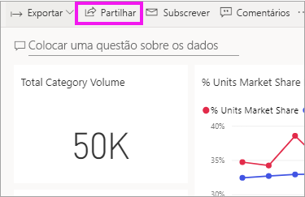
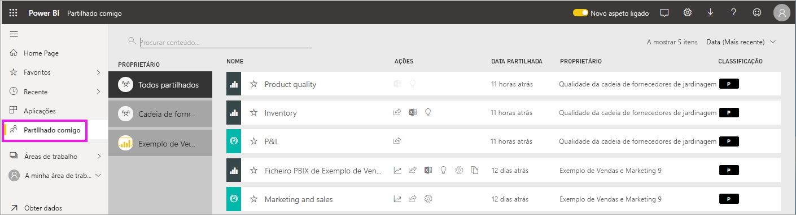
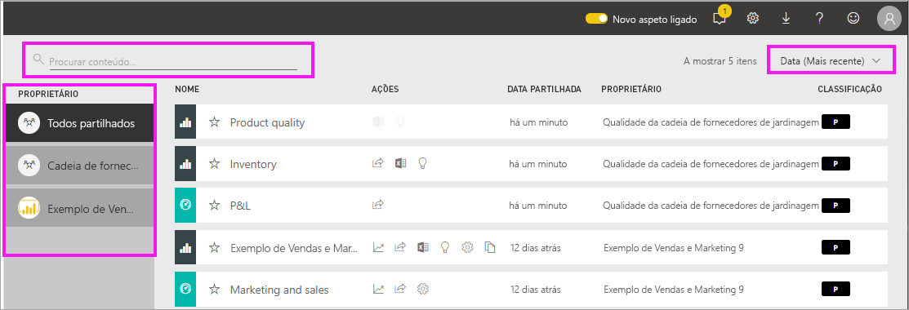

# Visualizar os dashboards e os relatórios partilhados comigo

[!INCLUDE[consumer-appliesto-yyny](../includes/consumer-appliesto-yyny.md)]

[!INCLUDE [power-bi-service-new-look-include](../includes/power-bi-service-new-look-include.md)]

Quando um colega partilha conteúdo consigo, através do botão **Partilhar**, ele aparece no seu contentor **Partilhado comigo**. O dashboard ou relatório só está disponível a partir **Partilhado comigo** e não a partir de **Aplicações**.

Veja a Amália a explicar a lista de conteúdo **Partilhado comigo** e a demonstrar como navegar e filtrar a lista. Em seguida, siga as instruções passo-a-passo abaixo do vídeo para experimentar. Para que possa ver dashboards partilhados consigo, tem de ter uma licença do Power BI Pro. Para mais detalhes, leia [O que é o Power BI Premium?](../admin/service-premium-what-is.md).
    

> [!NOTE]
> Este vídeo utiliza uma versão mais antiga do serviço Power BI.
    

<iframe width="560" height="315" src="https://www.youtube.com/embed/G26dr2PsEpk" frameborder="0" allowfullscreen></iframe>

## Interagir com conteúdo partilhado

Tem várias opções para interagir com os dashboards e os relatórios partilhados, consoante as permissões dadas pelo *designer*. Estas incluem a capacidade de fazer cópias do dashboard, abrir o relatório [na vista de Leitura](end-user-reading-view.md) e partilhar novamente com outros colegas.

### Ações disponíveis a partir do contentor **Partilhado comigo**
As ações disponíveis dependem das definições atribuídas pelo *designer* do conteúdo. Algumas das opções podem incluir:
* Selecionar o ícone de estrela para [adicionar um dashboard ou um relatório aos favoritos](end-user-favorite.md) .
* Remover um dashboard ou relatório  .
* Alguns dashboards e relatórios podem ser partilhados novamente  .
* [Abrir o relatório no Excel](end-user-export.md)  
* [Ver as informações](end-user-insights.md) que o Power BI encontra nos dados .
  
  > [!NOTE]
  > Para obter informações sobre as classificações EGRC, selecione o botão de **Classificação** ou [visite a Classificação de dados de dashboards](../create-reports/service-data-classification.md).
  > 

## Procurar e ordenar dashboards partilhados
Se a sua lista de conteúdo for longa, terá várias opções para encontrar aquilo de que precisa. Pode utilizar o campo de pesquisa, ordenar por data ou selecionar da coluna **Proprietário**.    

