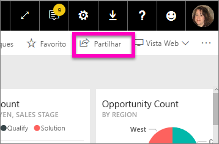
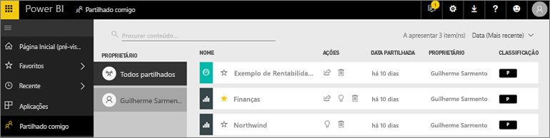
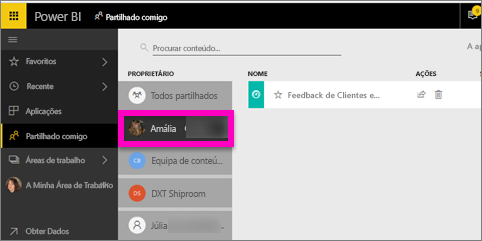

# Visualizar os dashboards e os relatórios partilhados comigo
## Partilhado comigo

Quando um colega partilha conteúdo consigo, através do botão **Partilhar**, ele aparece no seu contentor **Partilhado comigo**. O dashboard ou relatório só está disponível a partir **Partilhado comigo** e não a partir de **Aplicações**.

Veja a Amália a explicar a lista de conteúdo **Partilhado comigo** e a demonstrar como navegar e filtrar a lista. Em seguida, siga as instruções passo a passo abaixo do vídeo para experimentar. Para que possa ver dashboards partilhados consigo, tem de ter uma licença do Power BI Pro. Para mais detalhes, leia [O que é o Power BI Premium?](../service-premium.md).

<iframe width="560" height="315" src="https://www.youtube.com/embed/G26dr2PsEpk" frameborder="0" allowfullscreen></iframe>

Tem várias opções para interagir com os dashboards e os relatórios, consoante as permissões dadas pelo designer. Estas incluem a capacidade de fazer cópias do dashboard, abrir o relatório [na vista de Leitura](end-user-reading-view.md) e partilhar novamente com outros colegas.

## Ações disponíveis a partir do contentor **Partilhado comigo**
* Selecione o ícone de estrela para [Adicionar um dashboard ou um relatório aos favoritos](end-user-favorite.md).
* Remover um dashboard ou relatório  
* Alguns dashboards e relatórios podem ser partilhados novamente  
* Além disso, se as listas ficarem longas, [utilize o campo de pesquisa e a ordenação para localizar o que precisa](end-user-search-sort.md).
  
  > [!NOTE]
  > Para obter informações sobre as classificações EGRC, selecione o botão de classificação ou [visite a Classificação de dados de dashboards](../service-data-classification.md).
  > 
  > 
* Selecione o nome do dashboard para o abrir e explorar. Depois de abrir o dashboard partilhado, pode utilizar as Perguntas e Respostas para colocar questões sobre os dados subjacentes ou selecione um mosaico para abrir e interagir com o relatório na vista de Leitura.

## Filtrar dashboards partilhados pelo proprietário
O conteúdo no ecrã **Partilhado comigo** pode ser mais filtrado pelo proprietário do conteúdo. Por exemplo, se selecionar **Amália**, posso ver apenas o dashboard que ela partilhou comigo.

