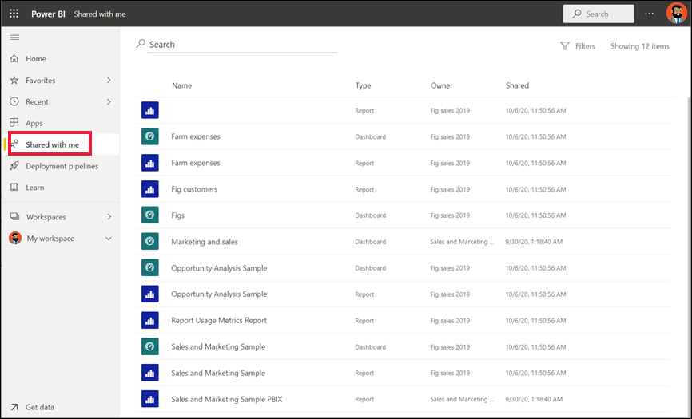

# Visualizar os dashboards e os relatórios partilhados comigo

[!INCLUDE[consumer-appliesto-yyny](../includes/consumer-appliesto-yyny.md)]

[!INCLUDE [power-bi-service-new-look-include](../includes/power-bi-service-new-look-include.md)]

Quando um colega partilhar um dashboard ou um relatório consigo, este será apresentado no contentor **Partilhado comigo** . Quando um colega partilha uma aplicação consigo, a aplicação aparece no contentor **Aplicações** e os relatórios e dashboards da aplicação aparecem no contentor **Partilhado comigo** .   

Veja a Amália a explicar a lista de conteúdo **Partilhado comigo** e a demonstrar como navegar e filtrar a lista. Em seguida, siga as instruções passo-a-passo abaixo do vídeo para experimentar. Para que possa ver dashboards partilhados consigo, tem de ter uma licença do Power BI Pro. Para mais detalhes, leia [O que é o Power BI Premium?](../admin/service-premium-what-is.md).
    

> [!NOTE]
> Este vídeo utiliza uma versão mais antiga do serviço Power BI.
    

<iframe width="560" height="315" src="https://www.youtube.com/embed/G26dr2PsEpk" frameborder="0" allowfullscreen></iframe>

## Interagir com conteúdo partilhado

Tem várias opções para interagir com os dashboards e os relatórios partilhados, consoante as permissões dadas pelo *designer* . Estas incluem a capacidade de fazer cópias do dashboard, subscrever, abrir o relatório [na Vista de leitura](end-user-reading-view.md) e partilhar novamente com outros colegas. Selecione um dashboard ou relatório para o abrir.

## Procurar e ordenar relatórios e dashboards partilhados
Se a lista de conteúdo **Partilhado comigo** for longa, terá várias opções para encontrar aquilo de que precisa. Utilize o campo de pesquisa (1), ordenar por uma das colunas (2) ou utilize o painel Filtros. Para abrir o painel Filtros, selecione **Filtros** no canto superior direito.    

