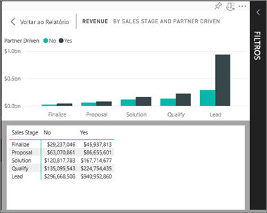
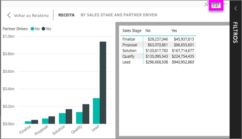

# Mostrar os dados que foram utilizados para criar a visualização
## Mostrar dados na Vista de Leitura
Uma visualização do Power BI é construída com dados dos conjuntos de dados subjacentes. Se estiver interessado em conhecer os bastidores, o Power BI permite-lhe *apresentar* os dados que estão a ser utilizados para criar o elemento visual. Quando seleciona **Mostrar Dados**, o Power BI apresenta os dados por baixo da visualização (ou junto da mesma).

## Utilizar *Mostrar Dados* na Vista de Leitura do serviço Power BI
1. No serviço Power BI, abra um relatório (na Vista de Leitura) e selecione um elemento visual.  
2. Para apresentar os dados subjacentes ao elemento visual, selecione as reticências (...) e selecione **Mostrar dados**.
   
   
3. Por predefinição, os dados são apresentados por baixo do elemento visual.
   
   

4. Para alterar a orientação, selecione o esquema vertical  no canto superior direito da visualização.
   
   

## Próximos passos
[Visualizações nos relatórios do Power BI](../visuals/power-bi-report-visualizations.md)    
[Relatórios do Power BI](end-user-reports.md)    
