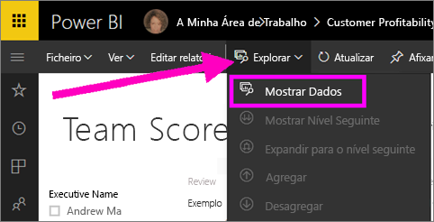
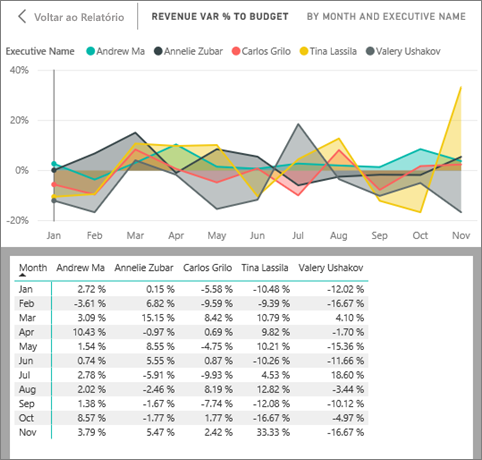
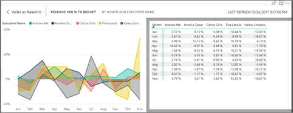
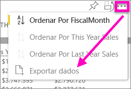

# Mostrar os dados que foram utilizados para criar a visualização
## Mostrar Dados
Uma visualização do Power BI é construída com dados dos conjuntos de dados. Se estiver interessado em conhecer os bastidores, o Power BI permite-lhe *apresentar* os dados que estão a ser utilizados para criar o elemento visual. Quando seleciona **Mostrar Dados**, o Power BI apresenta os dados por baixo da visualização (ou junto da mesma).

Também pode exportar os dados que estão a ser utilizados para criar a visualização como um ficheiro .xlsx ou .csv e visualizá-los no Excel. Para obter mais informações, veja [Exportar dados de visualizações do Power BI](end-user-export-data.md).

> [!NOTE]
> *Mostrar Dados* e *Exportar Dados* estão disponíveis no serviço Power BI e no Power BI Desktop. No entanto, o Power BI Desktop fornece uma camada adicional de detalhe; [ *Mostrar Registos* apresenta as linhas atuais do conjunto de dados](../desktop-see-data-see-records.md).
> 
> 

## Utilizar *Mostrar Dados* no serviço Power BI
1. No serviço Power BI, abra um relatório na [Vista de leitura ou Vista de edição](end-user-reading-view.md) e selecione um elemento visual.  No Power BI Desktop, abra a vista de Relatório.
2. Para apresentar os dados subjacentes ao elemento visual, selecione **Explorar** > **Mostrar dados**.
   
   
3. Por predefinição, os dados são apresentados por baixo do elemento visual.
   
   
4. Para alterar a orientação, selecione o esquema vertical  no canto superior direito da visualização.
   
   
5. Para exportar os dados para um ficheiro .csv, selecione as reticências e escolha **Exportar dados**.
   
    
   
    Para obter mais informações sobre como exportar dados para o Excel, veja [Exportar dados de visualizações do Power BI](end-user-export-data.md).
6. Para ocultar os dados, anule a seleção **Explorar** > **mostrar dados**.

### Passos seguintes
[Exportar dados de visualizações do Power BI](end-user-export-data.md)    
[Visualizações nos relatórios do Power BI](../visuals/power-bi-report-visualizations.md)    
[Relatórios do Power BI](end-user-reports.md)    
[Power BI - Conceitos Básicos](end-user-basic-concepts.md)    
Mais perguntas? [Pergunte à Comunidade do Power BI](http://community.powerbi.com/)

