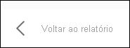

# Mostrar dados com relatórios do Power BI

[!INCLUDE[consumer-appliesto-yyny](../includes/consumer-appliesto-yyny.md)]

Um elemento visual do Power BI é criado com dados dos conjuntos de dados subjacentes. Se estiver interessado em conhecer os bastidores, o serviço Power BI permite-lhe *apresentar* os dados que estão a ser utilizados para criar um elemento visual num relatório. Ao selecionar **Mostrar como uma tabela**, o Power BI apresenta os dados por baixo do elemento visual (ou junto ao mesmo).

Num dashboard, utilize a opção [Exportar para o Excel](end-user-export.md) para ver os dados subjacentes.

## Mostrar os dados que estão a ser utilizados para criar um elemento visual de relatório
1. No serviço Power BI, [abra um relatório](end-user-report-open.md) e selecione um elemento visual.  
2. Para apresentar os dados subjacentes ao elemento visual, selecione **Mais opções (...)** e **Mostrar como uma tabela**.
   
   
3. Por predefinição, os dados são apresentados por baixo do elemento visual.
   
   

4. Para alterar a orientação, selecione o esquema vertical  no canto superior direito da visualização.
   
   

Para regressar ao relatório, selecione **Voltar ao relatório**, no canto superior esquerdo. 

   

## Passos seguintes
[Elementos visuais em relatórios do Power BI](../visuals/power-bi-report-visualizations.md)    
[Relatórios do Power BI](end-user-reports.md)    
