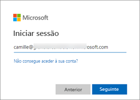
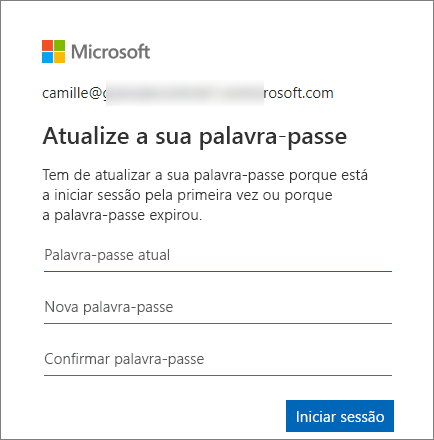
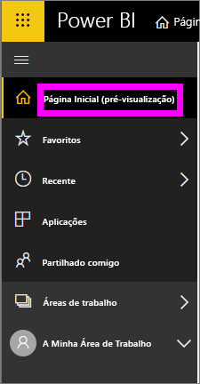
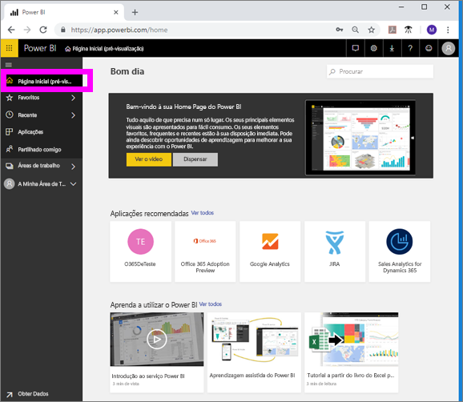

# Iniciar sessão no serviço Power BI

## Contas do Power BI
Antes de poder iniciar sessão no Power BI, tem de ter uma conta. Existem duas formas de obter uma conta do Power BI. A primeira é quando a sua empresa compra licenças do Power BI para os respetivos colaboradores. A segunda é quando um utilizador individual se inscreve para obter uma versão de avaliação gratuita ou uma licença pessoal. Este artigo abrange o primeiro cenário.

## Sign in for the first time (Iniciar sessão pela primeira vez)

### Passo 1: abrir um browser
O serviço Power BI é executado num browser.  Portanto, o primeiro passo é abrir o seu browser favorito e escrever **app.powerbi.com**.

### Passo 2: escrever o endereço de e-mail
Ao iniciar sessão pela primeira vez, ser-lhe-á pedido que forneça o seu endereço de e-mail.  Deve introduzir o endereço de e-mail escolar ou profissional que utilizou para se inscrever no Power BI.  

Verifique se tem um e-mail do seu administrador do Power BI na sua Caixa de Entrada. A maioria dos administradores enviar-lhe-á um e-mail de boas-vindas com a sua palavra-passe temporária. Utilize esta conta de e-mail para iniciar sessão. 

 
### Passo 3: criar uma nova palavra-passe
Se o seu administrador do Power BI lhe enviou uma palavra-passe temporária, introduza-a no campo **Palavra-passe atual**. Se ainda não recebeu esta palavra-passe no seu e-mail, contacte o seu administrador do Power BI.

O Power BI irá memorizar as suas credenciais e não terá de introduzir o seu nome de utilizador (o endereço de e-mail) da próxima vez que iniciar sessão. 

### Passo 4: rever a Página inicial
Ao aceder pela primeira vez, o Power BI é aberto na sua **Página inicial**. Se a sua **Página inicial** não abrir, selecione a mesma no painel de navegação esquerdo. 

Na Página inicial, verá todos os conteúdos que tiver permissão para utilizar. Inicialmente, poderá ter poucos conteúdos na sua Página inicial. No entanto, não se preocupe pois isso irá mudar quando começar a utilizar o Power BI com os seus colegas. 

Se não quiser que o Power BI abra na sua Página inicial, pode [defini-lo de modo a abrir num dashboard ou relatório **Em Destaque**](end-user-featured.md) como alternativa. 

## Interagir com conteúdos de forma segura
Enquanto ***consumidor***, pode interagir com os conteúdos que forem partilhados consigo por outras pessoas para explorar os dados e tomar decisões empresariais.  Não tem de se preocupar ao filtrar, segmentar, subscrever, exportar e redimensionar conteúdos, dado que o seu trabalho não afeta o conjunto de dados subjacente ou os conteúdos partilhados originalmente (dashboards e relatórios). O Power BI é um espaço protegido que lhe permite explorar e experimentar. Isso não significa que não possa guardar as suas alterações, pois pode faz\ê-lo. Contudo, essas alterações afetam apenas a **sua** vista dos conteúdos. Além disso, pode reverter facilmente para a vista predefinida com um simples clique no botão.

## Terminar sessão no serviço Power BI
Ao fechar ou terminar sessão no Power BI, as suas alterações são guardadas para que possa recomeçar onde parou.

Para fechar o Power BI, feche o separador do browser no qual estiver a trabalhar. 

 

Caso esteja a partilhar um computador, recomendamos que termine sessão sempre que fechar o Power BI.  Para terminar sessão, selecione a sua imagem de Perfil no canto superior direito e selecione **Terminar sessão**. Caso contrário, quando tiver terminado, feche o separador do browser.

 

## Resolução de problemas e considerações
- Caso se tenha inscrito no Power BI como utilizador individual, inicie sessão com o endereço de e-mail que utilizou para se inscrever.

- Se utilizar o Power BI com mais do que uma conta, ser-lhe-á pedido que selecione uma conta na lista apresentada e que introduza uma palavra-passe ao iniciar sessão. 

## Próximos passos
[View a Power BI app](end-user-app-view.md) (Ver uma aplicação do Power BI)
