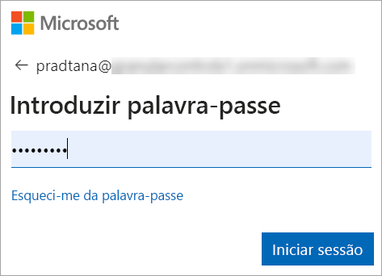
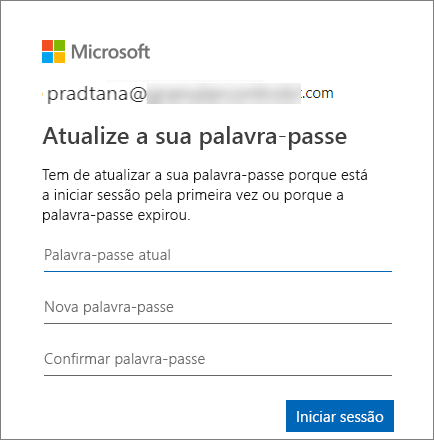
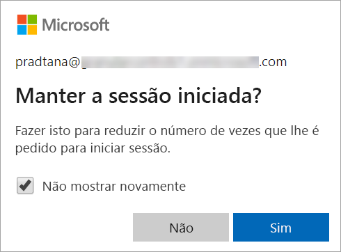
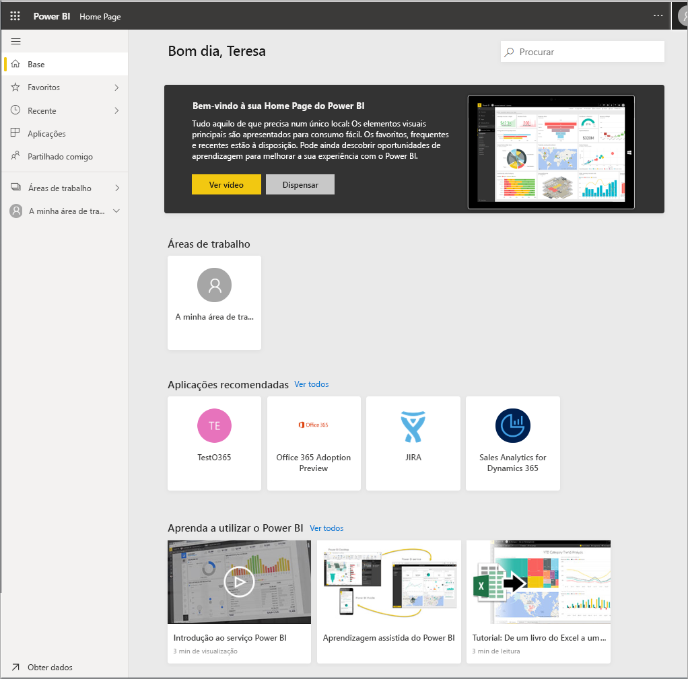

# Iniciar sessão no serviço Power BI

## Contas do Power BI
Antes de poder iniciar sessão no Power BI, tem de ter uma conta. Existem duas formas de obter uma conta do Power BI. A primeira é quando a sua empresa compra licenças do Power BI para os respetivos colaboradores. A segunda é quando um utilizador individual se inscreve para obter uma versão de avaliação gratuita ou uma licença pessoal. Este artigo abrange o primeiro cenário.

## Sign in for the first time (Iniciar sessão pela primeira vez)

### Passo 1: abrir um browser
O serviço Power BI é executado num browser.  Portanto, o primeiro passo é abrir o seu browser favorito e escrever **app.powerbi.com**.

### Passo 2: escrever o endereço de e-mail
Ao iniciar sessão pela primeira vez, ser-lhe-á pedido que forneça o seu endereço de e-mail.  Este endereço de e-mail é da conta escolar ou profissional que utilizou para se inscrever no Power BI.  

Verifique se tem um e-mail do seu administrador do Power BI na sua Caixa de Entrada. A maioria dos administradores enviar-lhe-á um e-mail de boas-vindas com a sua palavra-passe temporária. Utilize esta conta de e-mail para iniciar sessão. 

 
### Passo 3: criar uma nova palavra-passe
Se o seu administrador do Power BI lhe enviou uma palavra-passe temporária, introduza-a no campo **Palavra-passe atual**. Se ainda não recebeu uma palavra-passe no e-mail, contacte o administrador do Power BI.

Se quiser que o Power BI se lembre das suas credenciais, selecione **Sim**. 

### Passo 4: analisar a Home Page de destino
Ao aceder pela primeira vez, o Power BI é aberto na **Home Page** de destino. Se a **Home Page** não for apresentada, selecione-a no painel de navegação. 

Na Home Page, verá todos os conteúdos que tiver permissão para utilizar. Inicialmente, poderá ter poucos conteúdos, mas não se preocupe, pois isso mudará quando começar a utilizar o Power BI com os seus colegas. 

Se não quiser que o Power BI abra a Home Page, poderá [definir um dashboard ou relatório **Em Destaque**](end-user-featured.md) como alternativa. 

## Interagir com conteúdos de forma segura
Enquanto ***consumidor***, pode interagir com os conteúdos que forem partilhados consigo por outras pessoas para explorar os dados e tomar decisões empresariais.  Não tem de se preocupar ao filtrar, segmentar, subscrever, exportar e redimensionar conteúdos, dado que o seu trabalho não afeta o conjunto de dados subjacente ou os conteúdos partilhados originalmente (dashboards e relatórios). O Power BI é um espaço protegido que lhe permite explorar e experimentar. Isso não significa que não possa guardar as suas alterações, pois pode faz\ê-lo. Contudo, essas alterações afetam apenas a **sua** vista dos conteúdos. Além disso, pode reverter facilmente para a vista predefinida com um simples clique no botão.

## Terminar sessão no serviço Power BI
Ao fechar ou terminar sessão no Power BI, as suas alterações são guardadas para que possa recomeçar onde parou.

Para fechar o Power BI, feche o separador do browser no qual estiver a trabalhar. 

 

Caso esteja a partilhar um computador, recomendamos que termine sessão sempre que fechar o Power BI.  Para terminar sessão, selecione a sua imagem de Perfil no canto superior direito e selecione **Terminar sessão**. Caso contrário, quando tiver terminado, feche o separador do browser.

 

## Resolução de problemas e considerações
- Caso se tenha inscrito no Power BI como utilizador individual, inicie sessão com o endereço de e-mail que utilizou para se inscrever.

- Algumas pessoas usam o Power BI com mais do que uma conta. Se for o caso, ao iniciar sessão, ser-lhe-á pedido para selecionar uma conta numa lista. 

## Próximos passos
[View a Power BI app](end-user-app-view.md) (Ver uma aplicação do Power BI)
