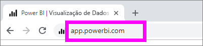
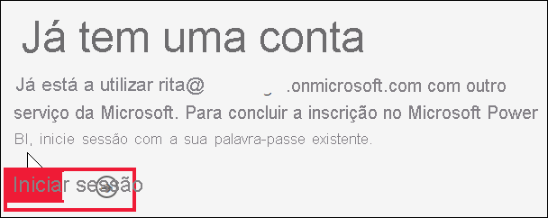
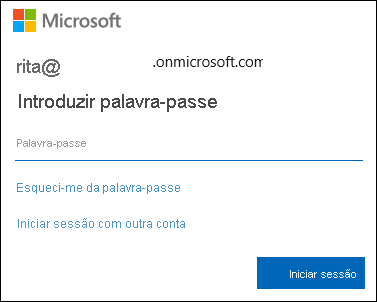
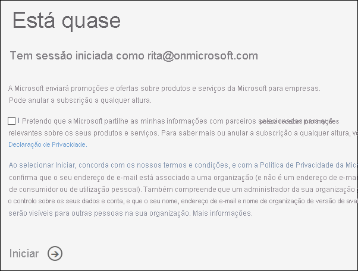
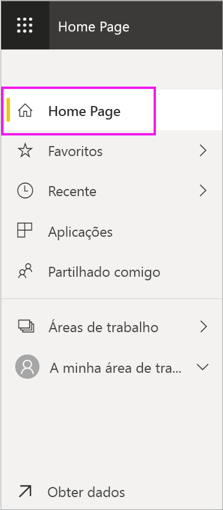
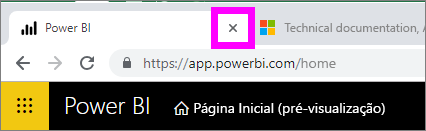
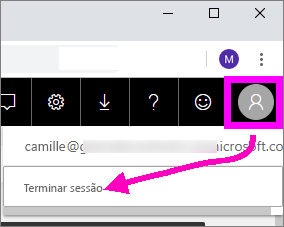

# Iniciar sessão no serviço Power BI

[!INCLUDE[consumer-appliesto-yynn](../includes/consumer-appliesto-yynn.md)]

## Contas do Power BI
Antes de poder iniciar sessão no Power BI, tem de ter uma conta. Existem duas formas de obter uma conta do Power BI. A primeira é quando a sua organização compra licenças do Power BI para os colaboradores. A segunda é quando um [utilizador individual se inscreve para obter uma versão de avaliação gratuita ou uma licença pessoal](../fundamentals/service-self-service-signup-for-power-bi.md). Este artigo abrange o primeiro cenário.

## Sign in for the first time (Iniciar sessão pela primeira vez)

### Passo 1: abrir o serviço Power BI
O serviço Power BI é executado num browser. 

- Se tiver recebido um e-mail de um colega com uma ligação para um dashboard ou relatório, selecione a ligação para **Abrir este relatório** ou **Abrir este dashboard**.

        

- Caso contrário, abra o browser favorito e escreva **app.powerbi.com**.

        

### Passo 2: escrever o endereço de e-mail
A primeira vez que iniciar sessão, a Microsoft verifica se já tem uma conta do Microsoft 365. No exemplo abaixo, a Rita já tem uma licença para outros serviços Microsoft. 

Introduza a palavra-passe. Esta é a palavra-passe da conta do Microsoft 365. É o mesmo e-mail e palavra-passe que utiliza para outros produtos Microsoft, como o Outlook e o Office.  Consoante a configuração da sua conta, poderá também ser-lhe pedido que introduza um código enviado para o e-mail ou dispositivo móvel.   

Por vezes, o administrador global poderá atribuir-lhe uma licença e enviar-lhe um e-mail com esta informação. Procure na Caixa de Entrada um e-mail de boas-vindas e siga as instruções para iniciar sessão pela primeira vez. Utilize esta mesma conta de e-mail para iniciar sessão. 
 
### Passo 3: rever os termos e condições
Reveja os termos e condições e, se estiver de acordo, selecione a caixa de verificação e escolha **Iniciar**.

### Passo 4: analisar a Home Page de destino
Ao aceder pela primeira vez, o Power BI é aberto na **Home Page** de destino. Se a **Home Page** não for apresentada, selecione-a no painel de navegação. 

Na Home Page, verá todos os conteúdos que tiver permissão para utilizar. Inicialmente, poderá ter poucos conteúdos, mas não se preocupe, pois isso mudará quando começar a utilizar o Power BI com os seus colegas. Lembra-se do relatório que o seu colega partilhou consigo por e-mail? Está na Home Page de destino com o título **Partilhado comigo**.

Se não quiser que o Power BI abra a Home Page, poderá [definir um dashboard ou relatório **Em Destaque**](end-user-featured.md) como alternativa. 

## Interagir com conteúdos de forma segura
Enquanto ***consumidor***, pode interagir com os conteúdos que forem partilhados consigo por outras pessoas para explorar os dados e tomar decisões empresariais.  Não tem de se preocupar ao filtrar, segmentar, subscrever, exportar e redimensionar conteúdos, dado que o seu trabalho não afeta o conjunto de dados subjacente ou os conteúdos partilhados originalmente (dashboards e relatórios). O Power BI é um espaço protegido que lhe permite explorar e experimentar. Isso não significa que não possa guardar as suas alterações, pois pode faz\ê-lo. Contudo, essas alterações afetam apenas a **sua** vista dos conteúdos. Além disso, pode reverter facilmente para a vista predefinida com um simples clique no botão.

## Terminar sessão no serviço Power BI
Ao fechar ou terminar sessão no Power BI, as suas alterações são guardadas para que possa recomeçar onde parou.

Para fechar o Power BI, feche o separador do browser no qual estiver a trabalhar. 

 

Caso esteja a partilhar um computador, recomendamos que termine sessão sempre que fechar o Power BI.  Para terminar sessão, selecione a sua imagem de Perfil no canto superior direito e selecione **Terminar sessão**.  

 

## Resolução de problemas e considerações
- Caso se tenha inscrito no Power BI como utilizador individual, inicie sessão com o endereço de e-mail que utilizou para se inscrever.

- Algumas pessoas usam o Power BI com mais do que uma conta. Se for o caso, ao iniciar sessão, ser-lhe-á pedido para selecionar uma conta numa lista. 

## Próximos passos
[View a Power BI app](end-user-app-view.md) (Ver uma aplicação do Power BI)
