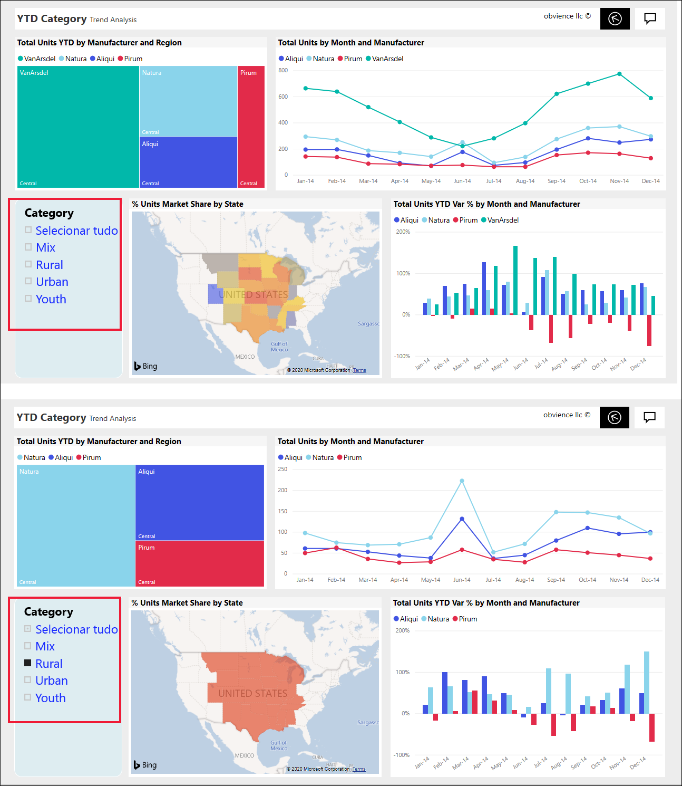
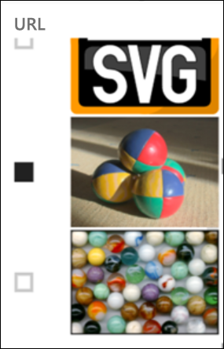
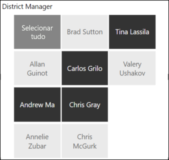
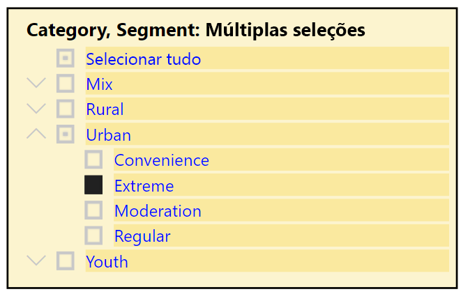
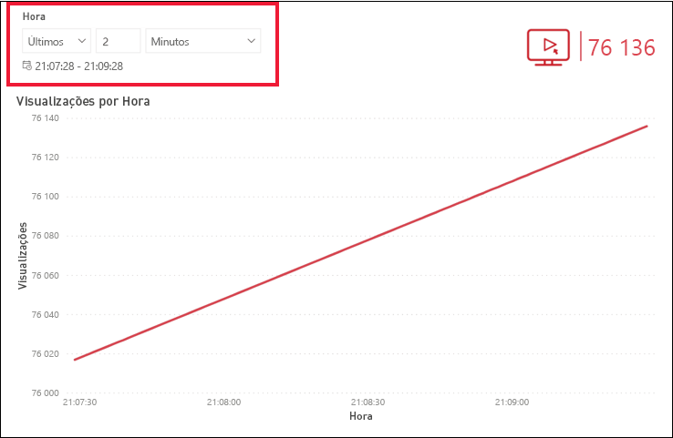
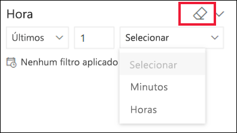

# Segmentações de dados no serviço Power BI

[!INCLUDE[consumer-appliesto-ynnn](../includes/consumer-appliesto-yynn.md)]

Uma segmentação de dados é um tipo de elemento visual que filtra os outros elementos visuais numa página de relatório. Ao utilizar relatórios do Power BI, irá descobrir muitos tipos de segmentações de dados. A imagem acima mostra a mesma segmentação de dados, mas com seleções diferentes. Veja como cada seleção filtra os outros elementos visuais na página.  

## Como utilizar segmentações de dados
Ao criar relatórios, os *designers* adicionam segmentações de dados para ajudar a contar uma história e dar-lhe ferramentas para explorar os seus dados.

### Segmentação de dados do intervalo numérico
 A segmentação de dados do intervalo numérico ajuda a explorar os dados quantitativos, como as vendas totais por: geografia, unidades em stock e data de encomenda. Utilize as alças para selecionar um intervalo. 

### Segmentação de dados de caixa de verificação vertical básica

Numa segmentação de dados de caixa de verificação básica, selecione uma ou mais caixas de verificação para ver o impacto nos outros elementos visuais na página. Para selecionar mais do que um, utilize Ctrl+selecione. Por vezes, o *designer* do relatório definirá a segmentação de dados apenas para permitir que selecione um valor de cada vez. 

### Segmentações de dados de imagem e forma
Quando as opções de segmentação de dados são imagens ou formas, efetuar as suas seleções é semelhante a utilizar caixas de verificação. Pode escolher uma ou mais imagens ou formas para aplicar a segmentação de dados aos outros elementos visuais na página. 

    

    

### Segmentação de dados de hierarquia

Numa segmentação de dados com uma hierarquia, utilize as divisas para expandir e fechar a hierarquia. O cabeçalho é atualizado para mostrar as suas seleções.

### Segmentação de dados de hora relativa
Com cenários de atualização rápida emergentes, a capacidade de filtrar para um período de tempo mais pequeno pode ser muito útil.
Com a segmentação de dados de hora relativa, pode aplicar filtros baseados no tempo a quaisquer dados de data ou hora no relatório. Por exemplo, pode utilizar a segmentação de dados de hora relativa para mostrar apenas visualizações de vídeo nos últimos 2 dias, horas ou até minutos. 

## Desativar uma segmentação de dados
Para desativar uma segmentação de dados, selecione o ícone de borracha.

## Próximas etapas
Para obter mais informações, veja os seguintes artigos:

[Tipos de visualização no Power BI](end-user-visualizations.md)

