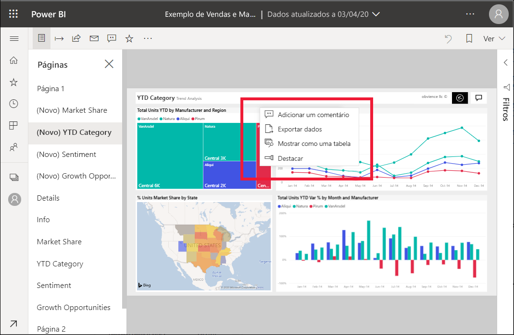

# Adicionar destaques a relatórios do Power BI

[!INCLUDE[consumer-appliesto-yyny](../includes/consumer-appliesto-yyny.md)]

Com o modo Em Destaque, pode chamar a atenção para um elemento visual específico numa página de relatórios.  Se o modo Em Destaque for selecionado quando adiciona um marcador, esse modo será mantido no marcador.

## Adicionar um destaque

1. [Abra um relatório](end-user-report-open.md) no serviço Power BI.

2. Decida que elemento visual gostaria de destacar numa página de relatórios. Selecione o menu pendente **Mais ações (...)** .  

    

3. Escolha a opção **Em Destaque**. O elemento visual é realçado, o que faz com que todos os outros elementos visuais na página fiquem desvanecidos até ficarem quase transparentes. 

    

## Próximas etapas

* [Apresentar um mosaico do dashboard ou um elemento visual do relatório no modo de detalhe](end-user-focus.md)

