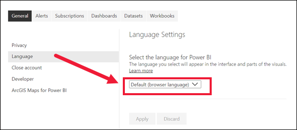
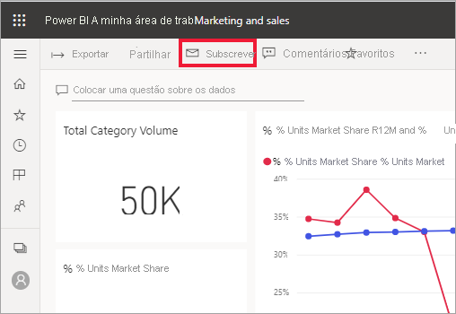
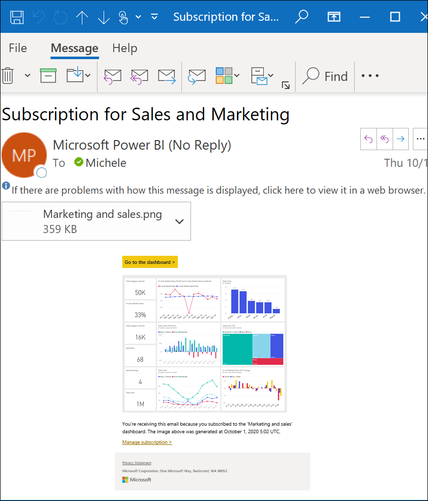
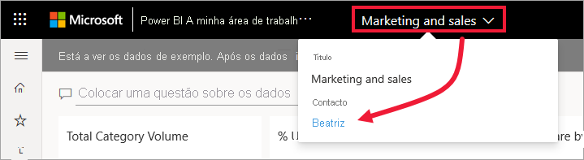
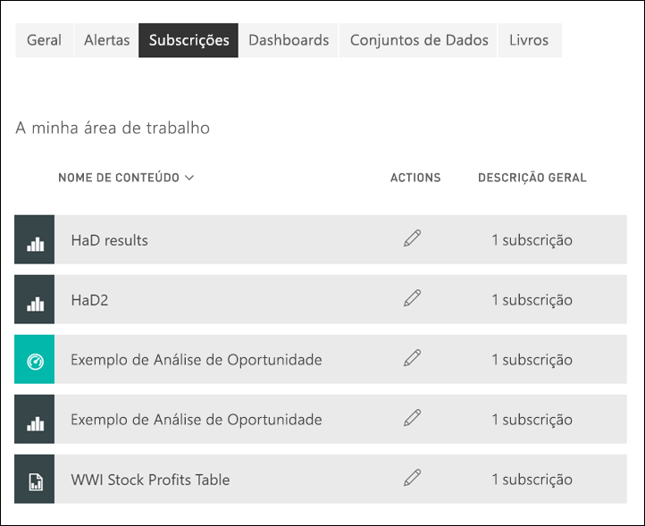

# Subscrever um relatório ou dashboard no serviço Power BI 

[!INCLUDE[consumer-appliesto-ynny](../includes/consumer-appliesto-ynny.md)]

Nunca foi tão fácil manter-se atualizado relativamente ao seus dashboards e relatórios mais importantes. Subscreva as páginas de relatório e dashboards mais importantes para si e o Power BI enviará um instantâneo por e-mail para a sua caixa de entrada. Indique ao Power BI com que frequência quer receber os e-mails: diariamente, semanalmente ou mediante a atualização dos dados. Também pode definir uma hora específica para o Power BI enviar os e-mails ou executar o envio agora.  Pode configurar até 24 subscrições diferentes por relatório ou dashboard.

O e-mail e o instantâneo utilizarão o idioma definido nas definições do Power BI (veja os [Idiomas e países/regiões com suporte no Power BI](../fundamentals/supported-languages-countries-regions.md)). Se nenhum idioma estiver definido, o Power BI utilizará o inglês como contingência. Para ver ou definir a sua preferência de idioma, selecione o ícone de engrenagem  > **Definições > Geral > Idioma**. 

Quando receber o e-mail, verá que este inclui uma ligação para “ir para o relatório/dashboard”. Nos dispositivos móveis com aplicações do Power BI instaladas, a seleção desta ligação inicia a aplicação (por oposição à ação predefinida de abrir o relatório ou dashboard no site do Power BI).

## Requirements
**Criar** uma subscrição para si requer um certo tipo de [licença](end-user-license.md). Se não conseguir criar uma subscrição, contacte o administrador do Power BI ou o suporte técnico de TI. **Subscrever outros** só está disponível para o proprietário do relatório ou do dashboard. A subscrição de relatórios paginados é ligeiramente diferente. Veja [Subscrever um relatório paginado no serviço Power BI para si e para outras pessoas](paginated-reports-subscriptions.md) para obter mais informações. 

## Subscrever um dashboard ou uma página de relatórios
Quer esteja a subscrever um dashboard ou um relatório, o processo é semelhante. O mesmo botão permite-lhe subscrever os dashboards e os relatórios do serviço Power BI.
 
.

1. Abra o dashboard ou o relatório.
2. Na barra de menus superior, selecione **Subscrever** ou selecione o ícone de envelope .    
1. Selecione **Adicionar nova subscrição**.
   

   
    
    O ecrã do lado esquerdo é apresentado quando estiver num dashboard e selecionar **Subscrever**. O ecrã do lado direito é apresentado quando estiver numa página de relatório e selecionar **Subscrever**. 
    
    a. Para subscrever mais do que uma página num relatório, selecione **Adicionar outra subscrição** e selecione uma página diferente no menu pendente perto da parte superior.

    b. Utilize o controlo de deslize amarelo para ativar e desativar a subscrição.  Definir o controlo de deslize para Desativado não elimina a subscrição. Para eliminar a subscrição, selecione o ícone de recipiente do lixo.

    c. Opcionalmente, adicione um assunto e preencha os detalhes da mensagem de e-mail. 

    d. Selecione uma **Frequência** para a sua subscrição.  Pode selecionar as opções Diariamente, Semanalmente ou Depois da atualização de dados (Diariamente).  Para receber o e-mail de subscrição apenas em determinados dias, selecione **Semanalmente** e escolha os dias em que o pretende receber.  Por exemplo, se quiser receber o e-mail de subscrição apenas durante os dias úteis, selecione a opção **Semanalmente** e desmarque as caixas Sáb. e Dom. Se selecionar **Mensalmente**, introduza os dias do mês nos quais pretende receber o e-mail de subscrição.   

    e. Se escolher Diariamente, Hora a Hora, Mensalmente ou Semanalmente, também poderá escolher uma Hora Agendada para a subscrição. Pode definir para que seja executada a cada hora ou a cada 15, 30 ou 45 minutos. Selecione manhã ou tarde/noite. Também pode especificar o fuso horário. Se escolher Hora a Hora, selecione a Hora Agendada para o início da subscrição e esta será executada a cada hora.  

    f. Agende a data de início e de fim ao introduzir as mesmas nos campos de data. Por predefinição, a data de início da sua subscrição será a data em que a criou e a data de fim será um ano após a criação. Pode alterá-la para qualquer data no futuro (até ao ano 9999) em qualquer altura antes de a subscrição terminar. Quando uma subscrição atinge a data de fim, esta é interrompida até que a volte a ativar.  Receberá notificações antes da data de fim agendada a perguntar se quer prolongar a subscrição.     

    exemplo, Para rever a sua subscrição e testá-la, selecione **Executar agora**.  Esta opção faz com que o e-mail seja imediatamente enviado para si. 

3. Se tudo estiver correto, selecione **Guardar e fechar** para guardar a subscrição. Receberá um e-mail e um instantâneo do dashboard ou do relatório dentro do período que definiu. Todas as subscrições cuja frequência estiver definida para **Depois da atualização de dados** só enviarão um e-mail após a primeira atualização agendada para o dia em questão.
   
   
   
    Atualizar a página de relatório não atualiza o conjunto de dados. Apenas o proprietário do conjunto de dados pode atualizar manualmente um conjunto de dados. Para procurar o nome do proprietário do(s) conjunto(s) de dados subjacente(s), selecione o menu pendente na barra de menus ou procure o e-mail da subscrição original.
   
    

## Gerir as subscrições
Apenas o utilizador pode gerir as subscrições que cria. Selecione **Subscrever** novamente e escolha **Gerir todas as subscrições** no canto inferior esquerdo (ver capturas de ecrã acima). São apresentadas as subscrições da área de trabalho atual. Para ajudar a compreender as áreas de trabalho, veja [Áreas de Trabalho no Power BI](end-user-workspaces.md). 

Uma subscrição terminará se a licença Pro expirar, o dashboard ou o relatório for eliminado pelo proprietário ou a conta de utilizador utilizada para criar a subscrição for eliminada.

## Considerações e resolução de problemas
* Para evitar que os e-mails da subscrição vão para a pasta de spam, adicione o alias de e-mail do Power BI (no-reply-powerbi@microsoft.com) aos contactos. Se estiver a utilizar o Microsoft Outlook, clique com o botão direito do rato no alias e selecione **Adicionar aos contactos do Outlook**. 
* É possível que os dashboards com mais de 25 mosaicos afixados ou mais de quatro páginas de relatórios dinâmicos afixadas não sejam apresentados por inteiro nos e-mails de subscrição enviados para os utilizadores. Sugerimos que contacte o designer do dashboard e lhe peça que reduza o número de mosaicos afixados para 25 e o de relatórios dinâmicos afixados para menos de quatro, de modo a garantir que o e-mail é apresentado corretamente.  
* Para subscrições de e-mail do dashboard, se um mosaico tiver segurança aplicada ao nível da linha (RLS), o mesmo não será apresentado.  
* Se as ligações no seu e-mail (para o conteúdo) deixarem de funcionar, o conteúdo poderá ter sido eliminado. No e-mail, abaixo da captura de ecrã, pode ver se foi você ou outra pessoa que o subscreveu. Se foi outra pessoa, peça a esse colega que cancele os e-mails ou volte a subscrever.
* Para subscrições de dashboards, determinados tipos de mosaicos ainda não são suportados. Estes incluem: transmissão em fluxo de mosaicos, mosaicos de vídeos e mosaicos de conteúdo Web personalizados. 
* As subscrições de páginas de relatório estão associadas ao nome da página de relatório. Se subscrever uma página de relatório e lhe for atribuído um nome novo, terá de criar novamente a sua subscrição.
* Se não conseguir utilizar a funcionalidade de subscrição, contacte o seu administrador de sistema ou o suporte técnico de TI. A sua organização pode ter desativado esta funcionalidade.  
* As subscrições por e-mail não suportam a maioria dos [elementos visuais personalizados](../developer/visuals/power-bi-custom-visuals.md).  A exceção são os elementos visuais personalizados do Power BI que foram [certificados](../developer/visuals/power-bi-custom-visuals-certified.md).    
* As subscrições por e-mail são enviadas com as estatísticas de filtro e segmentação de dados predefinidas do relatório. Quaisquer alterações às predefinições efetuadas depois da subscrição não irão aparecer no e-mail. Os Relatórios Paginados suportam esta funcionalidade e permitem-lhe definir os valores de parâmetros específicos por subscrição.  
* De momento, as subscrições por e-mail não suportam elementos visuais do Power BI baseados em R.  
* As subscrições podem falhar em dashboards ou relatórios com imagens extremamente grandes devido aos limites de tamanho por e-mail.    
* O Power BI interrompe automaticamente a atualização nos conjuntos de dados associados a dashboards e relatórios que não tenham sido acedidos durante mais de dois meses.  No entanto, se adicionar uma subscrição a um dashboard ou relatório, este não será interrompido, mesmo se não for acedido.
* Não se esqueça de que, tal como outros produtos BI, o período que definiu para a subscrição começa quando é iniciado o processamento da mesma.  Quando o processamento do relatório estiver concluído, a subscrição é colocada em fila e é enviada para os destinatários de e-mail.  Embora nos esforcemos por processar e disponibilizar todas as subscrições o mais rapidamente possível, por vezes existem picos de procura em que pode ocorrer um atraso mais longo devido ao número de subscrições que podem ser enviadas de uma só vez.  Para a maioria dos clientes, não deve ocorrer um atraso superior a 15 minutos para processar e enviar os relatórios, embora por vezes possa demorar até 30 minutos para determinados inquilinos com uma utilização significativa.  Não esperamos que os eventuais atrasos na entrega ultrapassem os 60 minutos, a partir do momento em que a subscrição é agendada.  Se um cliente sofrer um atraso dessa duração, deverá primeiro garantir que o endereço no-reply-powerbi@microsoft.com está na lista de remetentes seguros e não está bloqueado pelo fornecedor de e-mail.  Se o e-mail não estiver bloqueado, o cliente deverá contactar o administrador do Power BI ou o suporte técnico de TI para obter assistência.

## Próximos passos

[Pesquisar e ordenar conteúdos](end-user-search-sort.md)
