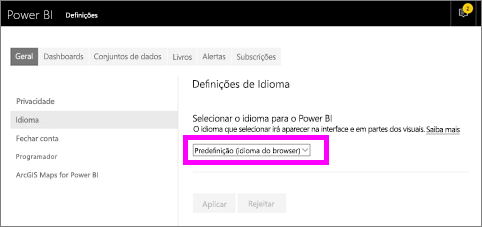
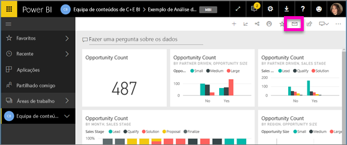
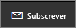
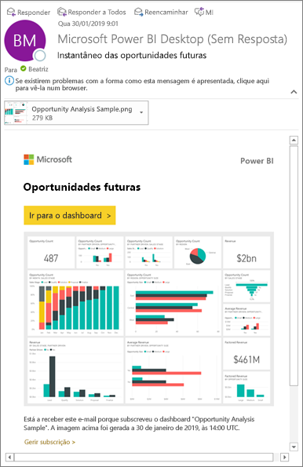
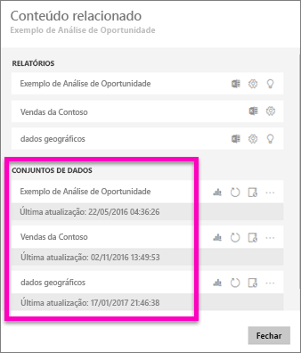
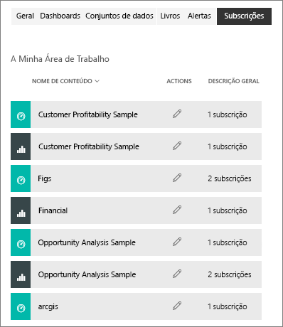

# Subscrever um relatório ou dashboard no serviço Power BI 
Nunca foi tão fácil manter-se atualizado relativamente ao seus dashboards e relatórios mais importantes. Subscreva as páginas de relatório e dashboards mais importantes para si e o Power BI enviará um instantâneo por e-mail para a sua caixa de entrada. Indique ao Power BI com que frequência quer receber os e-mails: diariamente, semanalmente ou mediante a atualização dos dados. Também pode definir uma hora específica para o Power BI enviar os e-mails ou executar o envio agora.  

O e-mail e o instantâneo utilizarão o idioma definido nas definições do Power BI (veja os [Idiomas e países/regiões com suporte no Power BI](../supported-languages-countries-regions.md)). Se não for definido qualquer idioma, o Power BI utilizará o idioma de acordo com a definição de local do browser atual. Para ver ou definir a sua preferência de idioma, selecione o ícone de engrenagem  > **Definições > Geral > Idioma**. 

Quando receber o e-mail, verá que este inclui uma ligação para "ir para o relatório/dashboard". Nos dispositivos móveis com aplicações do Power BI instaladas, a seleção desta ligação inicia a aplicação (por oposição à ação predefinida de abrir o relatório ou dashboard no site do Power BI).

## Requirements
**Criar** uma subscrição é uma funcionalidade do Power BI Pro.   

## Subscrever um dashboard ou uma página de relatórios
Quer esteja a subscrever um dashboard ou um relatório, o processo é semelhante. O mesmo botão permite-lhe subscrever os dashboards e os relatórios do serviço Power BI.
 
.

1. Abra o dashboard ou o relatório.
2. Na barra de menus superior, selecione **Subscrever** ou selecione o ícone de envelope .
   
   

   
    
    O ecrã do lado esquerdo é apresentado quando estiver num dashboard e selecionar **Subscrever**. O ecrã do lado direito é apresentado quando estiver numa página de relatório e selecionar **Subscrever**. Para subscrever mais do que uma página num relatório, selecione **Adicionar outra subscrição** e selecione uma página diferente. 

4. Utilize o controlo de deslize amarelo para ativar e desativar a subscrição.  Definir o controlo de deslize para Desativado não elimina a subscrição. Para eliminar a subscrição, selecione o ícone de recipiente do lixo.

4. O seu endereço de e-mail é automaticamente adicionado ao campo **Subscrever**. Para subscrever outras pessoas na sua organização, adicione os respetivos endereços de e-mail aqui. 

5. Em opção, preencha os detalhes da mensagem de e-mail. 

5. Selecione uma **Frequência** para a sua subscrição.  Pode selecionar as opções Diariamente, Semanalmente ou Depois da atualização de dados (Diariamente).  Para receber o e-mail de subscrição apenas em determinados dias, selecione **Semanalmente** e escolha os dias em que o pretende receber.  Por exemplo, se quiser receber o e-mail de subscrição apenas durante os dias úteis, selecione a opção **Semanalmente** como frequência e desselecione as caixas Sáb. e Dom.   

6. Agende a hora de envio do e-mail ao selecionar a opção Diariamente ou Semanalmente como frequência e ao introduzir uma **Hora** **Agendada** para a subscrição.  Esta é a hora de início da tarefa de subscrição. Em determinados cenários, poderá demorar alguns minutos até o e-mail ser entregue na sua caixa de entrada.    

7. Agende a data de início e de fim ao introduzir as mesmas nos campos de data. Por predefinição, a data de início da sua subscrição será a data em que a criou e a data de fim será um ano após a criação. Quando uma subscrição atinge a data de fim, esta é interrompida até que a volte a ativar.  Receberá notificações antes da data de fim agendada a perguntar se quer prolongar a subscrição.     

8. Para rever a sua subscrição e testá-la, selecione **Executar agora**.  Esta opção faz com que o e-mail seja imediatamente enviado para si. 

8. Se tudo estiver correto, selecione **Guardar e fechar** para guardar a subscrição. Você e os colegas subscritos receberão um e-mail e um instantâneo do dashboard ou relatório dentro do agendamento que definiu. Todas as subscrições cuja frequência estiver definida para **Depois da atualização de dados** só enviarão um e-mail após a primeira atualização agendada para o dia em questão.
   
   
   
    Atualizar a página de relatório não atualiza o conjunto de dados. Apenas o proprietário do conjunto de dados pode atualizar manualmente um conjunto de dados. Para procurar um nome do proprietário do(s) conjunto(s) de dados subjacentes, selecione **Ver relacionado** na barra de menus superior ou procure o e-mail de subscrição original.
   
    

## Gerir as subscrições
Apenas o utilizador pode gerir as subscrições que cria. Selecione **Subscrever** novamente e escolha **Gerir todas as subscrições** no canto inferior esquerdo (ver capturas de ecrã acima). 

Uma subscrição terminará se a licença Pro expirar, o dashboard ou o relatório for eliminado pelo proprietário ou a conta de utilizador utilizada para criar a subscrição for eliminada.

## Considerações e resolução de problemas
* É possível que os dashboards com mais de 25 mosaicos afixados ou mais de quatro páginas de relatórios dinâmicos afixadas não sejam apresentados por inteiro nos e-mails de subscrição enviados aos utilizadores. Sugerimos que contacte o designer do dashboard e lhe peça que reduza o número de mosaicos afixados para 25 e o de relatórios dinâmicos afixados para menos de quatro, de modo a garantir que o e-mail é apresentado corretamente.  
* Para subscrições de e-mail do dashboard, se um mosaico tiver segurança aplicada ao nível da linha (RLS), o mesmo não será apresentado.  Para subscrições de e-mail do relatório, se o conjunto de dados utilizar RLS, não poderá criar uma subscrição.
* As subscrições de páginas de relatório estão associadas ao nome da página de relatório. Se subscrever uma página de relatório e lhe for atribuído um nome novo, terá de criar novamente a sua subscrição.
* Se não conseguir utilizar a funcionalidade de subscrição, contacte o seu administrador de sistema. A sua organização pode ter desativado esta funcionalidade por questões de autenticação ou outros motivos.  
* As subscrições por e-mail não suportam a maioria dos [elementos visuais personalizados](../power-bi-custom-visuals.md).  A exceção são os elementos visuais personalizados que foram [certificados](../power-bi-custom-visuals-certified.md).  
* De momento, as subscrições por e-mail não suportam elementos visuais personalizados baseados em R.  
* Para as subscrições de dashboard em específico, certos tipos de mosaicos não são ainda suportados.  Estes incluem: transmissão em fluxo de mosaicos, mosaicos de vídeos e mosaicos de conteúdo Web personalizados.     
* As subscrições podem falhar em dashboards ou relatórios com imagens extremamente grandes devido aos limites de tamanho por e-mail.    
* O Power BI interrompe automaticamente a atualização nos conjuntos de dados associados a dashboards e relatórios que não tenham sido acedidos durante mais de dois meses.  No entanto, se adicionar uma subscrição a um dashboard ou relatório, este não será interrompido, mesmo se não for acedido.
* Em ocasiões raras, as subscrições de e-mail poderão demorar mais de 15 minutos a serem entregues aos destinatários.  Se for o caso, recomendamos que execute a atualização de dados e a subscrição de e-mail separadamente para assegurar uma entrega atempada.  Se o problema persistir, contacte o suporte do Power BI.

## Próximos passos

[Pesquisar e ordenar conteúdos](end-user-search-sort.md)
