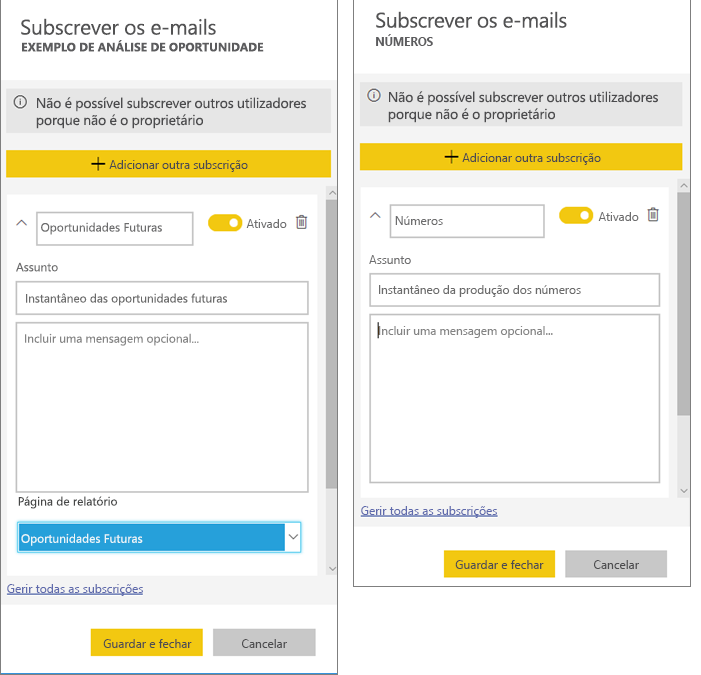
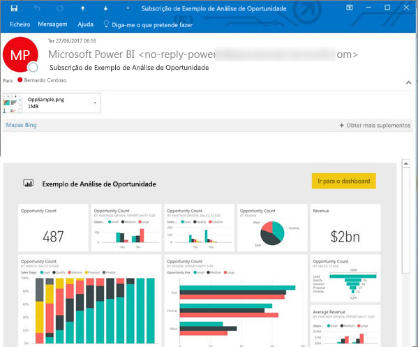
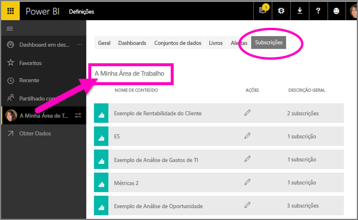

# Subscrever um relatório ou dashboard no serviço Power BI 
Nunca foi tão fácil manter-se atualizado relativamente ao seus dashboards e relatórios mais importantes. Subscreva as páginas de relatório e dashboards mais importantes para si e o Power BI enviará um instantâneo por e-mail para a sua caixa de entrada. Indique ao Power BI com que frequência quer receber os e-mails: desde uma vez por dia a uma vez por semana. 

O e-mail e o instantâneo utilizarão o idioma definido nas definições do Power BI (veja os [Idiomas e países/regiões com suporte no Power BI](../supported-languages-countries-regions.md)). Se não for definido qualquer idioma, o Power BI utilizará o idioma de acordo com a definição de local do browser atual. Para ver ou definir a sua preferência de idioma, selecione o ícone de engrenagem  > **Definições > Geral > Idioma**. 

Quando receber o e-mail, este incluirá uma ligação para "ir para o relatório/dashboard". Nos dispositivos móveis com aplicações do Power BI instaladas, a seleção desta ligação inicia a aplicação (por oposição à ação predefinida de abrir o relatório ou dashboard no site do Power BI).

## Requisitos
- **Criar** uma subscrição é uma funcionalidade do Power BI Pro. 
- Sendo que os e-mails de subscrição só são enviados quando um conjunto de dados subjacente é atualizado, as subscrições não funcionam em conjuntos de dados que não sejam atualizados.

## Subscrever um dashboard ou uma página de relatórios
Quer esteja a subscrever um dashboard ou um relatório, o processo é muito semelhante. O mesmo botão permite-lhe subscrever os dashboards e os relatórios do serviço Power BI.
 
.

1. Abra o dashboard ou o relatório.
2. Na barra de menus superior, selecione **Subscrever** ou selecione o ícone de envelope .
   
   

3. Utilize o controlo de deslize amarelo para ativar e desativar a subscrição.  Definir o controlo de deslize para Desativado não eliminará a subscrição. Para eliminar a subscrição, selecione o ícone de recipiente do lixo.

4. Em opção, preencha os detalhes da mensagem de e-mail. 

    Nas capturas de ecrã abaixo, repare que, na realidade, está a subscrever uma *página* de relatórios ao subscrever um relatório.  Para subscrever mais do que uma página num relatório, selecione **Adicionar outra subscrição** e selecione uma página diferente. 
      
   

5. Selecione **Guardar e fechar** para guardar a subscrição. Irá receber um e-mail com um instantâneo do dashboard ou da página de relatórios sempre que qualquer um dos conjuntos de dados subjacentes for alterado. Se o dashboard ou relatório for atualizado mais do que uma vez por dia, o e-mail só será enviado após a primeira atualização.  
   
   
   
Atualizar a página de relatório não atualiza o conjunto de dados. Apenas o proprietário do conjunto de dados pode atualizar manualmente um conjunto de dados. Para procurar um nome do(s) conjunto(s) de dados subjacentes, selecione **Ver relacionado** na barra de menu superior.
   

## Como é determinado o agendamento de e-mails
A tabela seguinte descreve a frequência com que receberá um e-mail. Tudo depende do método de ligação do conjunto de dados em que se baseia o dashboard ou o relatório (DirectQuery, ligação em direto, importado para o Power BI ou ficheiro do Excel no OneDrive ou SharePoint Online) e das opções de subscrição disponíveis e selecionadas (diariamente, semanalmente ou nenhum).

|  | **DirectQuery** | **Ligação em Direto** | **Atualização agendada (importação)** | **Ficheiro do Excel no OneDrive/SharePoint Online** |
| --- | --- | --- | --- | --- |
| **Com que frequência é atualizado o relatório/dashboard?** |A cada 15 min |O Power BI faz uma verificação a cada 15 minutos e, se o conjunto de dados tiver sido alterado, o relatório é atualizado. |O utilizador seleciona nenhum, diariamente ou semanalmente. Diariamente pode ser até 8 vezes por dia. Semanalmente é, na verdade, um agendamento semanal criado e definido pelo utilizador para atualizar, no mínimo, uma vez por semana e, no máximo, todos os dias. |A cada hora |
| **Quanto controlo o utilizador tem sobre o agendamento de subscrições por e-mail?** |As opções são: diariamente ou semanalmente |Sem opções: é enviado um e-mail ao utilizador se o relatório for atualizado, mas não mais do que uma vez por dia. |Se o agendamento da atualização for diariamente, as opções são diariamente e semanalmente.  Se o agendamento da atualização for semanalmente, a única opção é semanalmente. |Sem opções: é enviado um e-mail ao utilizador sempre que o conjunto de dados for atualizado, mas não mais do que uma vez por dia. |

## Gerir as subscrições
Só pode gerir as suas subscrições. Selecione **Subscrever** de novo e escolha **Gerir todas as subscrições** (ver capturas de ecrã abaixo no passo 4 acima). 

Uma subscrição terminará se a licença Pro expirar, o dashboard ou o relatório for eliminado pelo proprietário ou a conta de utilizador utilizada para criar a subscrição for eliminada.

## Considerações e resolução de problemas
* Para subscrições de e-mail do dashboard, se um mosaico tiver segurança aplicada ao nível da linha (RLS), o mesmo não será apresentado.  Para subscrições de e-mail do relatório, se o conjunto de dados utilizar RLS, não poderá criar uma subscrição.
* As subscrições de páginas de relatório estão associadas ao nome da página de relatório. Se subscrever uma página de relatório e lhe for atribuído um nome novo, terá de criar novamente a sua subscrição.
* Certas definições da sua organização podem ser configuradas no Azure Active Directory, que podem limitar a capacidade de utilizar as subscrições de e-mail no Power BI.  Isto inclui, mas não se limita a, ter uma autenticação multifator ou restrições de intervalos de IP quando se acede a recursos.
* Para subscrições por e-mail em conjuntos de dados de ligação em direto, só receberá e-mails quando os dados forem alterados. Assim, se ocorrer uma atualização mas sem alterações de dados, o Power BI não enviará nenhum e-mail.
* As subscrições por e-mail não suportam a maioria dos [elementos visuais personalizados](../power-bi-custom-visuals.md).  A única exceção são os elementos visuais personalizados que foram [certificados](../power-bi-custom-visuals-certified.md).  
* De momento, as subscrições por e-mail não suportam elementos visuais personalizados baseados em R.  
* Se o mosaico do dashboard tiver segurança aplicada ao nível da linha (RLS), o mesmo não será apresentado.
* As subscrições por e-mail são enviadas com as estatísticas de filtro e segmentação de dados predefinidas do relatório. Quaisquer alterações às predefinições efetuadas depois da subscrição não irão aparecer no e-mail.    
* Para as subscrições de dashboard em específico, certos tipos de mosaicos não são ainda suportados.  Estes incluem: transmissão em fluxo de mosaicos, mosaicos de vídeos e mosaicos de conteúdo Web personalizados.     
* As subscrições podem falhar em dashboards ou relatórios com imagens extremamente grandes devido aos limites de tamanho por e-mail.    
* O Power BI interrompe automaticamente a atualização nos conjuntos de dados associados a dashboards e relatórios que não tenham sido acedidos durante mais de 2 meses.  No entanto, se adicionar uma subscrição a um dashboard ou relatório, este não será interrompido, mesmo se não for acedido.    

## Próximos passos
* Mais perguntas? [Experimente perguntar à Comunidade do Power BI](http://community.powerbi.com/)    
* [Ler a mensagem de blogue](https://powerbi.microsoft.com/blog/introducing-dashboard-email-subscriptions-a-360-degree-view-of-your-business-in-your-inbox-every-day/)

