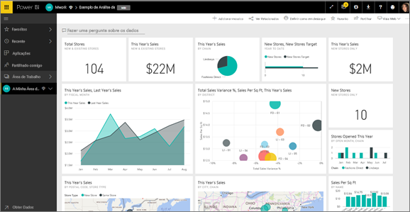
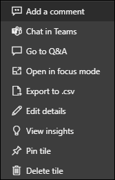

# Dashboard tiles in Power BI (Mosaicos do dashboard no Power BI)

[!INCLUDE[consumer-appliesto-yyny](../includes/consumer-appliesto-ynny.md)]

Um mosaico é um instantâneo dos seus dados, afixado a um dashboard por um *designer*. Os *designers* podem criar mosaicos a partir de um relatório, conjunto de dados, dashboard, a partir da caixa de Perguntas e Respostas, do Excel, do SQL Server Reporting Services (SSRS) e muito mais.  Esta captura de ecrã mostra vários mosaicos diferentes afixados a um dashboard.

Além de mosaicos afixados a partir de relatórios, os *designers* podem adicionar mosaicos autónomos diretamente no dashboard através da opção **Adicionar mosaico**. Os mosaicos autónomos incluem: caixas de texto, imagens, vídeos, dados de transmissão em fluxo e conteúdo Web.

Precisa de ajuda para compreender os mosaicos modulares que compõem o Power BI?  Veja [Power BI – Conceitos básicos](end-user-basic-concepts.md).

## Interagir com mosaicos num dashboard

1. Passe o rato sobre o mosaico para apresentar as reticências.
   
    
2. Selecione as reticências para abrir o menu de ação do mosaico. As opções disponíveis variam consoante as suas permissões, o tipo de elemento visual e o método utilizados para criar o mosaico. Por exemplo, os itens de menu disponíveis para mosaicos afixados a partir de Perguntas e Respostas são diferentes dos mosaicos afixados a partir de um relatório. Aqui está um menu de ação para um mosaico criado através das Perguntas e Respostas.

   
    

   
    Algumas das ações disponíveis nestes menus são:
   
   * [Abrir o relatório utilizado para criar o mosaico](end-user-reports.md)   
   
   * [Abrir a pergunta das Perguntas e Respostas que foi utilizada para criar o mosaico ](end-user-reports.md)   
   

   * [Abrir o livro que foi utilizado para criar o mosaico ](end-user-reports.md)   
   * [Ver o mosaico no modo de detalhe ](end-user-focus.md)   
   * [Ver informações ](end-user-insights.md) 
   * [Adicionar um comentário e iniciar um debate](end-user-comment.md) 
   * [Gerir alertas definidos num mosaico do dashboard](end-user-alerts.md) 
   * [Abrir os dados no Excel](end-user-export.md) 

3. Para fechar o menu de ação, selecione uma área em branco na tela.

### Selecionar (clicar) um mosaico
Ao selecionar um mosaico, o que ocorre em seguida depende de como o mosaico foi criado e se este tem uma [ligação personalizada](../create-reports/service-dashboard-edit-tile.md). Se este tiver uma ligação personalizada, a seleção do mosaico levá-lo-á a essa ligação. Caso contrário, a seleção do mosaico leva-o para o relatório, o livro do Excel Online, a relatório do SSRS que está no local ou para a pergunta das Perguntas e Respostas que foi utilizada para criar o mosaico.

> [!NOTE]
> A exceção a isto são os mosaicos de vídeo adicionados aos dashboards por *designers*. A seleção de um mosaico de vídeo (criado desta forma) faz com que o vídeo seja reproduzido diretamente no dashboard.   
> 
> 

## Considerações e resolução de problemas
* Se nada acontecer quando selecionar (clicar) um mosaico ou se receber uma mensagem de erro, eis estão alguns motivos possíveis:
  - O relatório que serviu para criar a visualização não foi guardado ou foi eliminado.
  - O mosaico foi criado a partir de um livro no Excel Online e não tem, pelo menos, permissões de Leitura para esse livro.
  - Se o mosaico foi criado a partir do SSRS e não tiver permissão para o relatório do SSRS ou se não tiver acesso à rede onde o servidor do SSRS está localizado.
* No caso dos mosaicos criados diretamente no dashboard com a opção **Adicionar mosaico**, se uma hiperligação personalizada tiver sido definida,a seleção do título, subtítulo e/ou do mosaico abrirá esse URL.  Caso contrário, por predefinição, a seleção de um destes mosaicos criados diretamente no dashboard para uma imagem, código Web ou caixa de texto não produz qualquer ação.
* Se a visualização original utilizada para criar o mosaico for alterada, o mosaico não será alterado.  Por exemplo, se o *designer* afixou um gráfico de linhas a partir de um relatório e, em seguida, alterou o gráfico de linhas para um gráfico de barras, o mosaico do dashboard continua a mostrar um gráfico de linhas. Os dados são atualizados, mas o tipo de visualização não.

## Próximas etapas
[Atualização de dados](../connect-data/refresh-data.md)

[Power BI - conceitos básicos](end-user-basic-concepts.md)

