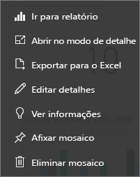

# Mosaicos de dashboard no Power BI
Os dashboards e os mosaicos de dashboard são uma funcionalidade do serviço Power BI e não do Power BI Desktop. Enquanto não for possível criar ou afixar mosaicos de dashboards no Power BI Mobile, estes [podem ser visualizados e partilhados](mobile/mobile-tiles-in-the-mobile-apps.md). Além disso, no Power BI Mobile, pode [adicionar imagens ao seu dashboard com a aplicação para iPhone](mobile/mobile-iphone-app-get-started.md).

## Os mosaicos do dashboard

Um mosaico é um instantâneo dos seus dados, afixado ao dashboard. Um mosaico pode ser criado a partir de um relatório, conjunto de dados, dashboard, a partir da caixa de Perguntas e Respostas, do Excel e do SQL Server Reporting Services (SSRS) e muito mais.  Esta captura de ecrã mostra vários mosaicos diferentes afixados a um dashboard.

Para além da afixação, os mosaicos autónomos podem ser criados diretamente no dashboard com a opção [Adicionar mosaico](../service-dashboard-add-widget.md). Os mosaicos autónomos incluem: caixas de texto, imagens, vídeos, dados de transmissão em fluxo e conteúdo Web.

Precisa de ajuda para compreender os mosaicos modulares que compõem o Power BI?  Veja [Power BI – Conceitos básicos](end-user-basic-concepts.md).

> [!NOTE]
> Se a visualização original utilizada para criar o mosaico for alterada, o mosaico não será alterado.  Por exemplo, se afixou um gráfico de linhas de um relatório e, em seguida, alterou o gráfico de linhas para um gráfico de barras, o mosaico do dashboard continua a mostrar um gráfico de linhas. Os dados são atualizados, mas o tipo de visualização não.
> 
> 

## Afixar um mosaico a partir de...
Existem diversas formas diferentes de adicionar (afixar) um mosaico a um dashboard. Os mosaicos podem ser afixados a partir de:

* [Perguntas e Respostas do Power BI](../service-dashboard-pin-tile-from-q-and-a.md)
* [um relatório](../service-dashboard-pin-tile-from-report.md)
* [outro dashboard](../service-pin-tile-to-another-dashboard.md)
* [um livro do Excel no OneDrive para Empresas](../service-dashboard-pin-tile-from-excel.md)
* [Power BI Publisher para Excel](../publisher-for-excel.md)
* [Informações Rápidas](end-user-insights.md)
* [SSRS](https://msdn.microsoft.com/library/mt604784.aspx)

E os mosaicos autónomos para imagens, caixas de texto, vídeos, dados de transmissão em fluxo e conteúdo Web podem ser criados diretamente no dashboard com a opção [Adicionar mosaico](../service-dashboard-add-widget.md).

  

## Interagir com mosaicos num dashboard
### Mover e redimensionar um mosaico
Pegue num mosaico e [mova-o no dashboard](../service-dashboard-edit-tile.md). Paire o cursor e selecione a  para redimensionar o mosaico.

### Passe o rato sobre um mosaico para alterar a aparência e o comportamento
1. Passe o rato sobre o mosaico para apresentar as reticências.
   
    
2. Selecione as reticências para abrir o menu de ação do mosaico.
   
    
   
    A partir daqui, pode:
   
   * [Abrir o relatório utilizado para criar este mosaico ](end-user-reports.md)   
   
   * [Abrir a folha de cálculo utilizada para criar este mosaico ](end-user-reports.md)   
     
    * [Ver no modo de detalhe ](end-user-focus.md)   
     * [Exportar os dados utilizados no mosaico](end-user-export-data.md) 
     * [Editar o título e subtítulo, adicionar uma hiperligação](../service-dashboard-edit-tile.md) 
     * [Executar informações ](end-user-insights.md) 
     * [Afixar o mosaico a outro dashboard ](../service-pin-tile-to-another-dashboard.md)
       
     * [Remover o mosaico](../service-dashboard-edit-tile.md)
     
3. Para fechar o menu de ação, selecione uma área em branco na tela.

### Selecionar (clicar) um mosaico
Ao selecionar um mosaico, o que ocorre em seguida depende de como o mosaico foi criado e se este tem uma [ligação personalizada](../service-dashboard-edit-tile.md). Se este tiver uma ligação personalizada, a seleção do mosaico levá-lo-á a essa ligação. Caso contrário, a seleção do mosaico leva-o para o relatório, o livro do Excel Online, a relatório do SSRS que está no local ou para a pergunta das Perguntas e Respostas que foi utilizada para criar o mosaico.

> [!NOTE]
> A exceção são os mosaicos de vídeo criados diretamente no dashboard com a opção **Adicionar mosaico**. A seleção de um mosaico de vídeo (criado desta forma) faz com que o vídeo seja reproduzido diretamente no dashboard.   
> 
> 

## Considerações e resolução de problemas
* Se o relatório usado para criar a visualização não tiver sido guardado, então selecionar um mosaico não produzirá nenhuma ação.
* Se o mosaico tiver sido criado a partir de um livro no Excel Online e se não tiver permissões pelo menos de Leitura para o livro, selecionar o mosaico de dados não abrirá o livro no Excel Online.
* No caso dos mosaicos criados diretamente no dashboard com a opção **Adicionar mosaico**, se uma hiperligação personalizada tiver sido definida,a seleção do título, subtítulo e/ou do mosaico abrirá esse URL.  Caso contrário, por predefinição, a seleção de um destes mosaicos criados diretamente no dashboard para uma imagem, código Web ou caixa de texto não produz qualquer ação.
* Se não tiver permissão para o relatório no SSRS, a seleção de um mosaico criado a partir do SSRS produzirá uma página com a indicação de que não tem acesso (rsAccessDenied).
* Se não tiver acesso à rede onde o servidor SSRS está localizado, a seleção de um mosaico criado a partir do SSRS produzirá uma página com a indicação de que não é possível localizar o servidor (HTTP 404). O dispositivo tem de ter acesso de rede ao servidor de relatórios para ver o relatório.
* Se a visualização original utilizada para criar o mosaico for alterada, o mosaico não será alterado.  Por exemplo, se fixou um gráfico de linhas de um relatório e, em seguida, alterar o gráfico de linhas para um gráfico de barras, o mosaico do dashboard continuará a mostrar um gráfico de linhas. Os dados são atualizados, mas o tipo de visualização não.

## Próximos passos
[Criar um cartão (mosaico de número grande) para o dashboard](../visuals/power-bi-visualization-card.md)

[Dashboards no Power BI](end-user-dashboards.md)  

[Atualização de dados](../refresh-data.md)

[Power BI - Conceitos Básicos](end-user-basic-concepts.md)

[Exportar um mosaico para o Power Point](http://blogs.msdn.com/b/powerbidev/archive/2015/09/28/integrating-power-bi-tiles-into-office-documents.aspx)

[Afixar itens do Reporting Services nos Dashboards do Power BI](https://msdn.microsoft.com/library/mt604784.aspx)

Mais perguntas? [Pergunte à Comunidade do Power BI](http://community.powerbi.com/)

