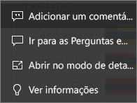
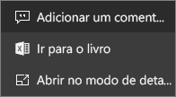
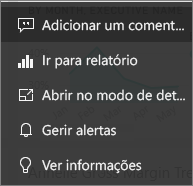

# Mosaicos de dashboard no Power BI
Um mosaico é um instantâneo dos seus dados, afixado ao dashboard por um *designer*. Um mosaico pode ser criado a partir de um relatório, conjunto de dados, dashboard, a partir da caixa de Perguntas e Respostas, do Excel, do SQL Server Reporting Services (SSRS) e muito mais.  Esta captura de ecrã mostra vários mosaicos diferentes afixados a um dashboard.

Além de mosaicos afixados a partir de relatórios, os *designers* podem adicionar mosaicos autónomos diretamente no dashboard através da opção **Adicionar mosaico**. Os mosaicos autónomos incluem: caixas de texto, imagens, vídeos, dados de transmissão em fluxo e conteúdo Web.

Precisa de ajuda para compreender os mosaicos modulares que compõem o Power BI?  Veja [Power BI – Conceitos básicos](end-user-basic-concepts.md).

## Interagir com mosaicos num dashboard

1. Passe o rato sobre o mosaico para apresentar as reticências.
   
    
2. Selecione as reticências para abrir o menu de ação do mosaico. As opções disponíveis variam consoante o tipo de elemento visual e o método utilizados para criar o mosaico. Eis alguns exemplos do que poderá ver.

    - mosaico criado com as Perguntas e Respostas
   
        

    - mosaico criado a partir de um livro
   
        

    - mosaico criado a partir de um relatório
   
        
   
    A partir daqui, pode:
   
   * [Abrir o relatório utilizado para criar este mosaico ](end-user-reports.md)   
   
   * [Abrir a pergunta das Perguntas e Respostas que foi utilizada para criar o mosaico ](end-user-reports.md)   
   

   * [Abrir o livro que foi utilizado para criar este mosaico ](end-user-reports.md)   
    * [Ver o mosaico no modo de detalhe ](end-user-focus.md)   
     * [Executar informações ](end-user-insights.md) 
    * [Adicionar um comentário e iniciar um debate](end-user-comment.md) 

3. Para fechar o menu de ação, selecione uma área em branco na tela.

### Selecionar (clicar) um mosaico
Ao selecionar um mosaico, o que ocorre em seguida depende de como o mosaico foi criado e se este tem uma [ligação personalizada](../service-dashboard-edit-tile.md). Se este tiver uma ligação personalizada, a seleção do mosaico levá-lo-á a essa ligação. Caso contrário, a seleção do mosaico leva-o para o relatório, o livro do Excel Online, a relatório do SSRS que está no local ou para a pergunta das Perguntas e Respostas que foi utilizada para criar o mosaico.

> [!NOTE]
> A exceção são os mosaicos de vídeo criados diretamente no dashboard com a opção **Adicionar mosaico**. A seleção de um mosaico de vídeo (criado desta forma) faz com que o vídeo seja reproduzido diretamente no dashboard.   
> 
> 

## Considerações e resolução de problemas
* Se o relatório usado para criar a visualização não tiver sido guardado, então selecionar um mosaico não produzirá nenhuma ação.
* Se o mosaico tiver sido criado a partir de um livro no Excel Online e se não tiver permissões pelo menos de Leitura para o livro, selecionar o mosaico de dados não abrirá o livro no Excel Online.
* No caso dos mosaicos criados diretamente no dashboard com a opção **Adicionar mosaico**, se uma hiperligação personalizada tiver sido definida,a seleção do título, subtítulo e/ou do mosaico abrirá esse URL.  Caso contrário, por predefinição, a seleção de um destes mosaicos criados diretamente no dashboard para uma imagem, código Web ou caixa de texto não produz qualquer ação.
* Se não tiver permissão para o relatório no SSRS, a seleção de um mosaico criado a partir do SSRS produzirá uma página com a indicação de que não tem acesso (rsAccessDenied).
* Se não tiver acesso à rede onde o servidor SSRS está localizado, a seleção de um mosaico criado a partir do SSRS produzirá uma página com a indicação de que não é possível localizar o servidor (HTTP 404). O dispositivo tem de ter acesso de rede ao servidor de relatórios para ver o relatório.
* Se a visualização original utilizada para criar o mosaico for alterada, o mosaico não será alterado.  Por exemplo, se o *designer* afixou um gráfico de linhas a partir de um relatório e, em seguida, alterou o gráfico de linhas para um gráfico de barras, o mosaico do dashboard continua a mostrar um gráfico de linhas. Os dados são atualizados, mas o tipo de visualização não.

## Próximos passos
[Atualização de dados](../refresh-data.md)

[Power BI - Conceitos Básicos](end-user-basic-concepts.md)
