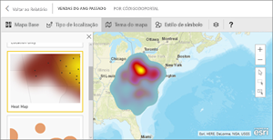
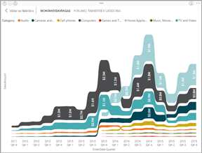
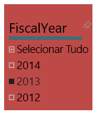
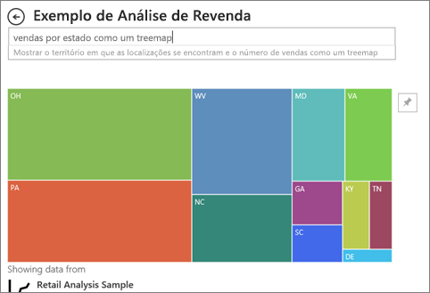

# Tipos de visualização no Power BI
Encontrará visualizações em relatórios, dashboards, aplicações e Perguntas e Respostas. Alguns destes tipos de visualização estão incorporados no Power BI e alguns são *elementos visuais personalizados*. Os elementos visuais personalizados são criados fora do Power BI e permitem que os *designers de relatórios* os adicionem a aplicações, dashboards e relatórios do Power BI. 

Este artigo é uma descrição geral das visualizações incorporadas no Power BI.  Estas são as visualizações que encontrará com mais frequência. 

> [!NOTE]
> Para saber mais sobre elementos visuais personalizados, procure-os na secção **Power BI visuals** (Elementos visuais do Power BI) do [Microsoft AppSource](https://appsource.microsoft.com/marketplace/apps?product=power-bi-visuals). Para cada elemento visual, encontrará uma descrição, informações do criador e capturas de ecrã ou um vídeo. 

## Lista das visualizações disponíveis no Power BI
Todas estas visualizações podem ser encontradas em relatórios, dashboards e aplicações do Power BI e [especificadas nas Perguntas e Respostas](#qna). Para saber como interagir com visualizações, veja [Interagir com visualizações em relatórios, dashboards e aplicações](end-user-visualizations.md).

### Gráficos das áreas: Básica (em camadas) e Empilhada

O gráfico de área básica baseia-se no gráfico de linhas com a área entre o eixo e a linha preenchida. Os gráficos de área realçam a magnitude da alteração ao longo do tempo e podem ser utilizados para chamar a atenção para o valor total numa tendência. Por exemplo, os dados que representam o lucro ao longo do tempo podem ser representados num gráfico de área para realçar o lucro total.

### Gráficos de barras e colunas

 

Os gráficos de barras são o padrão para observar um valor específico em diferentes categorias.

### Cartões: número único

Os cartões de número único apresentam um único facto, um único ponto de dados. Por vezes, um único número é a coisa mais importante que pretende controlar no seu dashboard ou relatório do Power BI, como as vendas totais, a quota de mercado ano após ano ou o total de oportunidades.  

### Cartões: várias linhas

Os cartões de várias linhas apresentam um ou mais pontos de dados, um por linha.

### Gráficos de combinação

Um gráfico de combinação combina um gráfico de colunas e um gráfico de linhas. Combinar os dois gráficos em um, permite-lhe fazer uma comparação rápida dos dados. Os gráficos de combinação podem ter um ou dois eixos Y, por isso certifique-se de que analisa atentamente. 

Os gráficos de combinação são uma ótima opção:
- quando tem um gráfico de linhas e um gráfico de colunas com o mesmo eixo X.
- para comparar várias medidas com intervalos de valores diferentes
- para ilustrar a correlação entre duas medidas numa visualização
- para verificar se uma medida atende o destino definido pela outra medida
- para conservar o espaço da tela

### Gráficos em anel

Os gráficos em anel são semelhantes aos gráficos circulares.  Mostram a relação das partes com um todo. A única diferença é que o centro está em branco e permite ter espaço para uma etiqueta ou ícone.

### Gráficos de funil

Os funis ajudam a visualizar um processo que contém fases e itens que seguem uma sequência de uma fase para a seguinte.  Um exemplo é um processo de vendas que começa com oportunidades potenciais e termina com a realização da compra.

Por exemplo, um funil de vendas que controla os clientes por fases: Oportunidade Potencial > Oportunidade Potencial Qualificada > Potencial Interessado > Contrato > Fecho. Num relance, a forma do funil transmite a integridade do processo que está a controlar.
Cada fase do funil representa um ponto percentual do total. Portanto, na maioria dos casos, um gráfico de funil tem a forma de um funil – com a primeiro fase, sendo a maior e cada fase subsequente menor do que a antecessor. Um funil em forma de pêra também é útil - pode identificar um problema no processo. Mas, em geral, a primeira fase, a fase de "entrada", é a maior.

Os gráficos de funil são uma ótima opção:
- Quando os dados são sequenciais e movimentam-se em pelo menos 4 fases.
- Quando o número de "itens" na primeira for maior que o número na fase final.
- calcular o potencial (receita de vendas/negociações/etc.) por fases.
- calcular e controlar as taxas de conversão e retenção.
- revelar afunilamentos num processo linear.
- controlar o fluxo de trabalho do carrinho de compras.
- acompanhar o progresso e o sucesso das campanhas de publicidade/marketing.

### Gráficos de medidor

Um gráfico de medidor radial tem um arco circular e apresenta um único valor que acompanha o progresso em relação a um objetivo/KPI. O objetivo, ou o valor de destino, é representado pela linha (agulha). O progresso em relação a esse objetivo é representado pelo sombreado. E o valor que representa o progresso é mostrado em negrito dentro do arco. Todos os valores possíveis são distribuídos de forma uniforme ao longo do arco, do mínimo (valor mais à esquerda) para o máximo (valor mais à direita).

No exemplo acima, somos um revendedor de automóveis e controlamos a média de vendas da equipa por mês. O nosso objetivo é 140 e este valor é representado pela agulha preta. A média mínima possível de vendas é 0 e definimos o máximo como 200. O sombreado azul mostra que temos atualmente uma média de aproximadamente 120 vendas este mês. Felizmente, ainda temos outra semana para atingir o nosso objetivo.

Os medidores radiais são uma ótima opção para:
- mostrar o progresso para atingir um objetivo
- representar uma medida percentual, como um KPI
- mostrar a integridade de uma única medida
- mostrar informações que podem ser analisadas e compreendidas rapidamente

 ### Gráfico de principais influenciadores

Um gráfico de principais influenciadores apresenta os maiores contribuidores para um determinado resultado ou valor.

Os principais influenciadores são uma ótima opção para ajudá-lo a compreender os fatores que influenciam uma métrica principal. Por exemplo, *o que influencia os clientes a fazer uma segunda encomenda *ou* por que é que as vendas foram tão altas no último mês de junho*. 

### KPIs

Um KPI (Indicador Chave de Desempenho) é uma indicação visual que comunica a quantidade de progresso feito em relação a uma meta mensurável. 

Os KPIs são uma ótima opção:
- para medir o progresso (em que estou adiantado ou atrasado?)
- para medir a distância de um objetivo (quão adiantado ou atrasado estou?)

### Gráficos de linhas

Os gráficos de linhas enfatizam o formato geral de uma série inteira de valores, geralmente ao longo do tempo.

### Mapas: mapas básicos

Utilize um mapa básico para associar informações categóricas e quantitativas a localizações espaciais.

### Mapas: Mapas ArcGIS

A combinação de mapas ArcGIS com o Power BI leva o mapeamento além da apresentação de pontos num mapa, a um nível totalmente novo. As opções disponíveis para mapas de base, tipos de localização, temas, estilos de símbolos e camadas de referência cria belíssimas visualizações de mapas informativos. A combinação de camadas de dados autoritativas (como dados de censo) num mapa com análise espacial proporciona uma compreensão mais aprofundada dos dados na visualização.

### Mapas: mapas preenchidos (Coropleto)

Um mapa de manchas utiliza sombreado, tonalidade ou padrões para mostrar como um valor difere em proporção numa localização geográfica ou região. Exiba rapidamente estas diferenças relativas com sombreado que varia de claro (menos frequente/inferior) a escuro (mais frequente/mais).

### Mapas: mapas de formas

Os mapas de formas comparam regiões num mapa com cores. Ao contrário do elemento visual de mapa, os mapas de formas não podem mostrar localizações geográficas precisas de pontos de dados num mapa. Em vez disso, o seu objetivo principal é mostrar comparações relativas de regiões num mapa ao colori-los de forma diferente.

### Matriz

O elemento visual de matriz é um tipo de elemento visual de tabela (consulte "Tabela" abaixo) que suporta um esquema gradual. Muitas vezes, os designers de relatórios incluem matrizes em relatórios e dashboards para permitir que os utilizadores selecionem um ou mais elementos (linhas, colunas, células) na matriz para realçar de forma cruzada outros elementos visuais numa página de relatório.  

### Gráficos circulares

Os gráficos circulares mostram a relação das partes com um todo. 

### Gráfico do friso

Os gráficos do friso mostram que categoria de dados tem a classificação mais elevada (valor maior). Os gráficos de friso são uma forma eficaz de mostrar as alterações de classificação, com a classificação (valor) mais elevada sempre mostrada na parte superior de cada período temporal.

### Gráficos de dispersão, de bolhas e de pontos

Um gráfico de dispersão tem sempre dois eixos de valor para mostrar um conjunto de dados numéricos num eixo horizontal e outro conjunto de valores numéricos num eixo vertical. O gráfico mostra pontos na intersecção de um valor numérico de x e y e combina estes valores em pontos de dados individuais. Estes pontos de dados podem ser distribuídos de forma uniforme ou não pelo eixo horizontal, consoante os dados.

Um gráfico de bolhas substitui os pontos de dados por bolhas, sendo que o tamanho das bolhas representa uma dimensão adicional dos dados.

Um gráfico de pontos é semelhante a um gráfico de bolhas e a um gráfico de dispersão, exceto no facto de poder desenhar dados numéricos ou categóricos ao longo do eixo X.

### Dispersão de alta densidade

Por definição, a amostragem de dados de alta densidade é efetuada para criar visualizações reativas à interação com alguma rapidez. A amostragem de alta densidade utiliza um algoritmo que elimina pontos sobrepostos e garante que todos os pontos no conjunto de dados são representados no elemento visual. Não apresenta apenas uma amostra representativa dos dados.  

Isto garante a melhor combinação de capacidade de resposta, representação e preservação dos pontos importantes no conjunto geral dos dados.

### Segmentações

Uma segmentação de dados é um gráfico autónomo que pode ser utilizado para filtrar os outros elementos visuais na página. As segmentações de dados têm vários formatos diferentes (categoria, intervalo, data, etc.) e podem ser formatadas para permitir a seleção de apenas um, vários ou todos os valores disponíveis. 

As segmentações de dados são uma ótima opção para:
- apresentar os filtros mais utilizados ou importantes na tela do relatório para facilitar o acesso
- facilitar a apresentação do estado atual filtrado sem ter de abrir uma lista pendente
- filtrar por colunas desnecessárias e ocultas nas tabelas de dados
- criar relatórios mais objetivos ao colocar as segmentações de dados junto aos elementos visuais importantes

### Imagens autónomas

Uma imagem autónoma é um gráfico que foi adicionado a um relatório ou dashboard. 

### Tabelas

Uma tabela é uma grelha que contém dados relacionados numa série lógica de linhas e colunas. Também pode conter cabeçalhos e uma linha para totais. As tabelas funcionam bem com comparações quantitativas, onde pode observar vários valores para uma única categoria. Por exemplo, esta tabela apresenta cinco medidas diferentes para Categoria.

As tabelas são uma excelente opção:
- para ver e comparar dados detalhados e valores exatos (em vez de representações visuais)
- para apresentar dados num formato tabular
- para apresentar dados numéricos por categorias

### Treemaps

Os treemaps são gráficos de retângulos coloridos, em que o tamanho representa um valor.  Podem ser hierárquicos, com retângulos aninhados nos retângulos principais. O espaço dentro de cada retângulo é alocado com base no valor que está a ser medido. Além disso, os retângulos são organizados por tamanho da parte superior esquerda (maior) para a parte inferior direita (menor).

Os treemaps são uma ótima opção:
- para apresentar grandes quantidades de dados hierárquicos
- quando um gráfico de barras não puder lidar efetivamente com um grande número de valores
- para mostrar as proporções entre cada parte e o todo
- para mostrar o padrão da distribuição da medida em cada nível das categorias na hierarquia
- para mostrar atributos com a codificação de cor e tamanho
- para identificar padrões, valores atípicos, colaboradores mais importantes e exceções

### Gráficos de cascata

O gráfico de cascata mostra um total parcial, conforme os valores são adicionados ou subtraídos. É útil para entender como um valor inicial (por exemplo, a receita líquida) é afetado por uma série de alterações positivas e negativas.

As colunas são codificadas para que possa identificar rapidamente os aumentos e diminuições. Muitas vezes, as colunas de valores iniciais e finais começam no eixo horizontal, enquanto os valores intermediários são colunas flutuantes. Devido a essa "aparência", os gráficos de cascata também são chamados de gráficos de ponte.

Os gráficos de cascata são uma ótima opção:
- quando houver alterações de medida numa série de tempo ou categorias diferentes
- para auditar as principais alterações que contribuem para o valor total
- para traçar o lucro anual da empresa, mostrando várias origens de receita e chegar ao lucro total (ou perda).
- para ilustrar o início e final do número de funcionários da sua empresa num ano
- para visualizar a quantidade de dinheiro ganho e gasto em cada mês, e o saldo parcial da sua conta.

## Informe as Perguntas e Respostas sobre qual a visualização a utilizar
Ao escrever consultas em linguagem natural com as Perguntas e Respostas do Power BI, pode especificar o tipo de visualização na consulta.  Por exemplo:

"***vendas por estado como um mapa de árvore***"

## Próximos passos
[Interagir com visualizações em relatórios, dashboards e aplicações](end-user-visualizations.md)    
[A referência correta do elemento visual de sqlbi.com](http://www.sqlbi.com/wp-content/uploads/videotrainings/dashboarddesign/visuals-reference-may2017-A3.pdf)