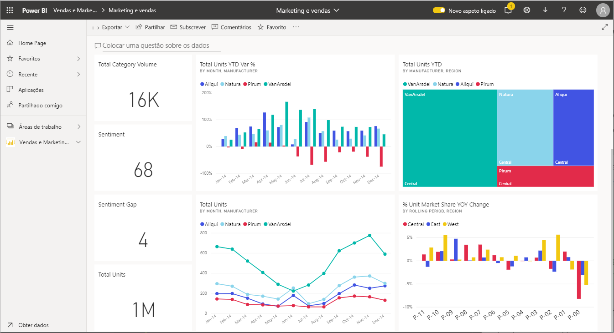

# Interagir com elementos visuais em relatórios, dashboards e aplicações

De forma muito simplificada, uma ***visualização*** (ou *elemento visual*) é um tipo de gráfico criado pelos *estruturadores* do Power BI que utilizam os dados dos relatórios e dos conjuntos de dados. 

Os elementos visuais podem ser encontrados em dashboards e relatórios, podendo ainda ser criados imediatamente através das Perguntas e Respostas do Power BI. Quando um designer cria um elemento visual num relatório, pode *afixá-lo* num dashboard. Um [elemento visual num dashboard chama-se um *mosaico*](end-user-tiles.md). Este dashboard tem oito mosaicos. 

> [!TIP]
> Recomendamos que leia primeiro o tópico de descrição geral [conceitos básicos do Power BI para *consumidores*](end-user-basic-concepts.md) antes de ler este conteúdo mais detalhado.

## O que posso fazer com os elementos visuais?

Os elementos visuais são criados por *estruturadores* dos relatórios e dos dashboards e são partilhados com os *consumidores*. Como consumidor, tem muitas opções para interagir com os elementos visuais para que possa revelar informações e tomar decisões condicionadas por dados empresariais. A maioria destas opções está listada na tabela abaixo, com ligações para instruções passo a passo.

Para muitas destas opções, o seu administrador ou o *designer* pode desativar a sua capacidade de ver ou utilizar estas funcionalidades. Algumas destas funcionalidades só funcionam em elementos visuais específicos.  Se tiver perguntas, contacte o seu administrador ou o proprietário do relatório ou dashboard. Para encontrar o proprietário, selecione a lista pendente do dashboard ou relatório. 

> [!IMPORTANT]
> Mas antes de tudo, uma palavra sobre as perguntas e respostas. As perguntas e respostas são a ferramenta de pesquisa de linguagem natural do Power BI. Escreva uma pergunta usando uma linguagem natural e a funcionalidade de Perguntas e Respostas responde à pergunta através de um elemento visual. A funcionalidade de Perguntas e Respostas é uma forma de os consumidores poderem criar os seus próprios elementos visuais. No entanto, não é possível guardar os elementos visuais que criar com as Perguntas e Respostas. No entanto, se houver algo específico que pretende saber a partir dos dados e o estruturador não o tiver incluído num relatório ou dashboard, as perguntas e respostas serão uma ótima opção. Para saber mais sobre as perguntas e respostas, veja [Perguntas e respostas para os consumidores](end-user-q-and-a.md).

|Tarefa  |Num dashboard  |Num relatório  | Nas perguntas e respostas
|---------|---------|---------|--------|
|[Adicionar comentários a um elemento visual ou iniciar uma conversa com os colegas sobre o elemento visual](end-user-comment.md).     |  sim       |   sim      |  não  |
|[Abrir e explorar o relatório em que o elemento visual foi criado](end-user-tiles.md).     |    sim     |   na      |  não |
|[Ver uma lista dos filtros e segmentações de dados que afetam o elemento visual](end-user-report-filter.md).     |    não     |   sim      |  sim |
|[Abrir e explorar um elemento visual nas Perguntas e Respostas (se o *designer* tiver utilizado as Perguntas e Respostas para criar o elemento visual)](end-user-q-and-a.md).     |   sim      |   na      |  na  |
|[Criar um elemento visual nas Perguntas e Respostas (não poderá guardá-lo para fins de exploração)](end-user-q-and-a.md).     |   sim      |   se o designer tiver adicionado as Perguntas e Respostas ao relatório      |  sim  |
|[Pedir ao Power BI para procurar factos interessantes ou tendências](end-user-insights.md) nos dados do elemento visual.  Estes elementos visuais gerados automaticamente chamam-se *informações*.     |    sim     |  para todo o relatório, não por elemento visual       | não   |
|[Ver apenas um elemento visual de cada vez, através do *modo* de detalhe](end-user-focus.md).     | sim        |   sim      | na  |
|[Ver quando é que o elemento visual foi atualizado pela última vez](end-user-fresh.md).     |  sim       |    sim     | na  |
|[Ver apenas um elemento visual de cada vez, sem limites ou barras de navegação, através do modo de *ecrã inteiro* ou do modo de *detalhe*](end-user-focus.md).     |   sim      |  sim       | por predefinição  |
|[Imprima](end-user-print.md).     |  sim       |   sim      | não  |
|[Examinar o elemento visual ao adicionar e modificar os filtros.](end-user-report-filter.md)     |    não     |   sim      | não  |
|Passar o cursor sobre um elemento visual para revelar outros detalhes e sugestões de ferramentas.     |    sim     |   sim      | sim  |
|[Fazer a filtragem cruzada e o realce cruzado de outros elementos visuais na página.](end-user-interactions.md)    |   não      |   sim      | na  |
|[Mostrar os dados utilizados para criar o elemento visual](end-user-show-data.md).     |  não       |   sim      | não  |
| [Alterar a forma como o elemento visual é ordenado](end-user-change-sort.md). | não  | sim  | pode alterar a ordem ao reformular a pergunta  |
| Adicionar um destaque ao elemento visual. | não  | sim  |  não |
| [Exportar para o Excel.](end-user-export.md) | sim | sim | não|
| [Criar um alerta](end-user-alerts.md) para notificá-lo quando um valor exceder um limiar definido.  | sim  | não  | não |
| [Aplicar filtros cruzados e realces cruzados nos outros elementos visuais na página](end-user-report-filter.md).  | não      | sim  | não  |
| [Explorar um elemento visual que tem uma hierarquia](end-user-drill.md).  | não  | sim   | não |

## Próximos passos
Regressar a [Conceitos básicos para consumidores](end-user-basic-concepts.md)    
[Selecionar um elemento visual para abrir um relatório](end-user-report-open.md)    
[Tipos de elementos visuais disponíveis no Power BI](end-user-visual-type.md)