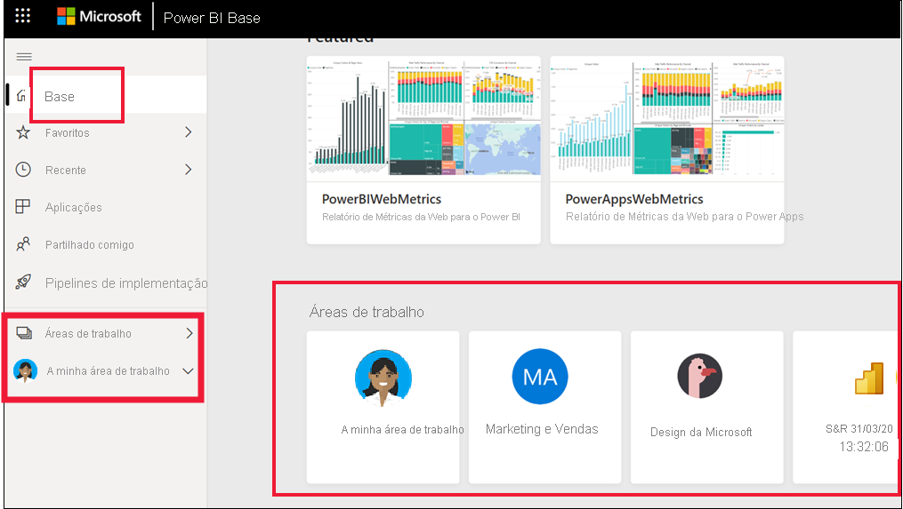
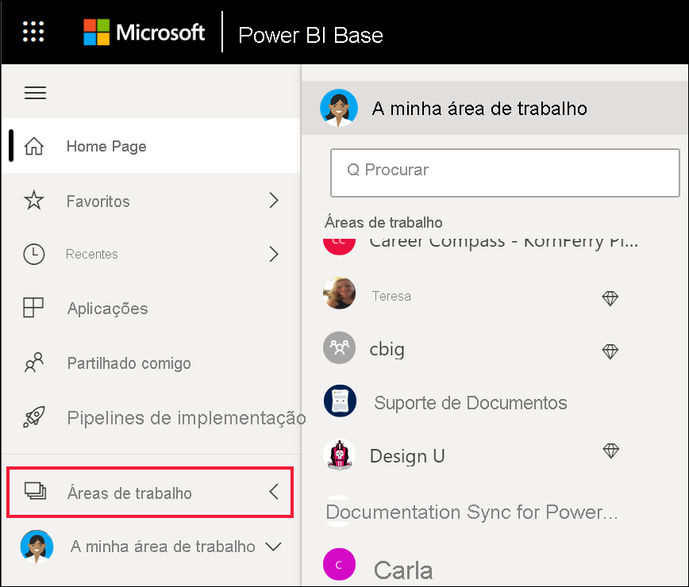

# Colaborar em áreas de trabalho

 As *áreas de trabalho* são locais onde colabora com os colegas sobre conteúdos específicos. As áreas de trabalho são criadas pelos *designers* do Power BI para incluírem coleções de dashboards e relatórios. O designer pode partilhar a área de trabalho com colegas. Os designers também podem agrupar uma coleção de dashboards e relatórios numa *aplicação* e distribuí-la por toda a comunidade, pela respetiva organização ou por pessoas ou grupos específicos. Determinados tipos de aplicações, chamadas *aplicações de modelo* , criam uma área de trabalho quando a aplicação é instalada. [Saiba mais sobre aplicações](end-user-apps.md). 

 Todos os que utilizam o serviço Power BI também têm uma **A minha área de trabalho** .  A minha área de trabalho é o seu sandbox pessoal onde pode criar conteúdos para si mesmo.

 Pode ver as suas áreas de trabalho no Power BI **Home Page** ou ao selecionar **Áreas de Trabalho** a partir do seu painel de navegação.

 

## Tipos de áreas de trabalho
**A Minha Área de Trabalho** armazena todos os conteúdos que criou e de que é proprietário. Considere-a a sua sandbox pessoal ou uma área de trabalho para o seu próprio conteúdo. Para muitos *utilizadores empresariais* do Power BI, **A minha área de trabalho** permanece vazia porque a tarefa não envolve criar novos conteúdos. Por definição, os *utilizadores empresariais* consomem dados criados por outros utilizadores e utilizam esses dados para tomar decisões empresariais. Se vir que está a criar conteúdos, considere ler os [artigos do Power BI para designers](../create-reports/index.yml).

As **áreas de trabalho** incluem todos os conteúdos da aplicação específica. Quando um *designer* cria uma aplicação, este agrupa todos os conteúdos necessários para tirar proveito dessa aplicação. Os conteúdos podem incluir dashboards, relatórios e conjuntos de dados. Nem todas as aplicações irão conter estes três elementos de conteúdos. A aplicação pode conter apenas um dashboard ou três dashboards de cada tipo de conteúdo, ou mesmo 20 relatórios. Tudo depende de o que o *designer* incluir na aplicação. Normalmente, as áreas de trabalho de aplicações partilhadas com *utilizadores empresariais* não incluem os conjuntos de dados.

A área de trabalho Vendas de figos abaixo contém três relatórios e um dashboard. 

## Permissões nas áreas de trabalho

As permissões de acesso determinam as ações que pode fazer numa área de trabalho, para que as equipas possam colaborar.  Ao conceder acesso a uma nova área de trabalho, os *designers* adicionam indivíduos ou grupos a uma das funções da área de trabalho: **Visualizador** , **Membro** , **Contribuidor** ou **Administrador** . 

Enquanto *utilizador empresarial* do Power BI, irá normalmente interagir nas áreas de trabalho com a função **Visualizador** . No entanto, um *designer* também poderia atribuir-lhe a função de **Membro** ou **Contribuidor** . A função Visualizador permite-lhe ver e interagir com os conteúdos (dashboards, relatórios, aplicações) criados por outros e partilhados consigo. Além disso, como a função Visualizador não consegue aceder ao conjunto de dados subjacente, é uma forma segura de interagir com os conteúdos e não ter de se preocupar com a possibilidade de "danificar" os dados subjacentes.

Para obter uma lista detalhada do que pode fazer como *utilizador empresarial* com a função Visualizador, veja [funcionalidades do Power BI para utilizadores empresariais](end-user-features.md).

### Permissões e funções de áreas de trabalho

Veja a seguir as capacidades das quatro funções: Administradores, Membros, Contribuidores e Visualizadores. Todas estas funcionalidades, exceto visualizar e interagir, exigem uma licença do Power BI Pro.

[!INCLUDE[power-bi-workspace-roles-table](../includes/power-bi-workspace-roles-table.md)]

## Licenciamento, áreas de trabalho e capacidade
O licenciamento também desempenha um papel na determinação do que pode e não pode fazer numa área de trabalho. Muitas funcionalidades exigem que o utilizador tenha uma licença do Power BI *Pro* ou que a área de trabalho seja armazenada na capacidade Premium. 

Os *utilizadores empresariais* trabalham frequentemente com uma licença gratuita. [Saiba mais sobre o licenciamento](end-user-license.md). Se o conteúdo não estiver armazenado na capacidade Premium, o utilizador empresarial não terá acesso.

Se a área de trabalho estiver armazenada na capacidade Premium, os *utilizadores empresariais* poderão ver e interagir com os conteúdos nessa área de trabalho. Um ícone de diamante identifica as áreas de trabalho que estão armazenadas na capacidade Premium.

 Para saber mais, veja [Qual é a minha licença?](end-user-license.md).

## Próximos passos
* [Aplicações no Power BI](end-user-apps.md)    

* Perguntas? [Experimente perguntar à Comunidade do Power BI](https://community.powerbi.com/)

