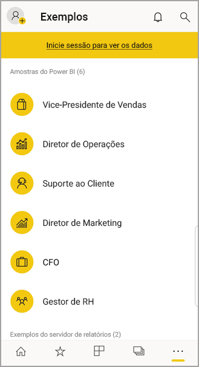

# Introdução à aplicação móvel Power BI em dispositivos Android
A aplicação Android para Microsoft Power BI dá a experiência BI móvel para Power BI, Power BI Report Server e Reporting Services. Veja e interaja com os dashboards da sua empresa no local e na cloud em qualquer lugar, com acesso móvel em direto e tátil. Explore os dados nos dashboards e partilhe com os seus colegas em e-mails e mensagens de texto. 

Crie relatórios do Power BI no Power BI Desktop e publique-os:

* [Publique-os no serviço Power BI](../../power-bi-overview.md) e crie dashboards.
* [Publique-os no local no Power BI Report Server](../../report-server/quickstart-create-powerbi-report.md).

Em seguida, na aplicação Power BI para Android, interaja com os seus dashboards e relatórios, seja no local ou na cloud.

Descubra as [novidades nas aplicações móveis do Power BI](../../mobile-whats-new-in-the-mobile-apps.md).

## Pré-requisitos

### Obter a aplicação

[Transfira a aplicação do Power BI para Android](http://go.microsoft.com/fwlink/?LinkID=544867) no Google Play.
  
O Power BI pode ser executado em vários dispositivos Android com o sistema operativo Android 5.0 ou posterior. Para verificar no seu dispositivo, aceda a **Definições** > **Acerca do dispositivo** > **Versão do Android**. 

**Iniciar quando abrir a aplicação**    
Mesmo sem se inscrever ou sem se ligar, depois de abrir a aplicação é possível percorrer as páginas de entrada para obter uma visão geral rápida daquilo que pode fazer com a aplicação Power BI no dispositivo Android. Toque em **Ignorar** para ver e explorar os exemplos e obter experiência prática com a aplicação. Pode [voltar aos exemplos](mobile-android-app-get-started.md#try-the-power-bi-and-reporting-services-samples) sempre que quiser na página inicial dos relatórios.

Descubra as [novidades nas aplicações móveis do Power BI](../../mobile-whats-new-in-the-mobile-apps.md).

## Inscrever-se no serviço Power BI na Web
Se ainda não se inscreveu, aceda ao [serviço Power BI http://powerbi.com/)](http://powerbi.com/) para se inscrever e obter a conta e criar e armazenar dashboards e relatórios e reunir dados. Em seguida, entre no Power BI a partir do seu dispositivo Android para ver os seus dashboards em qualquer local.

1. No serviço do Power BI, toque em [Inscrever-se](http://go.microsoft.com/fwlink/?LinkID=513879) para criar uma conta do Power BI.
2. Comece a [criar os seus próprios dashboards e relatórios](../../service-get-started.md).

## Introdução à aplicação Power BI no seu dispositivo
1. No seu dispositivo Android, no ecrã inicial, abra a aplicação Power BI para Android.
   
   
2. Para ver os seus dashboards e relatórios do Power BI, toque em **Power BI**.  
   
   Se receber uma mensagem a indicar que o Power BI não consegue iniciar a sua sessão, consulte ["Não foi possível autenticar porque o seu certificado SSL empresarial não é fidedigno"](mobile-android-app-error-corporate-ssl-account-is-untrusted.md) para obter detalhes sobre como resolver o problema.

   Para ver os relatórios e KPIs do Power BI Report Server e do Reporting Services, toque em **Report Server**.
   
   

## Experimentar os exemplos do Power BI e do Reporting Services
Mesmo sem se inscrever, pode experimentar os exemplos do Power BI e do Reporting Services. Depois de transferir a aplicação, pode ver os exemplos ou começar. Volte para os exemplos sempre que quiser, na página inicial dos dashboards.

### Exemplos do Power BI
Pode ver e interagir com os exemplos de dashboards do Power BI, mas há algumas coisas que não pode fazer com estes. Não pode abrir os relatórios correspondentes aos dashboards, partilhar os exemplos com outras pessoas ou torná-los favoritos.

1. Toque no botão de navegação global  no canto superior esquerdo.
2. Toque em **Definições** > **Descubra os nossos exemplos** e, em seguida, selecione uma função e explore o dashboard de exemplo dessa função.  
   
   

### Exemplos de relatórios móveis do Reporting Services
1. Toque no botão de navegação global  no canto superior esquerdo.
2. Toque em **Exemplos do Reporting Services** e, em seguida, abra a pasta Relatórios de Retalho ou Relatórios de Vendas para explorar os respetivos KPIs e relatórios móveis.
   
   

## Procurar um dashboard ou relatório
* Toque na lupa no canto superior direito e, em seguida, escreva o termo a procurar.
  
    
  
    Por predefinição, procura todos os dashboards e relatórios, mas pode simplesmente procurar um ou outro.

## Procurar os seus conteúdos nas aplicações móveis do Power BI
Os seus dashboards e relatórios são armazenados em locais diferentes nas aplicações móveis do Power BI, consoante a sua proveniência. Saiba mais sobre [encontrar conteúdos em aplicações móveis](../../mobile-apps-quickstart-view-dashboard-report.md). Além disso, pode sempre procurar qualquer elemento que tiver nas aplicações móveis do Power BI. 

## Ver os seus dashboards, KPIs e relatórios favoritos
Na página Favoritos nas suas aplicações móveis, vê todos os seus dashboards favoritos do Power BI, juntamente com KPIs e relatórios do Power BI Report Server e do Reporting Services. Quando tornar um dashboard *favorito* na aplicação móvel do Power BI, pode aceder ao mesmo em todos os seus dispositivos, incluindo o serviço Power BI no seu browser. 

* Toque em **Favoritos**.
  
   
  
   Os seus favoritos do Power BI e os seus favoritos do portal Web do Power BI Report Server e do Reporting Services encontram-se nesta página.
  
   

Saiba mais sobre os [favoritos nas aplicações móveis do Power BI](mobile-apps-favorites.md).

## Suporte empresarial para aplicações móveis do Power BI
As organizações podem utilizar o Microsoft Intune para gerir dispositivos e aplicações, incluindo as aplicações móveis do Power BI para Android e iOS.

O Microsoft Intune permite às organizações controlar elementos, como exigir um PIN de acesso, controlar como os dados são processados pela aplicação e até encriptar dados de aplicações quando a aplicação não está a ser utilizada.

> [!NOTE]
> Se utiliza a aplicação móvel do Power BI no seu dispositivo Android e a sua organização configurou o MAM do Microsoft Intune, a atualização de dados em segundo plano está desativada. Da próxima vez que entrar na aplicação, o Power BI atualiza os dados do serviço Power BI na Web.
> 
> 

Saiba mais sobre [configurar aplicações móveis do Power BI para Android com o Microsoft Intune](../../service-admin-mobile-intune.md). 

## Próximos passos
Eis outras coisas que pode fazer na aplicação para dispositivo Android do Power BI com dashboards e relatórios no Power BI, e relatórios e KPIs no portal Web do Power BI Report Server ou Reporting Services.

### Dashboards e relatórios do Power BI
* Veja [as suas aplicações](../../service-create-distribute-apps.md).
* Veja os seus [dashboards](../../mobile-apps-view-dashboard.md).
* Explore os [mosaicos nos dashboards](../../mobile-tiles-in-the-mobile-apps.md).
* Abra [relatórios do Power BI](../../mobile-reports-in-the-mobile-apps.md).
* Veja [as suas aplicações](../../service-create-distribute-apps.md).
* [Anote e partilhe mosaicos](mobile-annotate-and-share-a-tile-from-the-mobile-apps.md).
* Partilhe [dashboards](../../mobile-share-dashboard-from-the-mobile-apps.md).
* [Leia um código QR do Power BI](../../mobile-apps-qr-code.md) com o seu telemóvel Android para abrir um relatório ou mosaico de dashboard relacionado. 
* Veja as [notificações sobre atualizações à sua conta do Power BI](../../mobile-apps-notification-center.md), como os dashboards que os colegas partilham consigo.

### Relatórios e KPIs nos portais Web do Power BI Report Server e Reporting Services
* [Veja relatórios e KPIs no portal Web](mobile-app-ssrs-kpis-mobile-on-premises-reports.md) na aplicação móvel do Power BI para dispositivos Android.
* Crie [KPIs no portal Web](https://docs.microsoft.com/sql/reporting-services/working-with-kpis-in-reporting-services).
* Crie [relatórios no Power BI Desktop e publique-os no portal Web do Power BI Report Server](../../report-server/quickstart-create-powerbi-report.md)

### Veja também
* [Transfira a aplicação Android](http://go.microsoft.com/fwlink/?LinkID=544867) na loja de aplicações Android.
* [O que é o Power BI?](../../power-bi-overview.md)
* Perguntas? [Experimente perguntar à Comunidade do Power BI](http://community.powerbi.com/)

