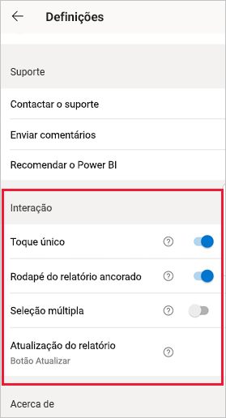
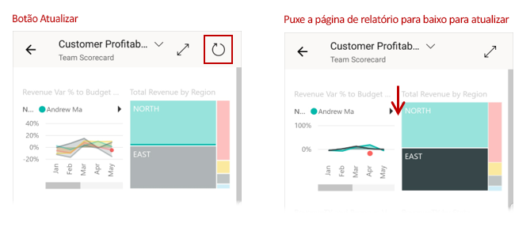
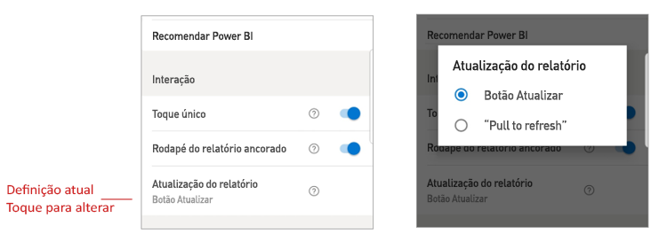

# Configurar definições de interação em relatórios

## Overview (Descrição geral)

A aplicação móvel do Power BI tem uma série de definições de "interação" configuráveis que lhe permitem controlar a forma como interage com os seus dados e definir o comportamento de determinados elementos na aplicação. A tabela abaixo mostra as definições de interação que estão atualmente disponíveis e os dispositivos que as têm.

| Definição | Telemóvel Android | iPhone | Tablet Android  | iPad |
|---------|:-:|:-:|:-:|:-:|
| [Interação com toque único ou duplo em elementos visuais de relatórios](#single-tap) |✔|✔|||
| [Seleção múltipla versus seleção única de pontos de dados nos elementos visuais do relatório](#multi-select) |✔|✔|✔|✔|
| [Rodapé do relatório ancorado versus dinâmico](#docked-report-footer) |✔|✔|||
| [Atualização do relatório por botão versus “pull to refresh” (puxar para atualizar)](#report-refresh) |✔||||

Para aceder às definições de interação, toque na imagem do perfil para abrir o [painel lateral](./mobile-apps-home-page.md#header), selecione **Definições** e procure a secção **Interação**.

As definições de interação são descritas nas secções abaixo.

## Definições de interação

### Toque único
Quando transfere a aplicação móvel do Power BI, a mesma encontra-se definida para interação com toque único. Isto significa que, quando toca num elemento visual para fazer algo, como selecionar um item de segmentação de dados, realces cruzados, clicar numa ligação ou num botão, etc., o toque seleciona o elemento visual e executa a ação que pretende.

Se preferir, pode desativar a interação com toque único. Tem também a interação com duplo toque. Na interação com duplo toque, começa por tocar num elemento visual para selecionar o mesmo, e depois toca novamente no elemento visual para executar a ação pretendida.

### Seleção múltipla

A opção de seleção múltipla torna possível selecionar pontos de dados múltiplos numa página de relatório. Quando a seleção múltipla está ligada, cada ponto de dados em que toca é adicionado a outros pontos de dados selecionados, com os resultados combinados automaticamente realçados em todos os elementos visuais da página. Quando a seleção múltipla está desligada, quando toca para selecionar um ponto de dados, a nova seleção substitui a seleção atual.

Para cancelar a seleção de um ponto de dados, toque novamente.

>[!NOTE]
>A seleção múltipla não é suportada nos elementos visuais do Power BI.
>
>O modo de seleção múltipla será suportado no Power BI Report Server na próxima versão do Report Server.

### Rodapé do relatório ancorado

A definição de rodapé do relatório ancorado determina se o rodapé do relatório permanece ancorado (ou seja, fixo e sempre visível) na parte inferior do relatório ou se é ocultado e reaparece com base nas suas ações no relatório, como o deslocamento.

Em telemóveis Android, a predefinição de rodapé de relatório ancorado é **ativado**, o que significa que o rodapé do relatório fica ancorado e sempre visível na parte inferior do relatório. Coloque a definição em **desativado** se preferir um rodapé de relatório dinâmico que apareça e desapareça, consoante as suas ações no relatório.

### Atualização do relatório

A definição de atualização do relatório define a forma como inicia atualizações em relatórios. Pode optar por ter um botão de atualização em todos os cabeçalhos de relatórios ou utilizar a ação de puxar para atualizar (puxar ligeiramente de cima para baixo) na página do relatório para atualizar o mesmo. A imagem abaixo ilustra as duas alternativas. 

Em telemóveis Android, é adicionado um botão de atualização por predefinição.

Para alterar a definição de atualização do relatório, aceda ao item de atualização de relatórios nas definições de interação. Será mostrada a definição atual. Toque no valor para abrir um pop-up onde poderá escolher um novo valor.

## Configuração remota

Podem também ser configuradas interações remotamente por um administrador, através de uma ferramenta MDM com um ficheiro de configuração de aplicação. Desta forma, é possível uniformizar a experiência de interação dos relatórios em toda a organização ou para grupos específicos de utilizadores na organização. Veja [Configurar interação com a gestão de dispositivos móveis](./mobile-app-configuration.md) para obter detalhes.

## Passos seguintes
* [Interagir com relatórios](./mobile-reports-in-the-mobile-apps.md#interact-with-reports)
* [Configurar interação com a gestão de dispositivos móveis](./mobile-app-configuration.md)
