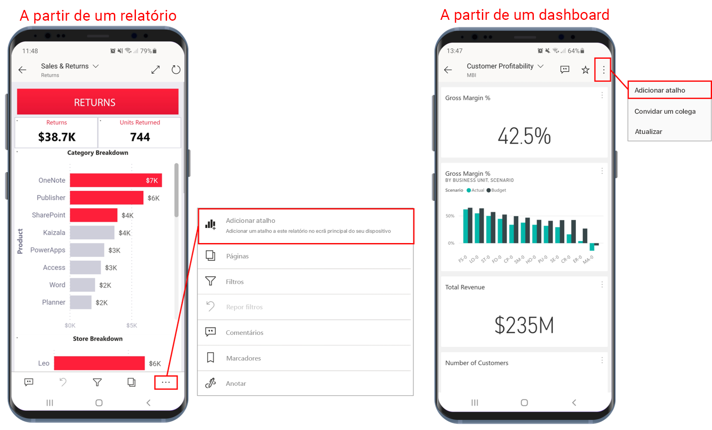
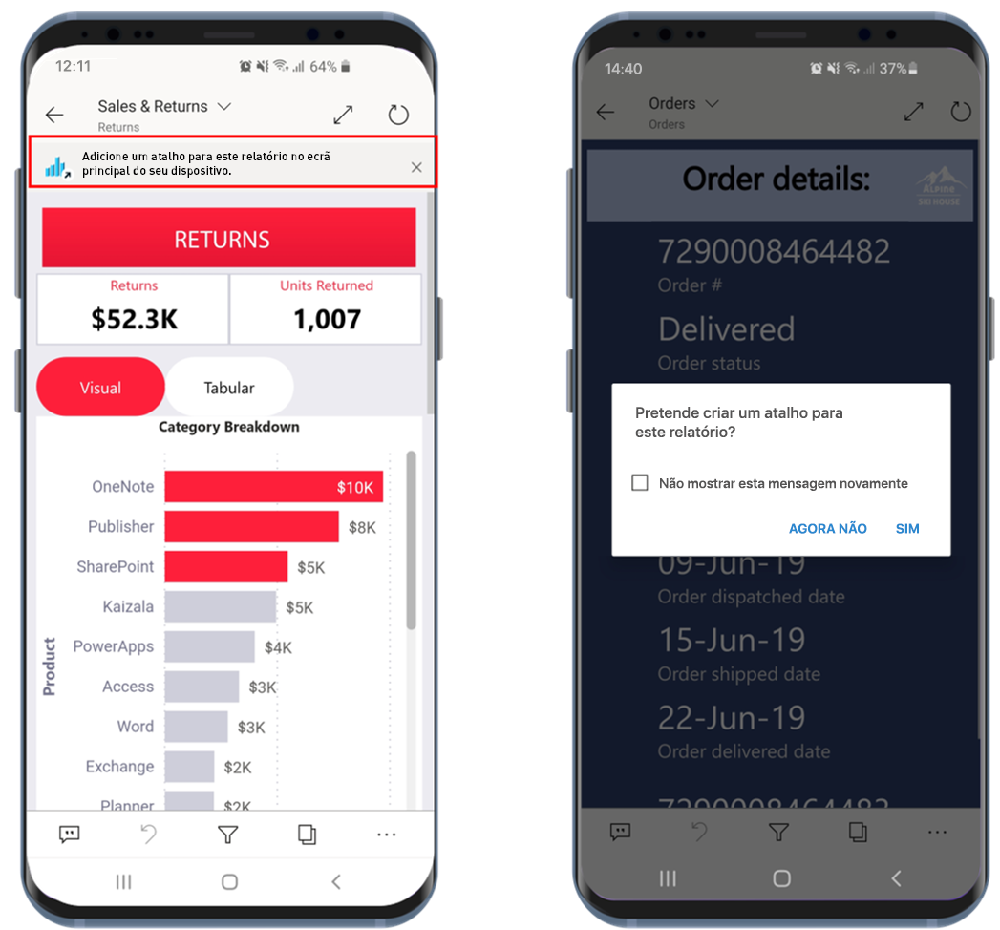
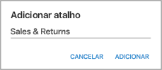
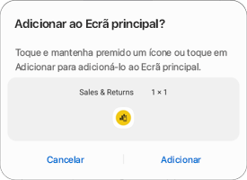
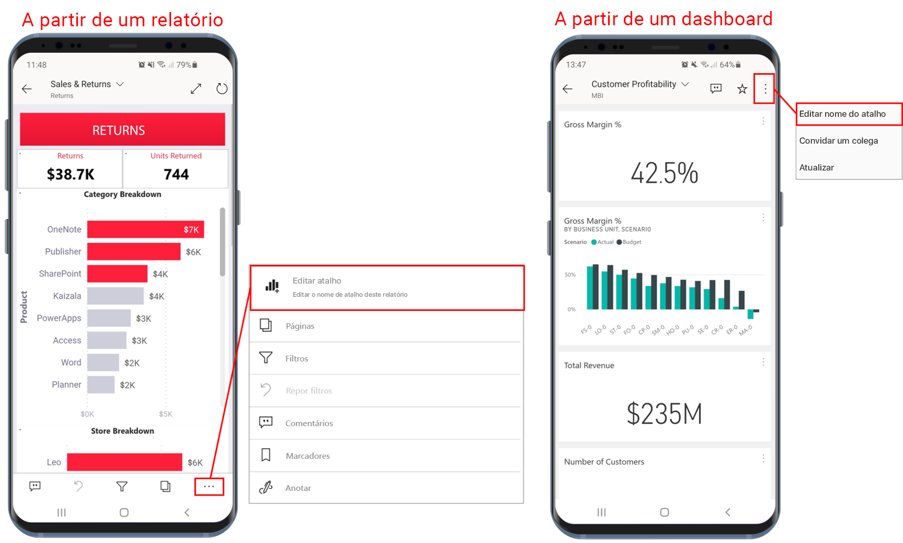
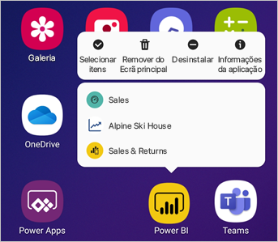

# Utilizar atalhos da aplicação no Android na aplicação Power BI para Android

Aplica-se a:

|  |  |
|:--- |:--- |
| Telemóveis Android |Tablets Android |

A aplicação móvel Power BI para Android oferece duas formas simples de aceder aos relatórios ou dashboards de que necessita, sem ter de navegar pela aplicação: **atalhos do ecrã principal do dispositivo** e **atalhos do iniciador de aplicações**.
 * **Atalhos do ecrã principal do dispositivo**: pode criar um atalho para qualquer relatório ou dashboard e afixá-lo ao ecrã principal do seu dispositivo. O relatório ou dashboard não tem de estar numa das suas áreas de trabalho. Também pode criar atalhos para relatórios e dashboards que estejam dentro de aplicações ou mesmo para relatórios ou dashboards localizados num inquilino externo (B2B).
 * **Atalhos do iniciador de aplicações**: pode aceder diretamente aos relatórios e dashboards vistos com frequência ao tocar sem soltar no ícone de iniciador de aplicações no ecrã principal do seu dispositivo para abrir o iniciador de aplicações. Um menu de acesso rápido fornece atalhos para três itens vistos com frequência. Estes itens mudam ocasionalmente. A aplicação móvel Power BI monitoriza os itens que vê com frequência e altera os atalhos de acordo com os seus hábitos.

 >[!NOTE]
 >Os atalhos da aplicação no Android estão disponíveis a partir do Android 8 e superior.

## Criar um atalho para qualquer relatório ou dashboard

Pode criar atalhos para qualquer relatório ou dashboard.

1. No menu de ações, clique em **Mais opções...** e selecione **Adicionar atalho**.

   

   Além disso, se a aplicação Power BI vir que está a aceder a um item com frequência, irá sugerir que crie um atalho para o item. Tal ocorre de duas formas:
   * Em dashboards e relatórios vistos com frequência, a opção **Adicionar atalho** aparecerá numa faixa quando abrir o item.
   * Se utilizar com frequência uma ligação para aceder a um relatório (por exemplo, a partir de um e-mail partilhado, anotação, etc.), depois de utilizar algumas vezes esta ligação, será aberta uma janela a perguntar se quer criar um atalho. A opção **Sim** irá abrir a caixa de diálogo **Adicionar atalho** (ver abaixo) e a opção **Agora não** continuará a direcioná-lo para o item a que estava a tentar aceder.
   
   Estas duas experiências são ilustradas abaixo.

   

 1. Será aberta uma caixa de diálogo **Adicionar atalho** com o nome do seu item. Pode editar o nome se quiser. Quando tiver terminado, toque em **ADICIONAR**.

    

1. Ser-lhe-á pedido para confirmar se quer adicionar o atalho. Toque em **ADICIONAR** para adicionar o atalho ao ecrã principal do seu dispositivo.

   

   Será adicionado um ícone de relatório ou dashboard de atalho ao ecrã principal do seu dispositivo com o nome introduzido.

   

## Editar o nome do atalho

Para editar o nome de um atalho, no menu de ações, selecione **Mais opções...** e, em seguida, selecione **Editar nome do atalho**

 

## Utilizar o iniciador de aplicações móveis do Power BI para aceder a conteúdos vistos com frequência

Pode utilizar o iniciador de aplicações móveis do Power BI para aceder diretamente aos itens acedidos com frequência.

Toque sem soltar no iniciador de aplicações para apresentar um menu de acesso rápido para itens vistos com frequência. Em seguida, toque num atalho para abrir o item pretendido.

Pode criar um atalho permanente para qualquer um dos itens listados apenas ao arrastar o ícone de atalho pretendido para o ecrã principal do seu dispositivo.

## Próximos passos
* [Localizar e aceder a conteúdos com a Pesquisa Google](mobile-app-find-access-google-search.md)
* Se estiver no iOS e estiver à procura de atalhos do Siri, veja [Utilizar Atalhos do Siri na Aplicação Power BI Mobile para iOS](mobile-apps-ios-siri-shortcuts.md).
* [Favoritos nas aplicações móveis do Power BI](mobile-apps-favorites.md)
