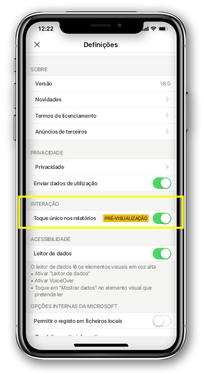

# Configurar a interação em relatórios para toque único ou duplo
Aplica-se a:

|  |  | 
|:--- |:--- |
| iPhones |Telemóveis Android |

Um relatório do Power BI é uma vista interativa dos seus dados, com visuais que representam diferentes descobertas e informações obtidas por meio desses dados.

Pode configurar o modo de interação com os seus dados. Pode decidir se pretende uma interação de toque único ou duplo.

* No caso da interação de toque duplo, um elemento visual é selecionado com o primeiro toque. A ação seguinte, como a seleção de itens em segmentações de dados, o realce cruzado ou o clique numa ligação ou botão, só é realizada com o segundo toque.

* Com uma interação de toque único, um toque seleciona o elemento visual e executa a ação.

A partir das versões do Power BI 18.0 para iOS e 112540 para Android, todas as novas instalações serão configuradas com o Toque único como comportamento predefinido.
Será sugerida a alteração para toque único aos utilizadores que já têm o Power BI instalado no telemóvel e pretendem fazer a atualização para estas novas versões.

## Alterar comportamento de interação

Para alterar o comportamento de interação, aceda às definições da aplicação e ative/desative a interação de toque único.

Este artigo aplica-se a relatórios de telemóveis e a relatórios no modo horizontal.

## Próximos passos
* [Ver e interagir com relatórios do Power BI otimizados para o seu telemóvel](mobile-apps-view-phone-report.md)
* Perguntas? [Experimente perguntar à Comunidade do Power BI](https://community.powerbi.com/)

