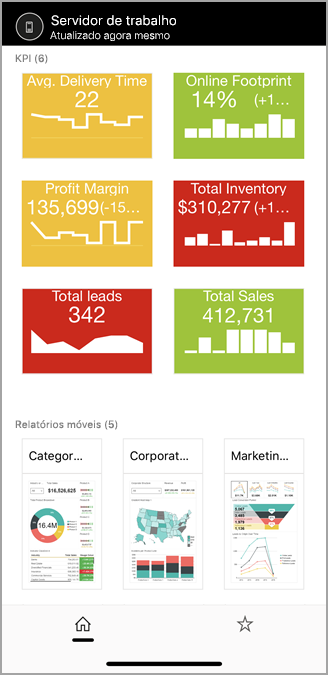
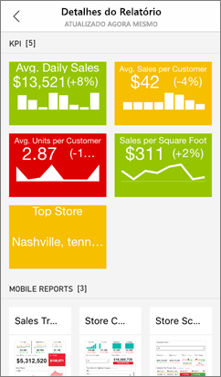
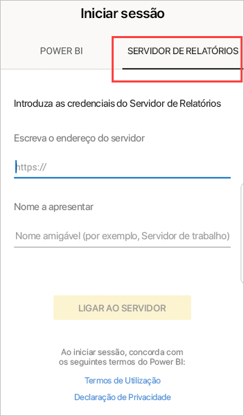
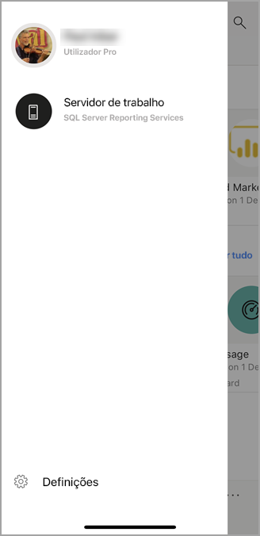
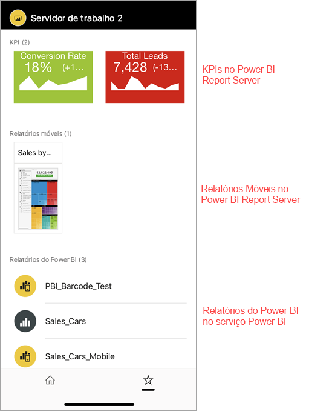

# Ver KPIs e relatórios no local do servidor de relatórios nas aplicações móveis do Power BI

As aplicações móveis do Power BI disponibilizam um acesso móvel, dinâmico e tátil às suas informações comerciais no local no Power BI Report Server e no SQL Server 2016 Reporting Services (SSRS).

Aplica-se a:

|  |  |  |  |
|:--- |:--- |:--- |:--- |
| iPhones |iPads |Telemóveis Android |Tablets Android |

## Comecemos pelo mais importante
**As aplicações móveis são o local onde pode ver os seus conteúdos do Power BI, não onde estes são criados.**

* O utilizador e outros criadores e relatórios na sua organização [criam relatórios do Power BI no Power BI Desktop e, em seguida, publicam-nos no portal Web do Power BI Report Server](../../report-server/quickstart-create-powerbi-report.md). 
* Pode criar [KPIs diretamente no portal Web](https://docs.microsoft.com/sql/reporting-services/working-with-kpis-in-reporting-services), organizá-los em pastas e marcar os seus favoritos para que os possa encontrar facilmente. 
* [Crie relatórios móveis do Reporting Services](https://docs.microsoft.com/sql/reporting-services/mobile-reports/create-mobile-reports-with-sql-server-mobile-report-publisher) com o SQL Server 2016 Enterprise Edition Mobile Report Publisher e publique-os no [portal Web do Reporting Services](https://docs.microsoft.com/sql/reporting-services/web-portal-ssrs-native-mode).  

Depois, nas aplicações móveis do Power BI, ligue até cinco servidores de relatórios para ver KPIs e relatórios do Power BI, organizados em pastas ou reunidos como favoritos. 

## Explore exemplos nas aplicações móveis sem uma ligação ao servidor
Mesmo que não tenha acesso a um portal Web do Reporting Services, ainda pode explorar as funcionalidades dos KPIs e relatórios móveis do Reporting Services. 

1. Toque na sua imagem do perfil que se encontra no canto superior esquerdo e, em seguida, toque em **Definições** no painel de contas que surge.

2. Na página de definições que é aberta, toque em **Exemplos do Reporting Services** e, em seguida, navegue para interagir com os relatórios móveis e KPIs de exemplo.
   
   

## Ligar a um servidor de relatórios no local
Pode ver relatórios do Power BI no local, relatórios móveis do Reporting Services e KPIs com as aplicações móveis do Power BI. 

1. No seu dispositivo móvel, abra a aplicação Power BI.
2. Se ainda não iniciou sessão no Power BI, toque em **Report Server**.
   
   
   
   Se já tiver iniciado sessão na aplicação do Power BI, toque na sua imagem do perfil que se encontra no canto superior esquerdo e, em seguida, toque em **Definições** no painel de contas que surge.
3. Na página das definições que é aberta, toque em **Ligar ao servidor**.
   
    

    A aplicação móvel precisa de aceder ao servidor de alguma forma. Existem algumas formas de fazê-lo:
     * Estar na mesma rede ou utilizar a VPN é a forma mais fácil.
     * É possível utilizar um Proxy de Aplicações Web para se ligar de fora da organização. Veja [Using OAuth to connect to Reporting Services (Utilizar o OAuth para se ligar ao Reporting Services)](mobile-oauth-ssrs.md) para obter detalhes.
     * Abra uma ligação (porta) na firewall.

4. Preencha o endereço do servidor e, se quiser, atribua um nome amigável ao servidor. Utilize este formato para o endereço do servidor:
   
     `https://<servername>/reports`
   
     OR
   
     `https://<servername>/reports`
   
   Inclua **http** ou **https** antes da cadeia de ligação.
   
    
5. Depois de escrever o endereço e o nome amigável opcional do servidor, toque em **Ligar** e preencha o seu nome de utilizador e palavra-passe quando lhe for pedido.
6. Agora, verá o servidor no painel "Contas" (neste exemplo, chama-se "Work server").
   
   

## Ligar a um servidor de relatórios no local no iOS ou Android

Se estiver a ver o Power BI na aplicação móvel para iOS ou Android, o seu administrador de TI poderá ter definido uma política de configuração da aplicação. Se for o caso, a sua experiência de ligação ao servidor de relatórios é simplificada, pelo que não terá de fornecer tantas informações quando se ligar a um servidor de relatórios. 

1. Verá uma mensagem a informar que a sua aplicação móvel está configurada com um servidor de relatórios. Toque em **Iniciar sessão**.

    

2.  Na página **Ligar ao servidor**, os detalhes do servidor de relatórios já estão preenchidos. Toque em **Ligar**.

    

3. Escreva uma palavra-passe para autenticar e, em seguida, toque em **Iniciar sessão**. 

    

Agora pode ver e interagir com KPIs e relatórios do Power BI armazenados no servidor de relatórios.

## Ver KPIs e relatórios do Power BI na aplicação do Power BI
Os relatórios do Power BI, relatórios móveis do Reporting Services e KPIs são apresentados nas mesmas pastas em que se encontram no portal Web do Reporting Services. 

* Toque num relatório do Power BI . É aberto em modo horizontal e o utilizador pode interagir com o mesmo na aplicação do Power BI.

    > [!NOTE]
  > Atualmente, as opções para desagregar e agregar não estão ativadas em relatórios do Power BI num Power BI Report Server.
  
    
* No Power BI Desktop, os proprietários de relatórios podem [otimizar um relatório](../../create-reports/desktop-create-phone-report.md) para as aplicações móveis do Power BI. No telemóvel, os relatórios otimizados têm um ícone  e um esquema especiais.
  
    
* Toque num KPI para vê-lo no modo de detalhe.
  
    

## Ver os seus KPIs e relatórios favoritos
Pode marcar KPIs e relatórios como favoritos no portal Web e, em seguida, vê-los numa pasta conveniente no seu dispositivo móvel, juntamente com os seus dashboards favoritos do Power BI.

* Toque em **Favoritos** na barra de navegação.
  
   
  
   Os seus relatórios e KPIs favoritos do portal Web estão nesta página, juntamente com os seus dashboards do Power BI no serviço Power BI:
  
   

## Remover uma ligação para um servidor de relatório
1. Abra o painel de contas e toque em **Definições**.
2. Toque no nome do servidor ao qual não quer estar ligado.
3. Toque em **Remover Servidor**.

## Próximas etapas
* [O que é o Power BI?](../../fundamentals/power-bi-overview.md)  
* Dúvidas? [Experimente perguntar à Comunidade do Power BI](https://community.powerbi.com/)
