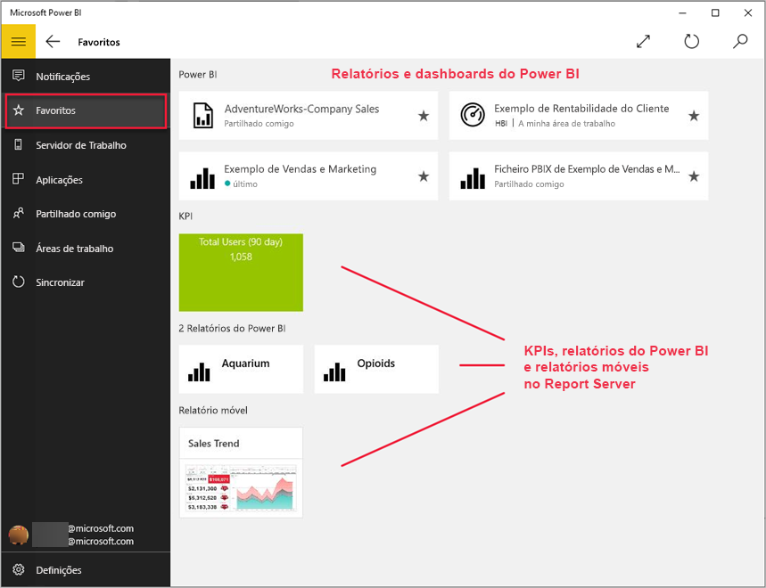

# Ver KPIs e relatórios móveis do Reporting Services (SSRS) na aplicação móvel do Power BI para Windows 10
A aplicação móvel do Power BI para Windows 10 oferece acesso móvel atualizado e tátil às suas informações empresariais no local mais importantes no SQL Server 2016 Reporting Services. 

## As coisas mais importantes primeiro
[Crie relatórios móveis do Reporting Services](https://msdn.microsoft.com/library/mt652547.aspx) com o SQL Server 2016 Enterprise Edition Mobile Report Publisher e publique-os no [portal Web do Reporting Services](https://msdn.microsoft.com/library/mt637133.aspx). Crie KPIs diretamente no portal Web. Organize-os em pastas e marque os seus favoritos para que os possa encontrar facilmente. 

Depois, na aplicação móvel do Power BI para Windows 10, veja os KPIs e relatórios móveis organizados em pastas e recolhidos como favoritos. 

> [!NOTE]
> O seu dispositivo precisa de executar o Windows 10. A aplicação funciona melhor em dispositivos com, pelo menos, 1 GB de RAM e 8 GB de armazenamento interno.
> 
> 

## Explorar exemplos sem um servidor do SQL Server 2016 Reporting Services
Mesmo que não tenha acesso a um portal Web do Reporting Services, ainda pode explorar as funcionalidades dos relatórios móveis do Reporting Services.

1. No seu dispositivo Windows 10, abra a aplicação do Power BI.
2. Toque no botão de navegação global  no canto superior esquerdo.
3. Toque no ícone das **Definições** , clique com o botão direito do rato ou mantenha premido **Ligar ao servidor** e, em seguida, toque em **Ver exemplos**.
   
   
4. Abra a pasta Relatórios de Revenda ou Relatórios de Vendas para explorar os respetivos KPIs e relatórios móveis.
   
   

Procure exemplos para interagir com KPIs e relatórios móveis.

## Ligar a um servidor de relatórios do Reporting Services
1. Na parte inferior do painel de navegação, toque em **Definições** 
2. Toque em **Ligar ao servidor**.
3. Preencha o endereço do servidor e o seu nome de utilizador e palavra-passe. Utilize este formato para o endereço do servidor:
   
     `https://<servername>/reports` OU   `https://<servername>/reports`
   
   > [!NOTE]
   > Inclua **http** ou **https**no início da cadeia de ligação.
   > 
   > 
   
    Toque em **Opções avançadas** para, se pretender, atribuir um nome ao servidor.
4. Toque na marca de verificação para ligar. 
   
   Agora pode ver o servidor no painel de navegação.
   
   
   
   >[!TIP]
   >Toque no botão de navegação global  a qualquer altura para alternar entre os seus relatórios móveis do Reporting Services e os dashboards no serviço Power BI. 
   > 

## Ver KPIs e relatórios móveis do Reporting Services na aplicação do Power BI
Os KPIs e os relatórios móveis do Reporting Services móveis são mostrados nas mesmas pastas em que estão contidos no portal da Web do Reporting Services.

* Toque num KPI para vê-lo no modo de foco.
  
    
* Toque num relatório móvel para abri-lo e interagir com ele na aplicação do Power BI.
  
    

## Ver os seus KPIs e relatórios favoritos
Pode marcar KPIs e relatórios móveis como favoritos no portal Web do Reporting Services e, em seguida, vê-los numa pasta conveniente no seu dispositivo Windows 10, juntamente com os seus dashboards e relatórios favoritos do Power BI.

* Toque em **Favoritos**.
  
   
  
   Os seus favoritos do portal Web encontram-se todos nesta página.
  
   

Saiba mais sobre os [favoritos nas aplicações móveis do Power BI](mobile-apps-favorites.md).

## Remover uma ligação para um servidor de relatório
Só se pode ligar a um servidor de relatórios de cada vez a partir da aplicação móvel do Power BI. Se quiser ligar-se a um servidor diferente, precisa de desligar-se do atual.

1. Na parte inferior do painel de navegação, toque em **Definições** .
2. Toque e mantenha premido o nome do servidor ao qual não se deseja ligar.
3. Toque em **Remover servidor**.
   
    

## Criar relatórios móveis e KPIs do Reporting Services
Os KPIs e relatórios móveis do Reporting Services não são criados na aplicação móvel do Power BI. São criados no SQL Server Mobile Report Publisher e num portal Web do SQL Server 2016 Reporting Services.

* [Crie os seus relatórios móveis do Reporting Services](https://msdn.microsoft.com/library/mt652547.aspx), e publique-os num portal Web do Reporting Services.
* Crie [KPIs num portal Web do Reporting Services](https://msdn.microsoft.com/library/mt683632.aspx)

## Próximos passos
* [Introdução à aplicação móvel Power BI para Windows 10](mobile-windows-10-phone-app-get-started.md)  
* [O que é o Power BI?](../../fundamentals/power-bi-overview.md)  
* Perguntas? [Experimente perguntar à Comunidade do Power BI](https://community.powerbi.com/)

