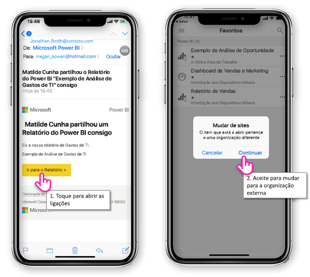
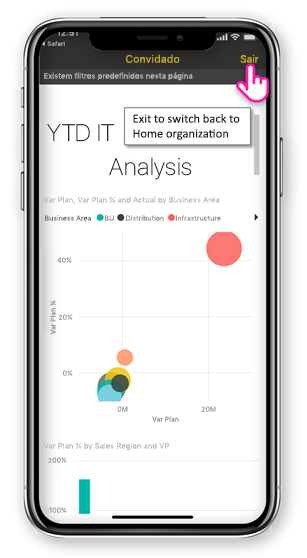
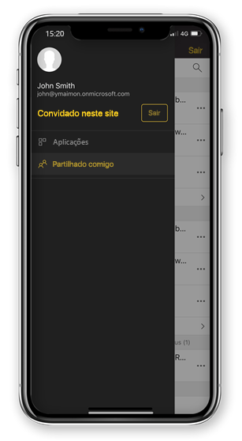

# Conteúdo do Power BI vista partilhado consigo, a partir de uma organização externa

Power BI está integrado no Azure Active Directory business-to-business (Azure AD B2B) para permitir uma distribuição segura de conteúdos do Power BI para utilizadores convidados fora da sua organização. E os utilizadores convidados externos podem utilizar a aplicação móvel do Power BI para aceder a esse conteúdo do Power BI partilhado com eles. 

Aplica-se a:

|  |  |  |  |
|:--- |:--- |:--- |:--- |
| iPhones |iPads |Telemóveis Android |Tablets Android |

## Aceder ao conteúdo partilhado

**Em primeiro lugar, precisa de alguém de uma organização externa para compartilhar um item com.** Quando alguém [compartilha um item com](../../service-share-dashboards.md), a partir da mesma organização ou de uma organização externa, receberá um e-mail com uma ligação para que o item partilhado. Seguir essa ligação em seu dispositivo móvel, abre-se a aplicação móvel do Power BI. Se a aplicação reconhece que o item foi partilhado a partir de uma organização externa, volta ligar a aplicação dessa organização com a sua identidade. A aplicação, em seguida, carrega todos os itens que foram partilhados dessa organização.

> [!NOTE]
> Se este for o primeiro item partilhado consigo, como um utilizador de convidados externos, deve solicitar o convite num browser. Pode não é possível afirmar o convite na aplicação do Power BI.

Enquanto estiver ligado a uma organização externa, um cabeçalho preto aparece na aplicação. Esse cabeçalho indica que não está ligado à sua organização da página principal. Para ligar-se na sua organização de casa, sair do modo de convidado.

Mesmo que precisa ter uma ligação de artefacto do Power BI para ligar a uma organização externa, depois que a sua aplicação muda, pode acessar todos os itens partilhados consigo (não apenas o item abertos a partir do e-mail). Para ver todos os itens que pode aceder na organização externa, aceda ao menu da aplicação e selecione **partilhado comigo**. Sob **aplicações** encontrar aplicações que pode utilizar também.

## Limitações

- Acesso condicional e de outras políticas do Intune não são suportadas no Azure AD B2B e no Power BI mobile. Isso significa que a aplicação aplica apenas as políticas da organização raiz, caso existam.
- Notificações push são recebidas a partir apenas o site da organização da página principal (mesmo quando o usuário estiver conectado como um convidado para uma organização externa). Abrir a notificação de volta a estabelecer ligação a aplicação ao site de organização da página principal do utilizador.
- Se o usuário encerra a aplicação, quando voltar aberto a aplicação liga-se automaticamente a organização da página principal do utilizador.
- Quando ligado a uma organização externa, algumas ações estão desativadas: favorito itens, alertas de dados, comentários e a partilha.
- Dados offline não estão disponíveis enquanto estiver ligado a uma organização externa.
- Se tiver a aplicação Portal da empresa instalada no seu dispositivo, em seguida, o dispositivo têm de estar inscritos.
