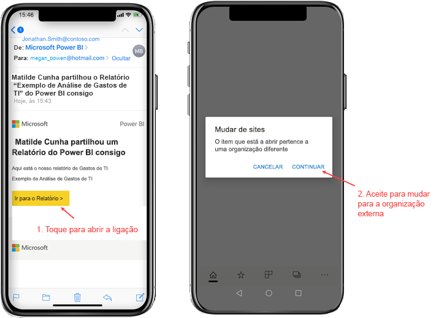
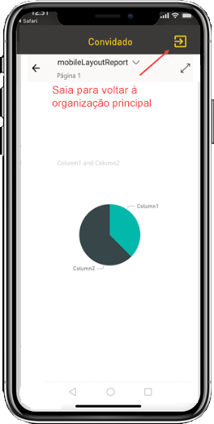
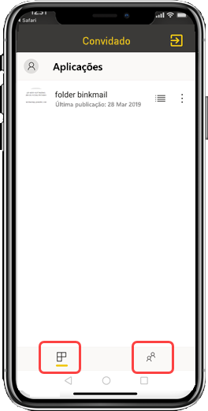

# Ver conteúdos do Power BI de uma organização externa partilhados consigo

O Power BI integra-se no Azure Active Directory business-to-business (Azure AD B2B) para permitir uma distribuição segura de conteúdos do Power BI a utilizadores convidados fora da sua organização. Além disso, os utilizadores convidados externos podem utilizar a aplicação móvel Power BI para aceder aos conteúdos do Power BI partilhados com os mesmos. 

Aplica-se a:

|  |  |  |  |
|:--- |:--- |:--- |:--- |
| iPhones |iPads |Telemóveis Android |Tablets Android |

## Aceder a conteúdos partilhados

**Em primeiro lugar, algum membro de uma organização externa tem de partilhar um item consigo.** Quando alguém da mesma organização ou de uma organização externa [partilha um item consigo](../../collaborate-share/service-share-dashboards.md), recebe um e-mail com uma ligação para este item partilhado. Se abrir esta ligação no seu dispositivo móvel, abrirá a aplicação móvel Power BI. Se a aplicação reconhecer que o item foi partilhado por uma organização externa, a aplicação voltará a ligar a esta organização com a sua identidade. Em seguida, a aplicação carrega todos os itens que esta organização partilhou consigo.

> [!NOTE]
> Se este for o primeiro item partilhado consigo enquanto utilizador convidado externo, tem de reclamar o convite num browser. Não pode reclamar o convite na aplicação Power BI.

Se estiver ligado a uma organização externa, será apresentado um cabeçalho preto na aplicação. Este cabeçalho indica que não está ligado à sua organização. Para voltar a ligar à sua organização, saia do modo de convidado.

Embora tenha de ter uma ligação de artefacto do Power BI para ligar a uma organização externa, assim que a sua aplicação for aberta, poderá aceder a todos os itens partilhados consigo (e não apenas ao item que abriu a partir do e-mail). Para ver todos os itens a que pode aceder na organização externa, aceda ao menu da aplicação e selecione **Partilhado comigo**. Em **Aplicações**, irá encontrar aplicações que também pode utilizar.

## Limitações

- Os utilizadores têm de ter uma conta ativa do Power BI e um inquilino principal.
- Os utilizadores têm de ter sessão iniciada no respetivo inquilino principal do Power BI para poderem aceder aos conteúdos partilhados com eles a partir de um inquilino externo.
- O acesso condicional e outras políticas do Intune não são suportados no Azure AD B2B e no Power BI Mobile. A aplicação impõe apenas as políticas da sua organização, se estas existirem.
- Apenas são recebidas notificações push do site da sua organização (mesmo quando o utilizador está ligado como um convidado a uma organização externa). A abertura da notificação volta a ligar a aplicação ao site da organização do utilizador.
- Se o utilizador encerrar a aplicação, quando esta for aberta novamente, será automaticamente ligada à organização do utilizador.
- Com uma ligação a uma organização externa, algumas ações são desativadas: itens favoritos, alertas de dados, comentários e partilha.
- Os dados offline não estão disponíveis quando um utilizador está ligado a uma organização externa.
- Se tiver a aplicação Portal da Empresa instalada no seu dispositivo, terá de o inscrever.
