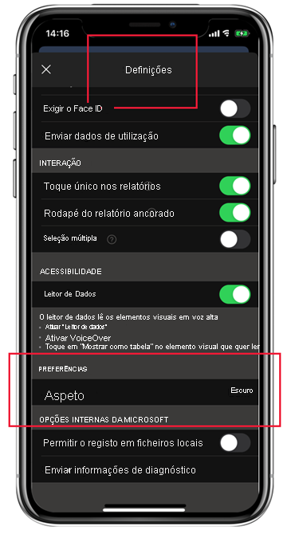

# Dark mode (Modo escuro)

Para acomodar as suas preferências de visualização individuais, a aplicação móvel do Power BI para iOS suporta os modos de ecrã claro e escuro. O modo escuro reduz a luminosidade do ecrã, o que facilita a leitura dos conteúdos.

 No modo escuro, todas as experiências de aplicação aparecem com um fundo escuro. O conteúdo do Power BI, no entanto, não é afetado. Os relatórios, dashboards e aplicações são sempre apresentados conforme pretendido pelos designers.
 
 Por predefinição, a aplicação móvel do Power BI utiliza as definições do dispositivo para determinar qual o aspeto do ecrã a apresentar. Se o dispositivo estiver configurado para o modo escuro, a aplicação será apresentada no modo escuro.
 
 Para alternar entre o modo claro e escuro, ou para deixar que as definições do dispositivo determinem o modo, aceda a **Definições > Preferências** e toque em **Aspeto** para escolher o modo desejado.

