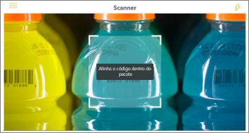

# Obter dados do mundo real com as aplicações móveis do Power BI
As aplicações móveis do Power BI podem ligar o mundo real diretamente às informações do BI relacionadas de várias formas. 

## Códigos QR para mosaicos
Crie um código QR para um relatório ou mosaico no dashboard e coloque-o onde quiser. Quando os seus colegas lerem o código com os respetivos iPhones, telemóveis Android ou a Aplicação Power BI for Mixed Reality, verão o mosaico que associou a esse código QR. Num iPhone, veem o código em realidade aumentada.

Mais informações:

* [Criar um código QR para um mosaico no Power BI](../../service-create-qr-code-for-tile.md)
* [Digitalizar um código QR do Power BI a partir do seu dispositivo móvel](mobile-apps-qr-code.md)
* [Scanning a QR code with the Power BI for Mixed Reality app](mobile-mixed-reality-app.md#scan-a-report-qr-code-in-holographic-view) (Ler um código QR com a aplicação Power BI for Mixed Reality).

## Códigos QR para relatórios
Crie um código QR para um relatório.  Quando os seus colegas digitalizarem o código com os respetivos iPhones (os telemóveis Android estarão disponíveis em breve), verão o relatório que associou a esse código QR. 

Mais informações sobre como [criar um código QR para um relatório no Power BI](../../service-create-qr-code-for-report.md)

## Códigos de barras
Marque os dados do código de barras no relatório para que os seus colegas possam digitalizar um código de barras num produto e aceder diretamente a esse relatório, filtrado para esse produto.

Mais informações:

* [Marcar dados do código de barras num relatório](../../desktop-mobile-barcodes.md)
* [Digitalizar um código de barras da aplicação Power BI no seu iPhone](mobile-apps-scan-barcode-iphone.md)

## Filtrar por localização
Categorize os dados geográficos num relatório no Power BI Desktop. Em seguida, os seus colegas verão esse relatório na aplicação móvel do Power BI para iOS e o Power BI fornecerá automaticamente filtros geográficos correspondentes à respetiva localização.

Mais informações sobre como [filtrar por localização](mobile-apps-geographic-filtering.md).

## Próximas etapas
* [Criar um código QR para um mosaico no Power BI](../../service-create-qr-code-for-tile.md)
* [Criar um código QR para um relatório no Power BI](../../service-create-qr-code-for-report.md)

