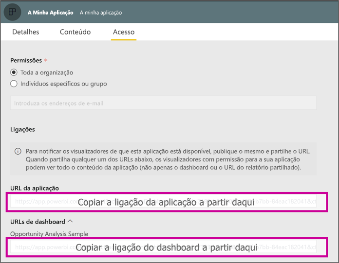

# <a name="create-a-link-to-a-specific-location-in-the-power-bi-mobile-apps"></a>Criar uma ligação para uma localização específica nas aplicações móveis do Power BI
Pode utilizar ligações para aceder diretamente a itens específicos no Power BI: Relatório, Dashboard e Mosaico.

Existem dois cenários principais para utilizar ligações no Power BI Mobile: 

* Para abrir o Power BI **fora da aplicação** e aceder a um conteúdo específico (relatório/dashboard/aplicação). Normalmente, este é um cenário de integração, quando quer abrir o Power BI Mobile noutra aplicação. 
* Para **navegar** dentro do Power BI. Normalmente, este cenário é utilizado quando quer criar uma navegação personalizada no Power BI.


## <a name="use-links-from-outside-of-power-bi"></a>Utilizar ligações de fora do Power BI
Ao utilizar uma ligação fora da aplicação do Power BI, irá querer garantir que a mesma será aberta pela aplicação e, se esta não estiver instalada no dispositivo, que será proposto ao utilizador a instalação da mesma. Criámos um formato de ligação especial para suportar exatamente isso. Este formato de ligação irá garantir que o dispositivo está a utilizar a aplicação para abrir a ligação e, se a aplicação não estiver instalada no dispositivo, irá propor ao utilizador que a obtenha na loja.

A ligação deverá começar com o seguinte:  
```html
https://app.powerbi.com/Redirect?[**QUERYPARAMS**]
```

> [!IMPORTANT]
> Se os conteúdos estiverem alojados em datacenters especiais, como Administração Pública, China, etc. a ligação deverá começar com o endereço do Power BI correto, como `app.powerbigov.us` ou `app.powerbi.cn`.   
>


Os **PARÂMETROS DE CONSULTA** são os seguintes:
* **action** (obrigatório) = OpenApp/OpenDashboard/OpenTile/OpenReport
* **appId** = se quiser abrir um relatório ou um dashboard que faz parte de uma aplicação 
* **groupObjectId** = se quiser abrir um relatório ou um dashboard que faz parte da área de trabalho (mas não de A minha área de trabalho)
* **dashboardObjectId** = ID de objeto do dashboard (se a ação for OpenDashboard ou OpenTile)
* **reportObjectId** = ID de objeto do relatório (se a ação for OpenReport)
* **tileObjectId** = ID de objeto do mosaico (se a ação for OpenTile)
* **reportPage** = se quiser abrir uma secção do relatório específica (se a ação for OpenReport)
* **ctid** = ID da organização do item (relevante para cenários B2B. Pode ser omitido se o item pertencer à organização do utilizador)

**Exemplos:**

* Abrir uma ligação da aplicação 
  ```html
  https://app.powerbi.com/Redirect?action=OpenApp&appId=appidguid&ctid=organizationid
  ```

* Abrir um dashboard que faz parte de uma aplicação 
  ```html
  https://app.powerbi.com/Redirect?action=OpenDashboard&appId=**appidguid**&dashboardObjectId=**dashboardidguid**&ctid=**organizationid**
  ```

* Abrir um relatório que faz parte de uma área de trabalho
  ```html
  https://app.powerbi.com/Redirect?Action=OpenReport&reportObjectId=**reportidguid**&groupObjectId=**groupidguid**&reportPage=**ReportSectionName**
  ```

### <a name="how-to-get-the-right-link-format"></a>Como obter o formato de ligação correto

#### <a name="links-of-apps-and-items-in-app"></a>Ligações de aplicações e itens na aplicação

Para **aplicações, relatórios e dashboards que fazem parte de uma aplicação**, a forma mais fácil de obter a ligação é aceder à área de trabalho e selecionar "Atualizar aplicação". Será aberta a experiência "Publicar aplicação" e, no separador Acesso, irá encontrar a secção **Ligações**. Ao expandir esta secção, irá ver a lista da aplicação e todas as suas ligações de conteúdos que podem ser utilizadas para aceder diretamente aos mesmos.



#### <a name="links-of-items-not-in-app"></a>Ligações de itens que não fazem parte da aplicação 

Para relatórios e dashboards que não fazem parte de uma aplicação, tem de extrair os IDs do URL do item.

Por exemplo, para encontrar o ID de objeto do **dashboard** de 36 carateres, navegue para o dashboard específico no serviço Power BI. 

```html
https://app.powerbi.com/groups/me/dashboards/**dashboard guid comes here**?ctid=**organization id comes here**`
```

Para encontrar o ID de objeto do **relatório** de 36 carateres, navegue para o relatório específico no serviço Power BI.
Este é um exemplo de relatório de "A Minha Área de Trabalho":

```html
https://app.powerbi.com/groups/me/reports/**report guid comes here**/ReportSection3?ctid=**organization id comes here**`
```
O URL acima contém também a página de relatório específica **"ReportSection3"** .

Este é um exemplo de um relatório de uma área de trabalho (não de A Minha Área de Trabalho):

```html
https://app.powerbi.com/groups/**groupid comes here**/reports/**reportid comes here**/ReportSection1?ctid=**organizationid comes here**
```

## <a name="use-links-inside-power-bi"></a>Utilizar ligações dentro do Power BI

As ligações dentro do Power BI funcionam nas aplicações móveis exatamente como no serviço Power BI.

Se quiser adicionar uma ligação ao seu relatório que aponte para outro item do Power BI, basta copiar o URL desse item na barra de endereço do browser. Saiba mais sobre [como adicionar uma hiperligação a uma caixa de texto num relatório](../../create-reports/service-add-hyperlink-to-text-box.md).

## <a name="use-report-url-with-filter"></a>Utilizar o URL do relatório com um filtro
Tal como o serviço Power BI, as aplicações do Power BI Mobile também suportam URLs de relatório que contêm um parâmetro de consulta com filtro. Pode abrir um relatório na aplicação do Power BI Mobile e filtrá-lo para um estado específico. Por exemplo, o seguinte URL abre o relatório de Vendas e filtra-o por Território:

```html
https://app.powerbi.com/groups/me/reports/**report guid comes here**/ReportSection3?ctid=**organization id comes here**&filter=Store/Territory eq 'NC'
```

Saiba mais sobre [como criar um parâmetro de consulta para filtrar relatórios](../../collaborate-share/service-url-filters.md).

## <a name="next-steps"></a>Próximos passos
Os seus comentários ajudam-nos a decidir o que implementar no futuro, portanto, não se esqueça de votar noutros recursos que gostaria de ver nas aplicações móveis do Power BI. 

* [Power BI apps for mobile devices (Aplicações do Power BI para dispositivos móveis)](mobile-apps-for-mobile-devices.md)
* Siga o @MSPowerBI no Twitter
* Participe na conversa na [Comunidade do Power BI](https://community.powerbi.com/)
* [O que é o Power BI?](../../fundamentals/power-bi-overview.md)