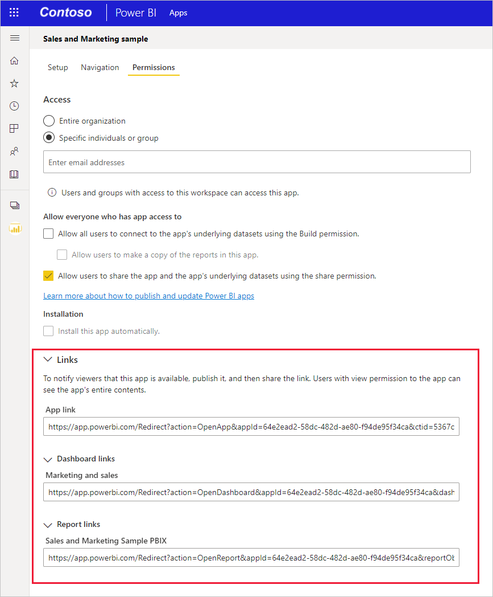

# <a name="create-a-link-to-a-specific-location-in-the-power-bi-mobile-apps"></a>Criar uma ligação para uma localização específica nas aplicações móveis do Power BI
Pode utilizar as ligações para acessar diretamente os itens específicos no Power BI: Relatório, Dashboard e mosaico.

Existem principalmente dois cenários para utilizar ligações no Power BI Mobile: 

* Para abrir o Power BI partir **fora da aplicação**e acessar conteúdo específico (relatório/dashboard/aplicação). Isso é normalmente um cenário de integração, quando deseja abrir o Power BI Mobile a partir de outra aplicação. 
* Para **navegue** dentro do Power BI. Isto é, normalmente, quando deseja criar uma navegação personalizada no Power BI.


## <a name="use-links-from-outside-of-power-bi"></a>Utilizar ligações a partir de fora do Power BI
Quando utiliza uma ligação a partir de fora da aplicação do Power BI, o que pretende certificar-se de que ele será aberto pelo aplicativo, e se a aplicação não estiver instalada no dispositivo, em seguida, para oferecer ao usuário para instalá-lo. Criamos um formato de ligação para oferecer suporte a exatamente isso. Este formato de ligação, serão Certifique-se de que o dispositivo está a utilizar a aplicação para abrir a ligação e, se a aplicação não estiver instalada no dispositivo, será oferecido ao utilizador para aceder à loja de obtê-lo.

A ligação deve começar com o seguinte  
```html
https://app.powerbi.com/Redirect?[**QUERYPARAMS**]
```

> [!IMPORTANT]
> Se o seu conteúdo é hospedado no Centro de dados especial como Goverment, China, etc. A ligação deve começar com o endereço correto do Power BI, como `app.powerbigov.us` ou `app.powerbi.cn`.   
>


O **parâmetros de consulta** são:
* **ação** (obrigatório) = OpenApp / OpenDashboard / OpenTile / OpenReport
* **appId** = se pretende abrir um relatório ou dashboard que fazem parte de uma aplicação 
* **groupObjectId** = se pretende abrir um relatório ou dashboard que fazem parte da área de trabalho (mas não a minha área de trabalho)
* **dashboardObjectId** = o ID de objeto do dashboard (se a ação é OpenDashboard ou OpenTile)
* **reportObjectId** = o ID de objeto de relatório (se a ação for OpenReport)
* **tileObjectId** = o ID de objeto de mosaico (se a ação for OpenTile)
* **reportPage** = se pretende abrir a secção de relatório específico (se a ação for OpenReport)
* **ctid** = o ID de organização do item (relevante para o cenário B2B. Isso pode ser omitido se o item pertence a organização do utilizador).

**Exemplos:**

* Ligação de abrir uma aplicação 
  ```html
  https://app.powerbi.com/Redirect?action=OpenApp&appId=appidguid&ctid=organizationid
  ```

* Abrir dashboard que faz parte de uma aplicação 
  ```html
  https://app.powerbi.com/Redirect?action=OpenDashboard&appId=**appidguid**&dashboardObjectId=**dashboardidguid**&ctid=**organizationid**
  ```

* Abra o relatório que faz parte de uma área de trabalho
  ```html
  https://app.powerbi.com/Redirect?Action=OpenReport&reportObjectId=**reportidguid**&groupObjectId=**groupidguid**&reportPage=**ReportSectionName**
  ```

### <a name="how-to-get-the-right-link-format"></a>Como obter o formato de ligação correta

#### <a name="links-of-apps-and-items-in-app"></a>Ligações de aplicações e itens na aplicação

Para **aplicações, relatórios e dashboard que fazem parte de uma aplicação**, a maneira mais fácil de obter a ligação é ir para a área de trabalho de aplicação e escolha "Aplicação de atualização". Esta ação irá abrir a experiência de "Publicar aplicação" e, no separador de acesso, encontrará um **Links** secção. Expansão que seção e verá a lista da aplicação e todos os seus conteúdos liga que pode ser utilizado para aceder às mesmas diretamente.



#### <a name="links-of-items-not-in-app"></a>Links de itens não na aplicação 

Para relatórios e dashboards que não fazem parte de uma aplicação, terá de extrair os IDs do URL do item.

Por exemplo, para determinar o caráter de 36 **dashboard** ID de objeto, navegue para o dashboard específico no serviço Power BI 

```html
https://app.powerbi.com/groups/me/dashboards/**dashboard guid comes here**?ctid=**organization id comes here**`
```

Para localizar o caráter de 36 **relatório** ID de objeto, navegue para o relatório específico no serviço Power BI.
Este é um exemplo de relatório de "A minha área de trabalho"

```html
https://app.powerbi.com/groups/me/reports/**report guid comes here**/ReportSection3?ctid=**organization id comes here**`
```
O URL acima também contém a página de relatório específica **"ReportSection3"** .

Este é um exemplo de um relatório a partir de uma área de trabalho (não minha área de trabalho)

```html
https://app.powerbi.com/groups/**groupid comes here**/reports/**reportid comes here**/ReportSection1?ctid=**organizationid comes here**
```

## <a name="use-links-inside-power-bi"></a>Utilize ligações dentro do Power BI

Ligações no Power BI estão a trabalhar nas aplicações móveis do exatamente como no serviço Power BI.

Se pretender adicionar ligação para o relatório que aponta para outro item do Power BI, pode copiar apenas esse URL do item de barra de endereço do browser. Leia mais sobre [como adicionar uma hiperligação a uma caixa de texto num relatório](https://docs.microsoft.com/power-bi/service-add-hyperlink-to-text-box).

## <a name="use-report-url-with-filter"></a>URL de relatório de utilização com um filtro
O mesmo que o serviço Power BI, Power BI Mobile apps também suporta URL de relatório que contém um parâmetro de consulta de filtro. Pode abrir um relatório na aplicação móvel do Power BI e filtrá-la para o estado específico. Por exemplo, este URL abre o relatório de vendas e filtrá-la por território

```html
https://app.powerbi.com/groups/me/reports/**report guid comes here**/ReportSection3?ctid=**organization id comes here**&filter=Store/Territory eq 'NC'
```

Leia mais em [como criar o parâmetro de consulta para filtrar relatórios](https://docs.microsoft.com/power-bi/service-url-filters).

## <a name="next-steps"></a>Próximos passos
Os seus comentários ajudam-nos a decidir o que implementar no futuro, portanto, não se esqueça de votar noutros recursos que gostaria de ver nas aplicações móveis do Power BI. 

* [Aplicações do Power BI para dispositivos móveis](mobile-apps-for-mobile-devices.md)
* Siga o @MSPowerBI no Twitter
* Participe na conversa na [Comunidade do Power BI](http://community.powerbi.com/)
* [O que é o Power BI?](../../power-bi-overview.md)

