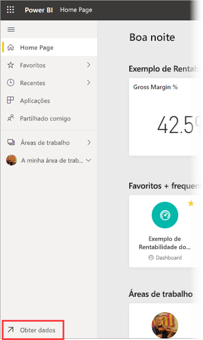
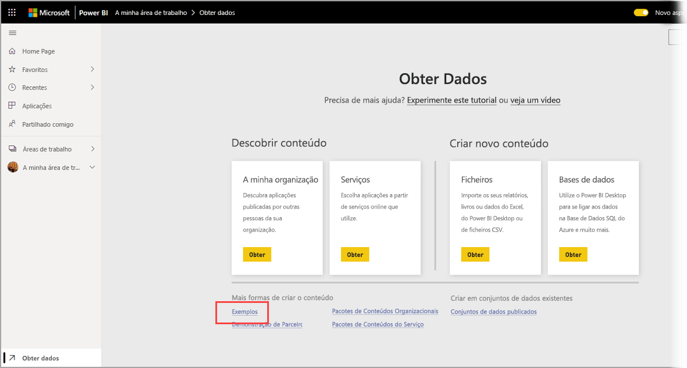
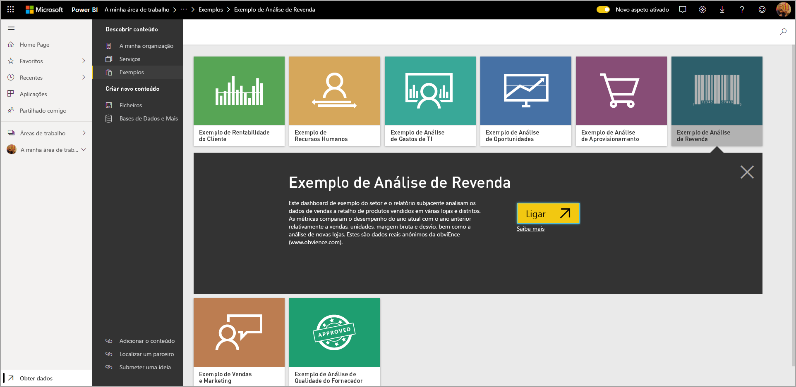
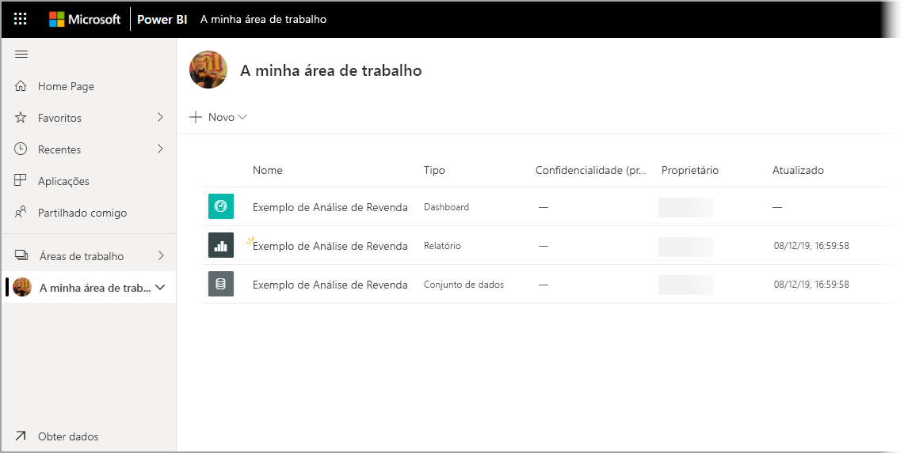

# Transferir exemplos para A minha área de trabalho no serviço Power BI

Parte da documentação de aplicações móveis disponível aqui utiliza dados de exemplo para fins exemplificativos. Para acompanhar com o seu dispositivo, pode transferir os dados de exemplo para a sua conta do serviço Power BI, onde pode vê-los a partir da aplicação Power BI Mobile no seu dispositivo. Este artigo descreve como transferir os dados de exemplo para a sua conta do serviço Power BI. 

## Pré-requisitos

Tem de ter uma conta do serviço Power BI para conseguir transferir dados. Se ainda não estiver inscrito no Power BI, [inscreva-se numa avaliação gratuita](https://app.powerbi.com/signupredirect?pbi_source=web) antes de começar.

## Transferir um exemplo

1. Abra o [serviço Power BI](https://app.powerbi.com) no browser e inicie sessão.

2. Selecione **Obter dados** no canto inferior esquerdo do painel de navegação. Se o painel de navegação estiver oculto e não conseguir ver a ligação Obter dados, apresente o painel ao clicar no ícone Mostrar/Ocultar painel de navegação .  
   
    

3. Na página Obter Dados, selecione a ligação **Exemplos**.
   
   

4. Selecione um exemplo para transferir. Certifique-se de que escolhe o exemplo que o tutorial, início rápido ou artigo pede. Depois de selecionar, clique em **Ligar**.
  
   
   
5. O Power BI importa o exemplo e adiciona um novo dashboard, relatório e conjunto de dados a A Minha Área de Trabalho do utilizador.
   
   
  
Está pronto para ver os exemplos no seu dispositivo móvel.

## Próximas etapas
* [Início rápido](mobile-apps-quickstart-view-dashboard-report.md)
* Dúvidas? Consulte a [secção sobre aplicações móveis da Comunidade do Power BI](https://go.microsoft.com/fwlink/?linkid=839277)
