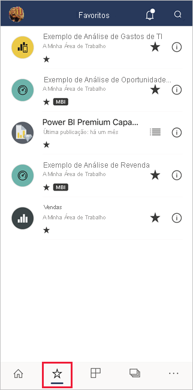
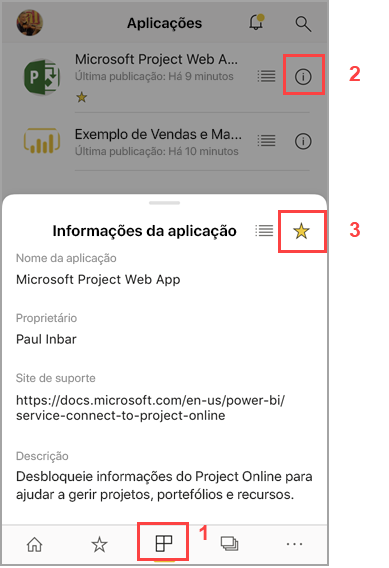
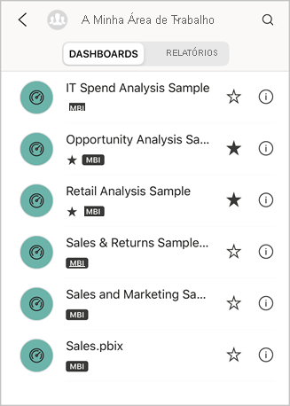
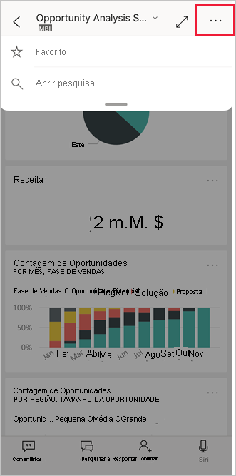
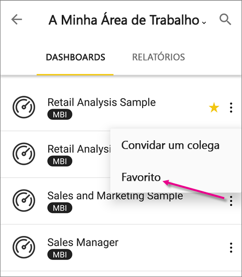
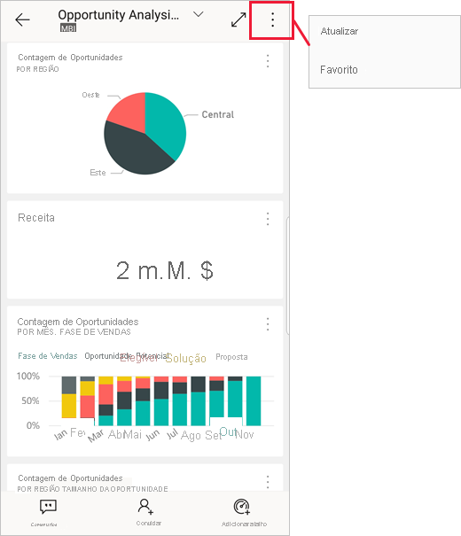
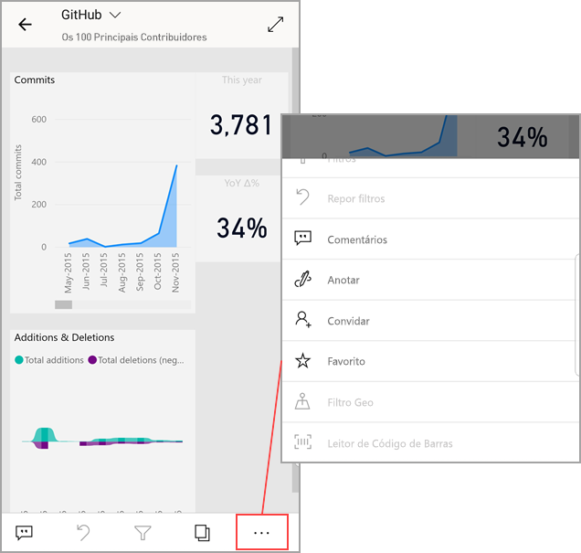

# Criar e ver favoritos nas aplicações móveis do Power BI
Aplica-se a:

|  |  |  |  |  |
|:--- |:--- |:--- |:--- |:--- |
| iPhones |iPads |Telemóveis Android |Tablets Android |Dispositivos Windows 10 |

>[!NOTE]
>O suporte à aplicação móvel do Power BI para **telemóveis com o Windows 10 Mobile** será descontinuado a 16 de março de 2021. [Saiba mais](https://go.microsoft.com/fwlink/?linkid=2121400)

Leia mais sobre como criar e ver os dashboards, relatórios e aplicações favoritos do Power BI, bem como os relatórios e KPIs favoritos no local do Power BI Report Server e Reporting Services, nas aplicações móveis.

Ao criar um favorito nas aplicações móveis do Power BI, este será apresentado na página Favoritos do [serviço Power BI](https://powerbi.com) e em todos os seus dispositivos móveis.

Para ver a sua página Favoritos, toque no ícone Favoritos da barra de navegação:

Também pode [tornar dashboards e aplicações do Power BI favoritos no serviço Power BI](../end-user-favorite.md). Depois, pode vê-los na página Favoritos na aplicação móvel.

Pode marcar KPIs e relatórios como favoritos num portal Web do Power BI Report Server ou Reporting Services e, em seguida, vê-los numa pasta conveniente no seu dispositivo móvel, juntamente com os seus dashboards favoritos do Power BI.

## Tornar uma aplicação favorita
1. Toque no ícone Aplicações da barra de navegação inferior para apresentar a sua página de aplicações.

2. Num dispositivo iOS, toque no botão de informações que se encontra à direita do nome da aplicação que pretende adicionar aos favoritos. Nos dispositivos Android, é apresentada a opção Mais opções (...) em vez do botão de informações. 

3. Na secção de informações da aplicação que é aberta, toque na estrela.
   
    
   
    A aplicação estará agora listada na sua página Favoritos, juntamente com os seus outros dashboards, relatórios e aplicações favoritos.
   
## Tornar um dashboard ou um relatório favorito nas aplicações móveis para iOS e Windows 10
Pode tornar um dashboard ou um relatório favorito do Power BI na lista de dashboards ou relatórios ou no próprio dashboard ou relatório.

* Na lista de dashboards ou relatórios na aplicação móvel, toque na estrela vazia junto ao nome do dashboard . A estrela fica amarela .
  
    
* Se estiver num dashboard, toque na estrela vazia  no friso. Se estiver num relatório, a estrela está em **Mais opções** (...).  A estrela fica a preto .
  
    

## Tornar um dashboard ou um relatório favorito nas aplicações móveis para Android
Pode tornar um dashboard ou um relatório favorito na lista de dashboards ou relatórios ou no próprio dashboard ou relatório.

* Na lista de dashboards ou relatórios na aplicação móvel, toque no botão vertical **Mais opções** (...) junto ao nome e, em seguida, toque na estrela dos Favoritos do separador de informações que é apresentado.
  
    

* Quando estiver num dashboard, toque na estrela vazia no friso . A estrela fica a cinzento-escuro .
  
    

* Se estiver num relatório, percorra para baixo para revelar o friso, toque em **Mais opções** (...) e, em seguida, desloque para baixo até encontrar a estrela vazia  e toque na mesma. A estrela fica a cinzento-escuro .
  
    

## Tornar KPIs e relatórios do Power BI Report Server e Reporting Services favoritos
Pode ver os seus KPIs e relatórios favoritos do Power BI Report Server e Reporting Services nas aplicações móveis do Power BI, mas não os pode tornar favoritos nas aplicações móveis. Pode [marcá-los como favoritos no portal Web](../../report-server/tutorial-explore-report-server-web-portal.md#tag-your-favorites). 

## Próximos passos
* [Tornar dashboards favoritos no serviço Power BI](../end-user-favorite.md) 
* Perguntas? [Experimente perguntar à Comunidade do Power BI](https://community.powerbi.com/)

