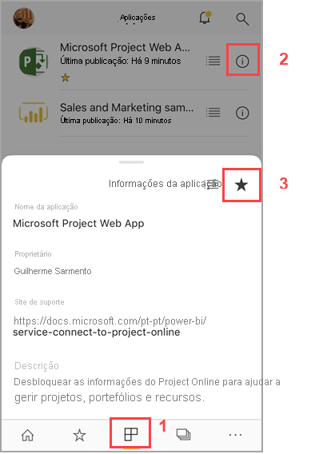
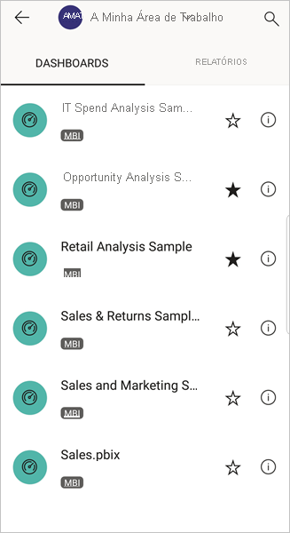

# Criar e ver favoritos nas aplicações móveis do Power BI
Aplica-se a:

|  |  |  |  |  |
|:--- |:--- |:--- |:--- |:--- |
| iPhones |iPads |Telemóveis Android |Tablets Android |Dispositivos Windows 10 |

Leia mais sobre como criar e ver os dashboards, relatórios e aplicações favoritos do Power BI, bem como os relatórios e KPIs favoritos no local do Power BI Report Server e Reporting Services, nas aplicações móveis.

Ao criar um favorito nas aplicações móveis do Power BI, este será apresentado na página Favoritos do serviço Power BI ([https://powerbi.com](https://powerbi.com)) e em todos os seus dispositivos móveis. 

Também pode [tornar dashboards e aplicações do Power BI favoritos no serviço Power BI](../end-user-favorite.md). Depois, pode vê-los na página Favoritos na aplicação móvel.

Pode marcar KPIs e relatórios como favoritos num portal Web do Power BI Report Server ou Reporting Services e, em seguida, vê-los numa pasta conveniente no seu dispositivo móvel, juntamente com os seus dashboards favoritos do Power BI.

## Ver os favoritos do Power BI
* Toque no menu de navegação superior  e, em seguida, toque em **Favoritos**.
  
  
  
  Pode ver todos os seus favoritos juntos nesta página:
  
  

## Tornar uma aplicação favorita
1. Na lista de aplicações na aplicação móvel, toque nas reticências (...) junto à aplicação > **Favorito**.
   
    
   
    Agora, esta ficará na lista dos seus dashboards e aplicações.
   
    

## Tornar um dashboard ou um relatório favorito nas aplicações móveis para iOS e Windows 10
Pode tornar um dashboard ou um relatório favorito do Power BI na lista de dashboards ou relatórios ou no próprio dashboard ou relatório.

* Na lista de dashboards ou relatórios na aplicação móvel, toque na estrela vazia junto ao nome do dashboard . A estrela fica amarela .
  
    
* No dashboard ou no relatório, toque na estrela vazia no friso . A estrela fica amarela .
  
    

## Tornar um dashboard ou um relatório favorito nas aplicações móveis para Android
Pode tornar um dashboard ou um relatório favorito na lista de dashboards ou relatórios ou no próprio dashboard ou relatório.

* Na lista de dashboards ou relatórios na aplicação móvel, toque nas reticências verticais (...) junto ao nome e, em seguida, toque em **Favorito**. Verá uma estrela amarela junto ao nome .
  
    
* No dashboard ou no relatório, toque na estrela vazia no friso . A estrela fica a cinzento-escuro .
  
    

## Tornar KPIs e relatórios do Power BI Report Server e Reporting Services favoritos
Pode ver os seus KPIs e relatórios favoritos do Power BI Report Server e Reporting Services nas aplicações móveis do Power BI, mas não os pode tornar favoritos nas aplicações móveis. Pode [marcá-los como favoritos no portal Web](../../report-server/tutorial-explore-report-server-web-portal.md#tag-your-favorites). 

## Próximos passos
* [Tornar dashboards favoritos no serviço Power BI](../end-user-favorite.md) 
* Perguntas? [Experimente perguntar à Comunidade do Power BI](http://community.powerbi.com/)

