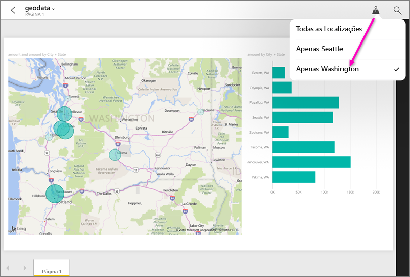

# Filtrar um relatório por localização geográfica nas aplicações móveis do Power BI
Aplica-se a:

|  |  |  |  |  |
|:--- |:--- |:--- |:--- |:--- |
| iPhones |iPads |Telemóveis Android |Tablets Android |Telemóveis Windows 10 |

Quando vê um relatório do Power BI no seu dispositivo móvel, vê um pequeno ícone de alfinete no canto superior direito? Se for esse o caso, pode filtrar esse relatório com base na sua localização geográfica.

> [!NOTE]
> Só pode filtrar por localização se os nomes geográficos no relatório estiverem em inglês (por exemplo, "New York City" ou "Germany"). Os tablets e PCs com Windows 10 não suportam a filtragem geográfica, mas os telemóveis com Windows 10 suportam.
> 
> 

## Filtrar o relatório consoante a sua localização geográfica
1. Abra um relatório na aplicação móvel do Power BI para o seu dispositivo móvel.
2. Se o relatório tiver dados geográficos, irá ver uma mensagem do Power BI a pedir acesso à sua localização. Clique em **Permitir** e, em seguida, toque novamente em **Permitir**.
3. Toque no ícone de alfinete . Pode filtrar por cidade, distrito ou país/região, consoante os dados no relatório. O filtro só lista opções correspondentes à sua localização atual.
   
    

## Por que motivo não vejo etiquetas de localização num relatório?
Para que possa ver as etiquetas de localização, as seguintes três condições precisam de ser cumpridas. 

* A pessoa que criou o relatório no Power BI Desktop [categorizou os dados geográficos](../../desktop-mobile-geofiltering.md) em pelo menos uma coluna, como Cidade, Estado ou País/Região.
* Está numa das localizações que tem dados na coluna.
* Está a utilizar um dos seguintes dispositivos móveis:
  * iOS (iPad, iPhone, iPod).
  * Telemóvel ou tablet Android.
  * Telemóvel Windows 10 (os outros dispositivos com Windows 10, como PCs e tablets, não suportam a filtragem geográfica).

Leia mais sobre [configurar a filtragem geográfica](../../desktop-mobile-geofiltering.md) no Power BI Desktop.

### Próximos passos
* [Ligar-se a dados do Power BI do mundo real](mobile-apps-data-in-real-world-context.md) com as aplicações móveis
* [Categorização de dados no Power BI Desktop](../../desktop-data-categorization.md) 
* Perguntas? [Experimente perguntar à Comunidade do Power BI](http://community.powerbi.com/)

