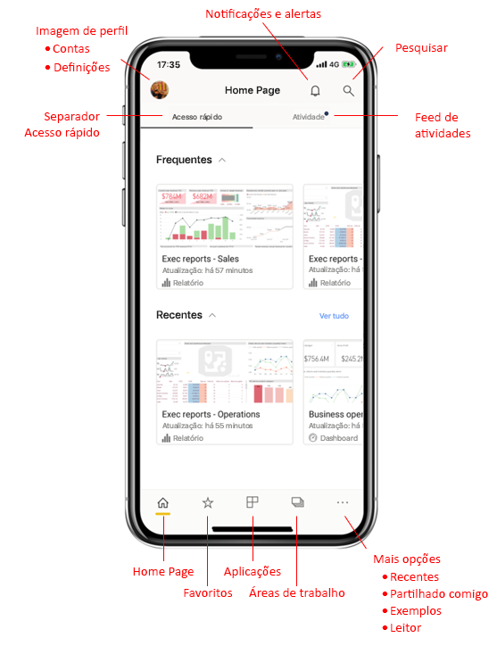
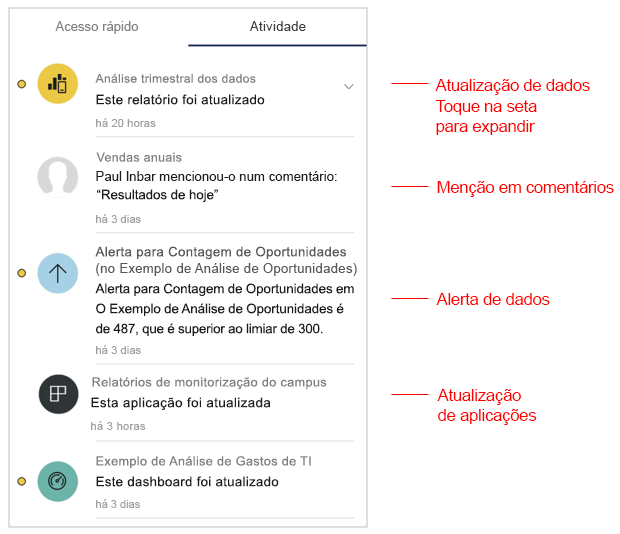
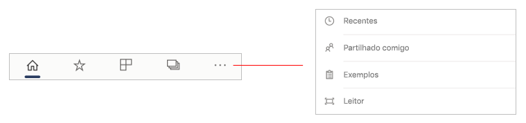
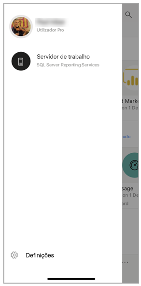
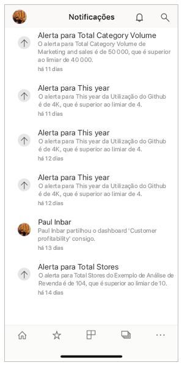
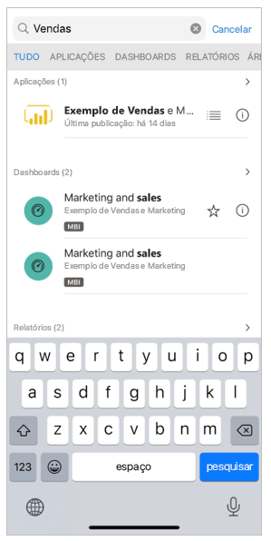

# Uma visita guiada rápida da home page da Aplicação móvel
Nesta visita guiada, irá conhecer a home page da aplicação Power BI Mobile, assim como as ajudas de navegação que esta lhe proporciona para aceder rapidamente àquilo de que precisa.

Aplica-se a:

|  |  |  |
|:--- |:--- |:--- |
| iPhone | iPad | Android | 

Quando abre a aplicação Power BI Mobile, é apresentada a home page, onde tem acesso rápido aos seus relatórios, dashboards e aplicações consultadas recentemente ou com maior frequência. Além disso, há um feed de atividades que o mantém a par do que está a acontecer com os seus conteúdos do Power BI, bem como ajudas de navegação convenientes para que chegue rapidamente aos de que precisa.

 
## Separador Acesso Rápido

O separador Acesso Rápido apresenta os seus relatórios, dashboards e aplicações consultadas recentemente ou com maior frequência, agrupados em duas secções que podem ser fechadas. Para ver uma lista mais longa dos itens vistos recentemente, toque em **Ver tudo** à direita de Recentes. 

## Feed de atividades

O feed de atividades ajuda-o a acompanhar o que está a acontecer com os seus conteúdos do Power BI. Apresenta-lhe todas as suas últimas notificações, alertas, comentários e @mentions.

As atualizações no feed incluem:
* **Dados atualizados**: quando os dados subjacentes num dos seus relatórios ou dashboards favoritos ou recentes são atualizados.
* **Novos comentários**: quando as pessoas fazem um comentário num relatório ou dashboard favorito ou recente, ou quando alguém o menciona num comentário.
* **Alertas de dados**: quando os dados atingem um limite que definiu previamente num [alerta de dados](mobile-set-data-alerts-in-the-mobile-apps.md).
* **Atualizações de aplicações**: quando um criador de aplicações publica uma atualização para uma aplicação que está a utilizar.

 Toque num item de atividade para aceder ao local relevante, de modo a explorar em maior detalhe.

Os itens de atividade são agregados, portanto todas as atualizações de dados provenientes da mesma aplicação ou área de trabalho serão agrupadas. Utilize o  seta de expansão para expandir e ver os itens agregados. O item mais recente estará sempre no topo da lista.

## Barra de navegação

Na parte inferior da página, verá a barra de navegação.

A barra de navegação oferece acesso rápido a:

*  **Home page** – leva-o de volta à home page.
*  **Favoritos** – os relatórios, dashboards e aplicações que marcou como [favoritos](mobile-apps-favorites.md).
*  **Aplicações** – as aplicações que instalou na sua conta.
*  **Áreas de trabalho** – as pastas de trabalho que reúnem os relatórios e dashboards que os criadores de conteúdos estão a criar.
*  **Recentes** – os itens que viu recentemente.
*  **Partilhado comigo** – os itens que outras pessoas partilharam consigo.
*  **Exemplos** – os exemplos do Power BI que pode utilizar para saber mais sobre as funcionalidades do Power BI.
*  **Scanner** – a câmara do dispositivo que pode utilizar como um scanner para digitalizar [códigos de barra](mobile-apps-scan-barcode-iphone.md) e [códigos QR](mobile-apps-qr-code.md).

## Cabeçalho

Na parte superior da página, o cabeçalho apresenta o nome da página do Power BI, o relatório ou o dashboard em que se encontra.

O cabeçalho fornece os seguintes itens de navegação:
* **Imagem do perfil ou avatar** – abre o painel lateral onde pode [alternar entre o serviço Power BI e as contas do Servidor de Relatórios](mobile-app-ssrs-kpis-mobile-on-premises-reports.md), assim como aceder às definições da aplicação Power BI Mobile.

    

* **Notificações** – abre a [página de notificações](mobile-apps-notification-center.md) em que pode ver e aceder às suas notificações. Um ponto na campainha das notificações indica que tem novas notificações.

    

* **Pesquisar** – pesquisar conteúdos do Power BI na sua subscrição.

    

## Próximas etapas
Nesta visita guiada, explorou a home page da aplicação Power BI Mobile. Leia mais sobre a utilização da aplicação Power BI Mobile. 
* [Explorar dashboards e relatórios](mobile-apps-quickstart-view-dashboard-report.md)
* [Explorar relatórios nas aplicações móveis do Power BI](mobile-reports-in-the-mobile-apps.md)
