# Analista virtual Perguntas e Respostas em aplicações iOS – Power BI

A forma mais fácil de conhecer os seus dados é fazer perguntas sobre os mesmos por palavras próprias. Neste artigo, vai fazer perguntas e ver informações de destaque sobre dados de exemplo com o analista virtual Perguntas e Respostas na aplicação móvel do Microsoft Power BI no iPad, iPhone e iPod Touch. 

Aplica-se a:

|  |  |
|:--- |:--- |
| iPhones |iPads |

O analista virtual Perguntas e Respostas é uma experiência de diálogo para o BI que acede aos dados subjacentes de Perguntas e Respostas no serviço Power BI [(https://powerbi.com)](https://powerbi.com). Sugere-lhe informações de dados e permite-lhe escrever ou falar as suas próprias perguntas.

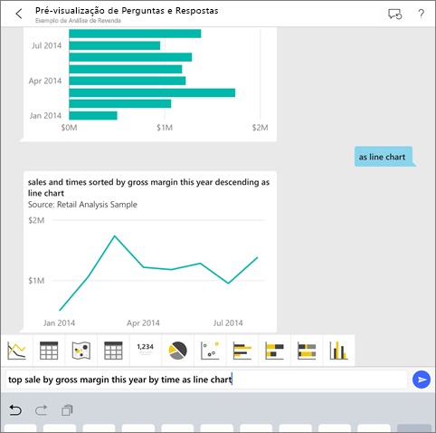

Se não estiver inscrito no Power BI, [inscreva-se para uma avaliação gratuita](https://app.powerbi.com/signupredirect?pbi_source=web) antes de começar.

## Pré-requisitos

* **Instalar a aplicação Power BI para iOS**: [Transfira a aplicação para iOS](https://go.microsoft.com/fwlink/?LinkId=522062) para o seu iPhone ou iPad.
Estas versões suportam a aplicação Power BI para iOS:
    * iPad com o iOS 11 ou posterior.
    * iPhone 5 e superior com o iOS 11 ou posterior.
* **Transfira os Exemplos de Análise de Revenda e de Análise de Oportunidade**: Neste início rápido, o primeiro passo é transferir os exemplos de Análise de Revenda e Análise de Oportunidade no serviço Power BI. [Saiba como transferir um exemplo](./mobile-apps-download-samples.md) para a sua conta do Power BI para começar. Certifique-se de que escolhe o Exemplo de Análise de Revenda e o Exemplo de Análise de Oportunidade.

Depois de concluir os pré-requisitos, estará pronto para experimentar o Analista virtual Perguntas e Respostas.

## Experimentar perguntar no iPhone ou iPad
1. Na parte inferior da barra de navegação do iPhone ou iPad, toque no botão Áreas de Trabalho , aceda a A Minha Área de Trabalho e abra o dashboard do Exemplo de Análise de Revenda.

2. Toque no ícone do analista virtual  no menu de ação na parte inferior da página (na parte superior da página num iPad).
     O analista virtual Perguntas e Respostas tem algumas sugestões para começar.
3. Escreva **show**, toque em **sales** na lista de sugestões > **Enviar** .

    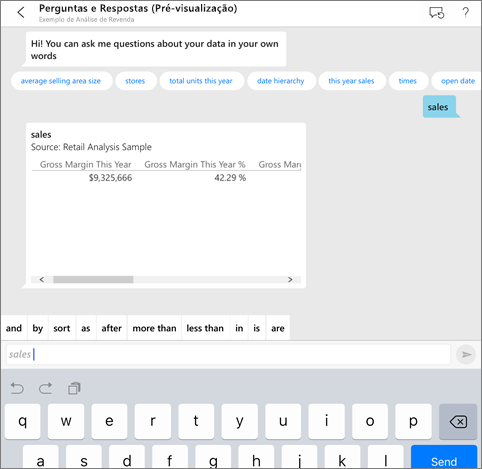
4. Toque em **by** nas palavras-chave e, em seguida, toque em **item** na lista de sugestões > **Enviar** .

    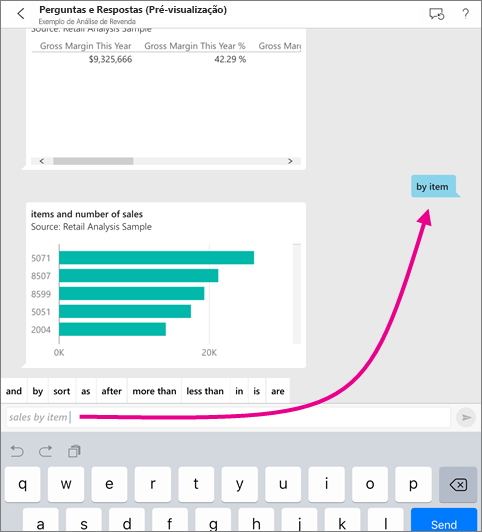
5. Toque em **as** nas palavras-chave, toque no ícone de gráfico de colunas  e, em seguida, toque em **Enviar** .
6. Mantenha pressionado o gráfico resultante e, em seguida, toque em **Expandir**.

    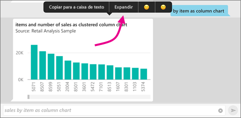

    O gráfico é aberto no modo de detalhe na aplicação.

    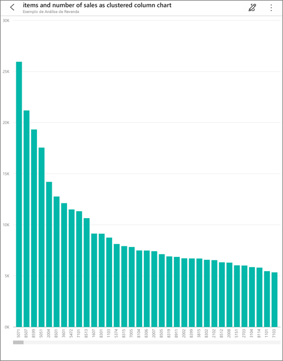
7. Toque na seta no canto superior esquerdo para voltar à janela de chat do analista virtual Perguntas e Respostas.
8. Toque no X à direita da caixa de texto para eliminar o texto e começar de novo.
9. Experimente uma nova pergunta: toque em **top** nas palavras-chave, toque em **sale by avg $/unit ly** > **Enviar** .

    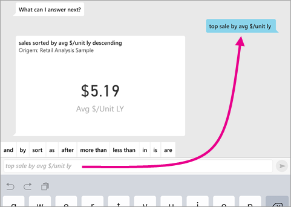
10. Selecione **by** nas palavras-chave, toque em **time** na lista de sugestões na parte superior > **Enviar** .

     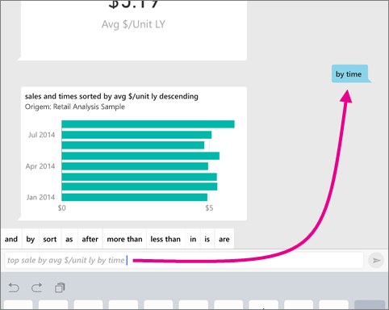
11. Escreva **as**, selecione o ícone do gráfico de linhas  na lista de sugestões > **Enviar** .

    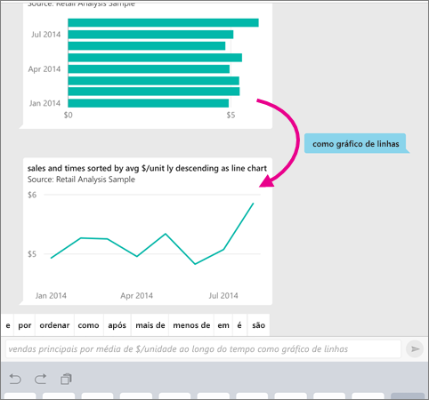

## Experimente enunciar as suas perguntas
Agora, pode fazer perguntas sobre os seus dados na aplicação móvel do Power BI ao falar em vez de escrever.

1. Toque no ícone do analista virtual Perguntas e Respostas  no menu de ação na parte inferior da página (na parte superior da página num iPad).
2. Toque no ícone do microfone .

    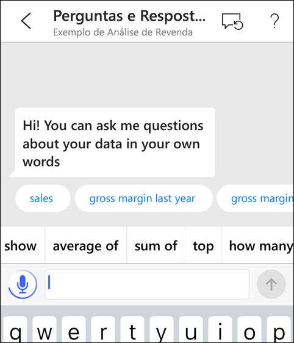

1. Quando o ícone do microfone estiver ativo, comece a falar. Por exemplo, diga "average unit price by time" e, em seguida, toque em **Enviar** .

    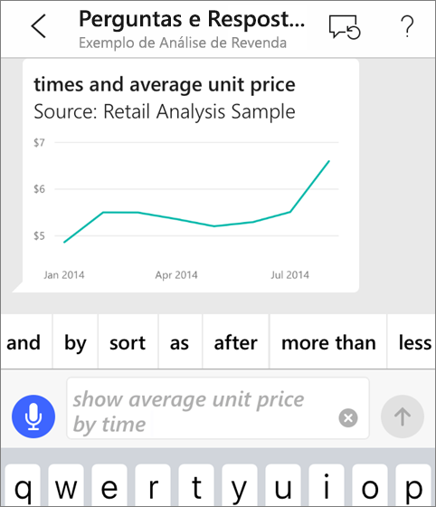

### Tem perguntas sobre privacidade ao utilizar a conversão de voz em texto?
Consulte a secção Reconhecimento de Fala nas [Novidades no iOS](https://go.microsoft.com/fwlink/?linkid=845624) nos Guias do Programador de Apple iOS.

## Ajuda e comentários
* Precisa de ajuda? Basta dizer "Olá" ou "Ajuda" para obter assistência para iniciar uma nova pergunta.
* Gostaria de fornecer comentários sobre os resultados? Mantenha premido um gráfico ou outro resultado e, em seguida, toque na cara sorridente ou triste.

    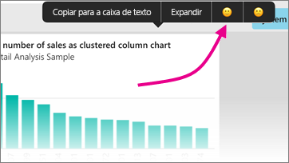

    Os seus comentários são anónimos e ajudam-nos a melhorar as nossas respostas às perguntas.

## Melhorar os resultados do analista virtual Perguntas e Respostas
Pode melhorar os resultados que o utilizador e os seus clientes obtêm quando estes utilizam o analista virtual Perguntas e Respostas num conjunto de dados, seja ao colocar perguntas mais direcionadas ou ao melhorar o conjunto de dados.

### Como fazer perguntas
* Siga estas [sugestões para fazer perguntas simples nas Perguntas e Respostas](../end-user-q-and-a-tips.md) no serviço Power BI ou no analista virtual Perguntas e Respostas na aplicação móvel para iOS.

### Como melhorar o conjunto de dados
* Melhore o conjunto de dados no Power BI Desktop ou no serviço Power BI para [fazer com que os seus dados funcionem bem com as Perguntas e Respostas e o analista virtual Perguntas e Respostas](../../create-reports/service-prepare-data-for-q-and-a.md).

## Próximos passos
* [Perguntas e Respostas no serviço Power BI](../end-user-q-and-a.md)
* Perguntas? Consulte a [secção sobre aplicações móveis da Comunidade do Power BI](https://go.microsoft.com/fwlink/?linkid=839277)
