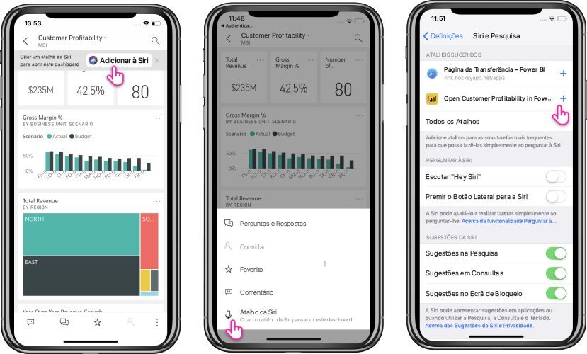

# Utilizar Atalhos do Siri na Aplicação Power BI Mobile para iOS

Utilize Atalhos da Siri para aceder diretamente aos conteúdos do Power BI de que precisa.

Para obter acesso rápido e fácil aos dashboards ou relatórios utilizados com maior frequência, pode criar um Atalho da Siri para acesso direto aos conteúdos do Power BI de que precisa. Com um Atalho da Siri, só precisa de pedir à Siri para o abrir sempre que precisar examinar os dados.

> [!NOTE]
> A integração dos Atalhos da Siri na aplicação móvel do Power BI está disponível para iPhones e iPads com iOS12 e posterior.

## Criar um atalho da Siri para um relatório ou dashboard

Existem três formas de criar atalhos da Siri para os seus relatórios e dashboards:

- Será adicionada uma faixa com uma opção **Adicionar à Siri** aos seus relatórios e dashboards utilizados com frequência. Toque na ação para abrir a página **Adicionar à Siri**.
    
- Utilize a ação **Atalho da Siri** no menu de ações (...) do **Relatório** ou **Dashboard**.
    
- Utilize os **Atalhos sugeridos** nas definições do dispositivo (**Definições do Dispositivo** > **Siri e Pesquisa**). Pode adicionar um atalho ao item na sugestão através do botão de sinal de adição (+).
     
     

Para um relatório do Power BI, o atalho irá capturar a página atual que estiver a ver quando criar o atalho. 

Todas as opções abrem a página **Adicionar à Siri**. Nesta página, terá de gravar uma expressão que utilizará mais tarde para a Siri abrir o relatório ou dashboard. 
   

    

## Utilizar Atalhos da Siri para ver relatórios ou dashboards

Quando criar um atalho para um relatório ou dashboard, poderá pedir à Siri para aceder ao mesmo sempre que quiser.
Ative a Siri e forneça a expressão que gravou para o atalho. A Siri irá iniciar o Power BI na página do relatório ou dashboard pedido. 

Para um relatório do Power BI, será aberta a página capturada quando criou o atalho.

  
  

## Editar uma expressão de atalho da Siri 
Pode editar a expressão de atalho através do botão **Atalho da Siri** no menu de ações (...) do **Relatório** ou **Dashboard**. A página Atalho da Siri será aberta com uma opção para **Voltar a gravar expressão**. 

## Criar um atalho para o ecrã principal a partir do atalho da Siri 
Após criar um atalho da Siri para alguns conteúdos do Power BI, também o poderá adicionar ao ecrã principal do dispositivo, para abrir esse conteúdo diretamente no ecrã principal com um único toque. Siga as instruções em https://support.apple.com/guide/shortcuts/apd735880972/ios.

## Eliminar um Atalho da Siri 
Para eliminar um atalho, aceda ao item e, no menu de ações (...), toque na ação **Atalho da Siri**. A página **Atalho da Siri** será aberta. Selecione **Eliminar Atalho**.

## Passos seguintes
Saiba mais sobre a aplicação móvel do Power BI ao fazer o seguinte: 

* Transfira a [aplicação móvel do Power BI para iPhone](https://go.microsoft.com/fwlink/?LinkId=522062)
* Siga [@MSPowerBI no Twitter](https://twitter.com/MSPowerBI)
* Participe na conversa na [Comunidade do Power BI](https://community.powerbi.com/)