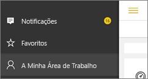
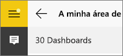
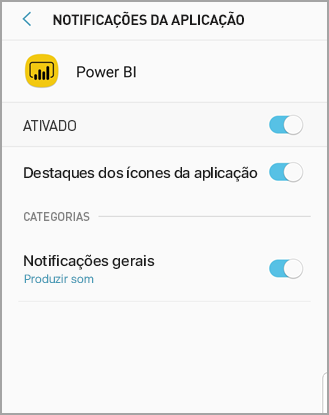

# Receber notificações nas aplicações móveis do Power BI
Aplica-se a:

|  |  |  |  |  |
|:--- |:--- |:--- |:--- |:--- |
| iPhones |iPads |Telemóveis Android |Tablets Android |Dispositivos Windows 10 |

As notificações levam informações relacionadas com a sua experiência do Power BI até si, no serviço Power BI no seu dispositivo móvel. Quando abrir as Notificações, verá um feed sequencial de mensagens sobre [alertas que definiu](mobile-set-data-alerts-in-the-mobile-apps.md), novos dashboards que foram partilhados consigo, alterações à sua área de trabalho de grupo, informações sobre eventos e reuniões do Power BI e muito mais.

> [!NOTE]
> Num dispositivo iOS, a primeira vez que iniciar sessão na [versão atualizada das aplicações do Power BI](https://powerbi.microsoft.com/mobile/), verá uma mensagem a perguntar se pretende que o Power BI envie notificações. Também pode configurar a forma como o Power BI envia as notificações em **Definições** para o seu dispositivo. 
> 
> 

## Ver notificações no seu dispositivo móvel
1. Quando receber notificações no seu dispositivo móvel, por predefinição, o Power BI emite um som e mostra uma barra de notificações.
   
   
   
   Ou num iPad:
   
   
   
   Pode [alterar a forma como o Power BI envia notificações](mobile-apps-notification-center.md#change-or-turn-off-notifications-on-your-mobile-device).
2. Se tiver recebido notificações, quando iniciar sessão no Power BI no seu dispositivo móvel verá um ponto amarelo no botão de navegação global  (Android) ou no ícone de **Notificações**. 
   
   
3. Selecione o ícone de Notificações  (Windows 10).
   
    As notificações são apresentadas com as mais recentes na parte superior e as mensagens não lidas realçadas. As notificações são mantidas durante 90 dias, a menos que as elimine ou atinja o limite máximo de 100.
   
   
4. Para dispensar uma notificação, toque e mantenha o dedo sobre a mesma e selecione **Dispensar**.

## Alterar ou desativar notificações no seu dispositivo móvel
Pode alterar a forma como o Power BI envia notificações.

1. Num dispositivo iOS, aceda a **Definições** > **Notificações**. 
   
    Num telemóvel Android, aceda a **Definições de Notificação**.
   
    Num dispositivo Windows, em **Definições**, aceda a **Sistema** > **Notificações e ações**.
2. Na lista de aplicações, selecione **Power BI**. 
3. Aqui, pode desativar completamente as notificações ou escolher as notificações que pretende.
   
    **Num iPhone**
   
    
   
    **Num telemóvel Android**
   
    

    **Num dispositivo Windows 10**

    

## Próximos passos
* [Alertas de dados no serviço Power BI](../../service-set-data-alerts.md)
* [Definir alertas de dados na aplicação para iPhone (Power BI para iOS)](mobile-set-data-alerts-in-the-mobile-apps.md)
* [Definir alertas de dados na aplicação móvel do Power BI para Windows 10](mobile-set-data-alerts-in-the-mobile-apps.md)
* [Transferir a versão mais recente das aplicações do Power BI](https://powerbi.microsoft.com/mobile/) para dispositivos móveis

