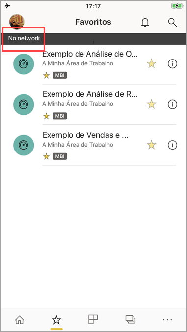

# Ver os dados offline em aplicações móveis do Power BI
Aplica-se a:

|  |  |  |  |  |
|:--- |:--- |:--- |:--- |:--- |
| iPhones |iPads |Telemóveis Android |Tablets Android |Dispositivos Windows 10 |

Uma vantagem da visualização do Power BI numa aplicação móvel em vez de num navegador móvel é que pode ver os dados mesmo quando não estiver ligado a uma rede. 

Por predefinição, o Power BI atualiza os dados com frequência para que obtenha respostas atualizadas para as suas questões de negócios a qualquer momento, mesmo durante o transporte ou viagens.

## Acesso a dados enquanto estiver offline
Enquanto estiver offline, pode aceder e interagir com dashboards a que tenha acedido anteriormente a partir da aplicação móvel.

Também tem acesso só de leitura a todos os relatórios do Power BI a que tiver acedido anteriormente a partir da aplicação móvel. Pode ver o relatório completo, mas não filtrar, fazer filtragem cruzada, classificar ou utilizar segmentações de dados nele.

## Atualização de dados em segundo plano
A atualização em segundo plano atualiza os seus dashboards favoritos, bem como os dashboards e relatórios que visualizou nas duas últimas semanas, com os dados do serviço Power BI (não da origem de dados). Se estiver ligado ao Wi-Fi, a atualização em segundo plano atualiza a cada 2 horas. Caso contrário, se estiver numa rede 3G, o Power BI atualiza o conteúdo a cada 24 horas.

Pode desativar a atualização agendada, por exemplo, para evitar a utilização da rede. Verifique as configurações do dispositivo.

> [!NOTE]
> Se utiliza a aplicação móvel do Power BI no seu dispositivo iOS e a sua organização configurou o MAM do Microsoft Intune, a atualização de dados em segundo plano está desativada. Na próxima vez que entrar na aplicação, o Power BI atualiza os dados do serviço Power BI na Web.
> 
> Saiba mais sobre como [configurar as aplicações móveis do Power BI com o Microsoft Intune](../../service-admin-mobile-intune.md). 
> 
> 

## Indicadores offline
O Power BI fornece indicadores claros quando entrar e sair do modo offline, assim como indicadores de dashboards, relatórios e mosaicos ausentes que não estão disponíveis offline.

## Limitações
Quando estiver offline com o Power BI no dispositivo móvel, pode encontrar estas limitações:

* O Power BI pode armazenar em cache até 250 MB de dados offline.
* Alguns tipos de mosaico exigem uma ligação de servidor ativa. Por conseguinte, não estão disponíveis offline; por exemplo, mosaicos do Bing e alguns mosaicos personalizados.
* Livros inteiros do Excel no Power BI não estão disponíveis offline.
* Pode ver relatórios móveis do Reporting Services e KPIs offline, se os tiver visualizado enquanto esteve ligado. Não são atualizados em segundo plano. São atualizados sempre que os abrir.
* Nas aplicações móveis do Power BI, não pode ver os ficheiros do Power BI Desktop (.pbix) guardados no Power BI Report Server. 

## Próximos passos
Os seus comentários ajudam-nos a decidir o que implementar no futuro, portanto, não se esqueça de votar noutros recursos que gostaria de ver nas aplicações móveis do Power BI. 

* [Aplicações do Power BI para dispositivos móveis](mobile-apps-for-mobile-devices.md)
* Siga o @MSPowerBI no Twitter
* Participe na conversa na [Comunidade do Power BI](http://community.powerbi.com/)
* [O que é o Power BI?](../../power-bi-overview.md)

