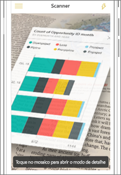

# Digitalizar um código QR do Power BI a partir do dispositivo móvel
Aplica-se a:

|  |  |  |  |
|:--- |:--- |:--- |:--- |
|iPhones |iPads |Telemóveis Android |Tablets Android |

Os códigos QR no Power BI podem ligar qualquer item do mundo real diretamente às informações do BI relacionadas; não é necessária navegação ou pesquisa.

Suponhamos que um colega [criou um código QR no serviço do Power BI](../../create-reports/service-create-qr-code-for-tile.md) para um relatório ou mosaico num dashboard, partilhou o dashboard ou relatório consigo e colocou o código QR numa localização estratégica; por exemplo, num e-mail ou item específico. 

Pode digitalizar o código QR para ter acesso imediato ao mosaico ou relatório relevante, diretamente do seu telemóvel, com o scanner da aplicação do Power BI ou qualquer outro scanner instalado no seu telemóvel. 

Se o seu colega não tiver partilhado o dashboard ou relatório consigo, pode pedir o acesso diretamente a partir da aplicação móvel. 

> [!NOTE]
> Também pode [ler um código QR do relatório com a aplicação Power BI for Mixed Reality](./mobile-hololens2-app.md#open-reports-with-qr-codes).

## Digitalizar um código QR do Power BI no iPhone com o scanner do Power BI

1. Na barra de navegação, toque em **Mais opções** (...) e, em seguida, toque em **Leitor**.

    

2. Se a câmara não estiver ativada, tem de aprovar a utilização da câmara pela aplicação do Power BI. Esta é uma aprovação única. 
 
3. Aponte o scanner para o código QR do Power BI. 
   
    
4. O mosaico ou relatório parece pairar sobre o fundo na realidade aumentada.
   
    

5. Pode tocar no mosaico para abri-lo em modo de foco ou voltar ao scanner.

### Digitalizar um código QR de um scanner externo no iPhone
1. Com qualquer scanner instalado no seu telemóvel, aponte o scanner para o código QR relevante do Power BI para ter acesso imediato ao mosaico ou relatório. 
2. Caso não tenha a aplicação Power BI instalada, será redirecionado para a [Apple App Store para transferi-la](https://go.microsoft.com/fwlink/?LinkId=522062) no seu iPhone.

## Digitalizar um código QR do Power BI no dispositivo Android com o scanner do Power BI

1. Na barra de navegação, toque em **Mais opções** (...) e, em seguida, toque em **Leitor**.

    

2. Se a câmara não estiver ativada, tem de aprovar a utilização da câmara pela aplicação do Power BI. Esta é uma aprovação única. 

3. Aponte o scanner para o código QR do Power BI. 
   
    
4. O mosaico ou relatório abre automaticamente no Power BI.
   
    

### Digitalizar um código QR de um scanner externo no dispositivo Android
1. Com qualquer scanner instalado no dispositivo Android, aponte o scanner para o código QR relevante do Power BI para ter acesso imediato ao mosaico ou relatório. 
2. Se não tiver a aplicação Power BI instalada, será redirecionado para o [Google Play para transferi-la](https://go.microsoft.com/fwlink/?LinkID=544867). 

## Próximos passos
* [Ligar a dados do Power BI do mundo real](mobile-apps-data-in-real-world-context.md) com as aplicações móveis
* [Criar um código QR para um mosaico no serviço Power BI](../../create-reports/service-create-qr-code-for-tile.md)
* [Criar um código QR para um relatório no serviço Power BI](../../create-reports/service-create-qr-code-for-report.md)
* Também pode [ler um código QR com a aplicação Power BI for Mixed Reality](./mobile-hololens2-app.md)
* Perguntas? [Experimente perguntar à Comunidade do Power BI](https://community.powerbi.com/)
