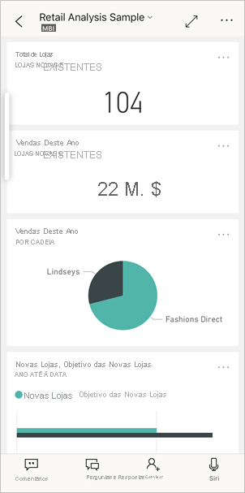
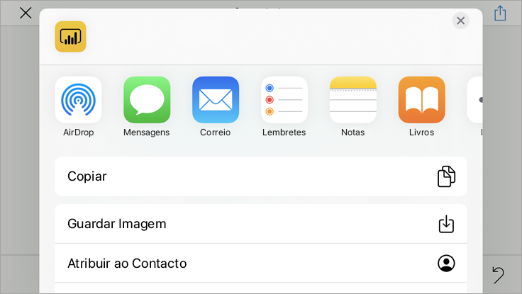

# Quickstart: Explorar dashboards e relatórios nas aplicações móveis do Power BI
Neste início rápido, pode fazer uma visita guiada rápida da aplicação Power BI Mobile e explorar um relatório e dashboard de exemplo. É apresentada a aplicação Power BI para iOS, mas pode facilmente acompanhar noutros dispositivos.

Aplica-se a:

|  |  |  |  |
|:--- |:--- |:--- |:--- |
| iPhone | iPad | Android | Windows 10 |

>[!NOTE]
>O suporte à aplicação móvel do Power BI para **telemóveis com o Windows 10 Mobile** será descontinuado a 16 de março de 2021. [Saiba mais](https://go.microsoft.com/fwlink/?linkid=2121400)

O dashboard é um portal para o ciclo de vida e os processos da sua empresa. É uma vista geral, um único local para monitorizar o estado atual da empresa. Os relatórios são vistas interativas dos seus dados, com elementos visuais que representam diferentes descobertas e informações obtidas através desses dados. 

## Pré-requisitos

* **Inscrever-se no Power BI**: Se não estiver inscrito no Power BI, [inscreva-se para uma avaliação gratuita](https://app.powerbi.com/signupredirect?pbi_source=web) antes de começar.
* **Instalar a aplicação Power BI no seu dispositivo**: transfira a aplicação móvel Power BI** a partir da [App Store](https://apps.apple.com/app/microsoft-power-bi/id929738808) (iOS) ou [Google Play](https://play.google.com/store/apps/details?id=com.microsoft.powerbim&amp;amp;clcid=0x409) (Android).
* **Transferir o Exemplo de Análise de Revenda**: o primeiro passo deste início rápido é transferir o Exemplo de Análise de Revenda no serviço do Power BI. [Saiba como transferir um exemplo](./mobile-apps-download-samples.md) para a sua conta do Power BI para começar. Certifique-se de que seleciona o Exemplo de Análise de Revenda.

Depois de concluir os pré-requisitos e transferir o Exemplo de Análise de Revenda para a sua conta do Power BI, estará pronto para começar esta visita guiada rápida.

## Ver um dashboard no seu dispositivo móvel
1. No seu dispositivo, abra a aplicação Power BI e inicie sessão com as credenciais da sua conta do Power BI, as mesmas que utilizou no serviço Power BI no browser.
 
1. Agora, toque no ícone **Áreas de trabalho** , selecione **As Minhas Áreas de Trabalho** e, em seguida, toque no Exemplo de Análise de Revenda para abri-lo.

    
   
    Os dashboards do Power BI têm um aspeto diferente no seu dispositivo móvel relativamente ao que têm no serviço Power BI. Todos os mosaicos são apresentados com a mesma largura e são dispostos um após o outro, de cima para baixo.

6. Desloque para baixo e toque no gráfico de linhas preenchido “Vendas deste Ano, Vendas do Ano Passado”.

    

    Abre-se no modo de detalhe.

7. No modo de detalhe, toque em **Abr** no gráfico. Os valores de abril são apresentados na parte superior do gráfico.

    

8. Toque no ícone Relatório  na parte inferior do ecrã (em dispositivos Android, este ícone poderá estar na parte superior do ecrã). O relatório relacionado com este mosaico abre-se no modo horizontal.

    

9. Toque na bolha amarela “040 – Juniors” no gráfico de bolhas. Observe como realça os valores relacionados nos outros gráficos. 

    

10. Percorra para cima para ver uma barra de ferramentas na parte inferior e toque em **Mais opções (…)** .

    

11. Desloque-se para baixo na lista e selecione **Anotar**.

    

12. Na barra de ferramentas Anotar, toque no ícone de cara sorridente e, em seguida, toque na página de relatório em que gostaria de adicionar algumas caras sorridentes.
 
    

13. Agora, toque em **Partilhar** no canto superior direito.

14. Escolha de que forma quer partilhar o relatório.  

    

    Pode partilhar este instantâneo com qualquer pessoa, dentro ou fora da sua organização. Se essa pessoa estiver na sua organização e tiver a sua própria conta do Power BI, também conseguirá abrir o relatório de Exemplo de Análise de Revenda.

## Limpar recursos

Depois de concluir este manual de início rápido, se desejar, pode eliminar o dashboard, o relatório e o conjunto de dados de exemplo da Análise de Revenda.

1. Abra o serviço Power BI ([serviço Power BI](https://app.powerbi.com)) e inicie sessão.

2. Na barra de navegação, selecione **A Minha Área de Trabalho**.

3. Selecione o separador Dashboards e, em seguida, clique no ícone de caixote do lixo.

    

    Agora, clique no separador Relatórios e repita o procedimento.

4. Depois, selecione o separador Conjuntos de dados, clique em **Mais opções** (...) e selecione **Eliminar**. 

    

## Próximos passos

Neste início rápido, explorou um dashboard e um relatório de exemplo no seu dispositivo móvel. Leia mais sobre como trabalhar no serviço Power BI. 

> [!div class="nextstepaction"]
> [Início Rápido: Introdução ao serviço Power BI](../end-user-experience.md)

