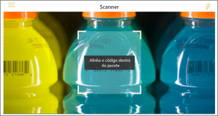
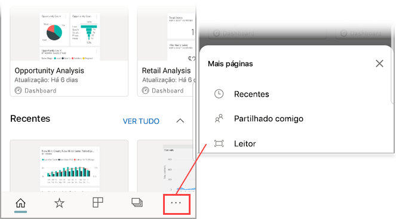

# Ler um código de barras com o seu dispositivo a partir da aplicação móvel Power BI
Leia códigos de barras físicos para aceder diretamente a informações filtradas do Power BI na aplicação móvel do Power BI.

Aplica-se a:

|  |  |  |  |
|:--- |:--- |:--- |:--- |
|iPhones |iPads |Telemóveis Android |Tablets Android |

Suponhamos que um colega [marcou um campo de código de barras num relatório do Power BI Desktop](../../transform-model/desktop-mobile-barcodes.md) e partilhou o relatório consigo. 

Quando ler um código de barras de um produto com o leitor da aplicação Power BI no seu dispositivo, irá ver o relatório (ou lista de relatórios) com esse código de barras. Pode abrir o relatório filtrado nesse código de barras.

## Ler um código de barras com o leitor do Power BI
1. Na barra de navegação, toque em **Mais opções** (...) e, em seguida, toque em **Leitor**.

    

2. Se a câmara não estiver ativada, tem de aprovar a utilização da câmara pela aplicação do Power BI. Esta aprovação só é feita uma vez. 
4. Aponte o leitor para um código de barras num produto. Irá ver uma lista de relatórios associados a esse código de barras.
5. Toque no nome do relatório para o abrir no seu dispositivo. O relatório é filtrado automaticamente com base nesse código de barras.

## Filtrar por outros códigos de barras num relatório
Ao ver um relatório filtrado por um código de barras no seu dispositivo, poderá filtrar esse mesmo relatório por um código de barras diferente.

* Se o código de barras tiver um filtro , o filtro estará ativo e o relatório estará já filtrado por um código de barras. 
* Se o ícone não tiver um filtro , o filtro não estará ativo e o relatório não estará filtrado por um código de barras. 

Seja qual for o caso, toque no ícone para abrir um pequeno menu com um leitor a pairar.

* Coloque o foco do leitor no novo item para alterar o filtro do relatório para um valor de código de barras diferente. 
* Selecione **Limpar filtro de código de barras** para voltar ao relatório não filtrado.
* Selecione **Filtrar por códigos de barras recentes** para mudar o filtro de relatório para um dos códigos de barras que leu na sessão atual.

## Problemas ao ler um código de barras
Eis algumas das mensagens que poderá ver quando ler um código de barras num produto.

### "Não foi possível filtrar o relatório..."
O relatório que decidiu filtrar baseia-se num modelo de dados que não inclui este valor de código de barras. Por exemplo, o produto "água mineral" não está incluído no relatório.  

### Os elementos visuais no relatório, ou alguns deles, não contêm valores
O valor do código de barras que leu existe no modelo mas os elementos visuais no relatório, ou alguns deles, não contêm este valor e, consequentemente, a filtragem devolve um estado vazio. Tente ver outras páginas de relatório ou editar os seus relatórios no Power BI Desktop para conter este valor 

### "Parece que não tem relatórios que possam ser filtrados por códigos de barras."
Isto significa que não tem relatórios compatíveis com códigos de barras. O leitor de código de barras só pode filtrar relatórios que tenham uma coluna marcada como **Código de barras**.  

Certifique-se de que o utilizador, ou o proprietário do relatório, marcou uma coluna como **Código de barras** no Power BI Desktop. Saiba mais sobre [marcar um campo de código de barras no Power BI Desktop](../../transform-model/desktop-mobile-barcodes.md)

### "Não foi possível filtrar o relatório. Parece que este código de barras não existe nos dados de relatório".
O relatório que decidiu filtrar baseia-se num modelo de dados que não inclui este valor de código de barras. Por exemplo, o produto "água mineral" não está incluído no relatório. Pode ler um produto diferente, selecionar outro relatório (se houver mais do que um relatório disponível) ou ver o relatório sem filtragem. 

## Próximos passos
* [Marcar um campo de código de barras no Power BI Desktop](../../transform-model/desktop-mobile-barcodes.md)
* [Mosaicos de dashboards no Power BI](../end-user-tiles.md)
* [Dashboards no Power BI](../end-user-dashboards.md)
