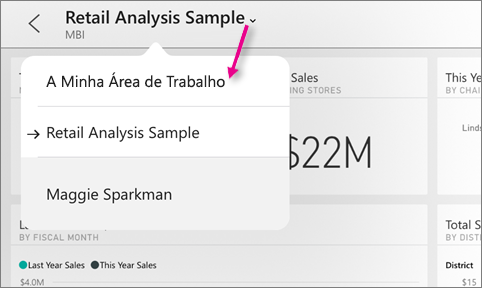
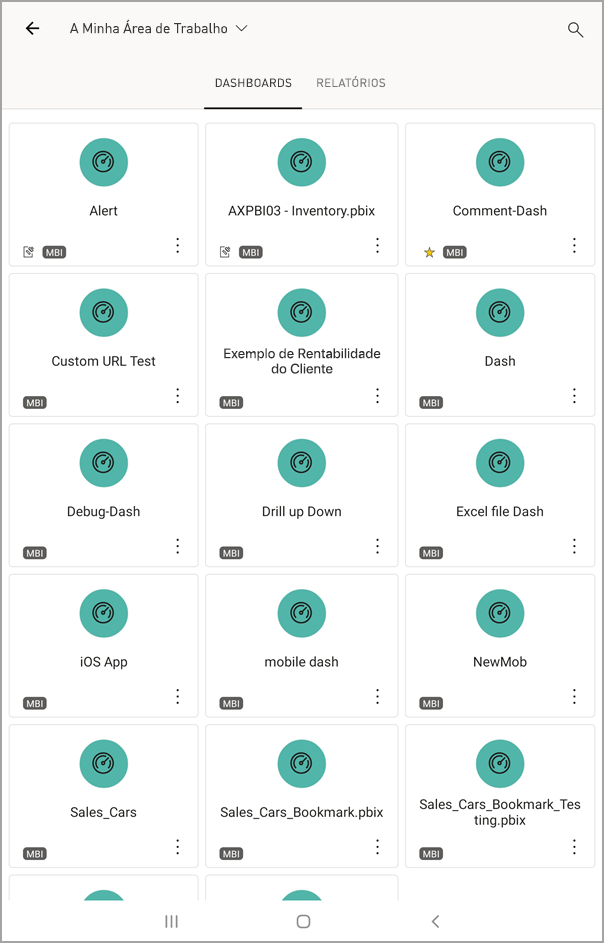
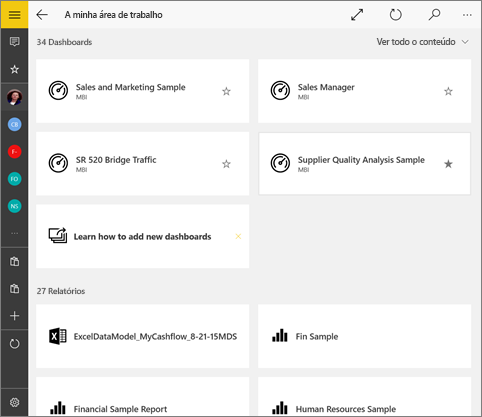
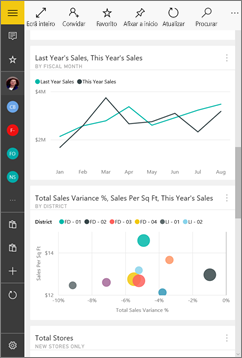
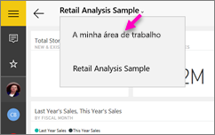
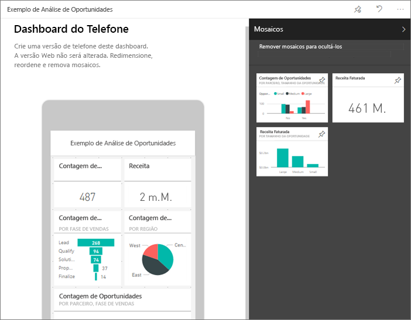

# Ver dashboards e relatórios nas aplicações móveis do Power BI
Aplica-se a:

|  |  |  |  |  |
|:--- |:--- |:--- |:--- |:--- |
| [iPhones](mobile-apps-view-dashboard.md#view-dashboards-on-your-iphone) |[iPads](mobile-apps-view-dashboard.md#view-dashboards-on-your-ipad) |[Telemóveis Android](mobile-apps-view-dashboard.md#view-dashboards-on-your-android-phone) |[Tablets Android](mobile-apps-view-dashboard.md#view-dashboards-on-your-android-tablet) |[Dispositivos Windows 10](mobile-apps-view-dashboard.md#view-dashboards-on-your-windows-10-device) |

Os dashboards são um portal para o ciclo de vida e processos de sua empresa. Um dashboard é uma descrição geral, um único lugar para monitorizar o estado atual do negócio.

## Criar dashboards no serviço Power BI (https://powerbi.com)
**Não cria dashboards nas aplicações móveis.** 

Para ver dashboards e relatórios no seu dispositivo móvel, tem de criar ou ligar-se aos mesmos através de um browser. 

1. Aceda ao serviço Power BI ([https://www.powerbi.com](https://www.powerbi.com)) e [inscreva-se para obter uma conta](../../service-self-service-signup-for-power-bi.md).
2. [Crie os seus próprios dashboards e relatórios do Power BI](../../service-get-started.md) ou ligue-se a [aplicações do Power BI](../../service-connect-to-services.md) existentes para obter uma variedade de serviços, como o [Microsoft Dynamics CRM](../../service-connect-to-microsoft-dynamics-crm.md) e o [Adobe Analyics](../../service-connect-to-adobe-analytics.md).

Segue-se um dashboard do Power BI no serviço Power BI:

## Ver dashboards no seu iPhone
1. Abra a aplicação Power BI no seu iPhone e inicie sessão.
   
   É necessário [transferir a aplicação para iPhone](http://go.microsoft.com/fwlink/?LinkId=522062) a partir da Apple App Store?
2. Toque num dashboard para abri-lo.  
   
    
   
   * As estrelas amarelas  mostram os dashboards favoritos. 
   * A notação abaixo de cada nome de dashboard (neste caso, "MBI")  mostra como os dados são classificados em cada dashboard. Leia mais sobre a [classificação de dados no Power BI](../../service-data-classification.md).
   
   Por predefinição, os dashboards do Power BI parecem um pouco diferentes no seu iPhone. Todos os mosaicos são apresentados com o mesmo tamanho e são dispostos um após o outro, de cima para baixo.
   
    
   
   > [!TIP]
   > Se for o proprietário do dashboard, no serviço Power BI, pode [criar uma vista do dashboard especificamente para telemóveis](../../service-create-dashboard-mobile-phone-view.md) no modo vertical. 
   > 
   > 
   
    Ou coloque o telemóvel de lado para ver o dashboard no modo horizontal.
   
    
3. Passe o dedo para cima e para baixo para ver todos os mosaicos no dashboard. Pode:
   
   * [Toque num mosaico](mobile-tiles-in-the-mobile-apps.md) para abri-lo no modo de detalhe e interagir com o mesmo.
   * Toque na estrela  para [torná-lo um favorito](mobile-apps-favorites.md).
   * Toque em **Convidar**  para [convidar um colega](mobile-share-dashboard-from-the-mobile-apps.md) para ver o seu dashboard.
   * [Sincronize o dashboard com o Apple Watch](mobile-apple-watch.md).
4. Para regressar à lista de dashboards, toque na seta junto ao título do dashboard e, em seguida, toque em **A Minha Área de Trabalho**.
   
   

### Ver dashboards no modo horizontal no iPhone
Basta colocar o telemóvel de lado para ver dashboards no modo horizontal. O esquema do dashboard muda de uma série de mosaicos para uma vista de todo o dashboard. Vê todos os mosaicos do dashboard dispostos da mesma forma que no serviço Power BI.

Pode utilizar o gesto de beliscar para ampliar e reduzir áreas diferentes do seu dashboard e o movimento panorâmico para navegar pelo dashboard. Além disso, também é possível [tocar num mosaico](mobile-tiles-in-the-mobile-apps.md) para abri-lo no modo de detalhe e interagir com os dados.

## Ver dashboards no seu iPad
1. Abra a aplicação Power BI.
   
   É necessário [transferir a aplicação iPad](http://go.microsoft.com/fwlink/?LinkId=522062) da Apple App Store primeiro?
2. Toque em **Dashboards** na parte superior da aplicação.  
   
   
   
   * As estrelas amarelas  mostram os dashboards favoritos. 
   * A notação abaixo de cada nome de dashboard (neste caso, "MBI")  mostra como os dados são classificados em cada dashboard. Leia mais sobre a [classificação de dados no Power BI](../../service-data-classification.md).
3. Pode partilhar um dashboard a partir da sua área de trabalho. Toque nas reticências (**...**) no canto inferior direito do mosaico do dashboard e toque em **Convidar Outras Pessoas**.
   
   
4. Também pode tocar num dashboard para abri-lo e ver os respetivos mosaicos. Enquanto estiver no dashboard, pode interagir com o mesmo:
   
   * [Toque num mosaico para interagir](mobile-tiles-in-the-mobile-apps.md) com o mesmo.
   * [Abrir os relatórios](mobile-reports-in-the-mobile-apps.md) subjacentes aos mosaicos.
   * [Convide outras pessoas para ver o dashboard](mobile-share-dashboard-from-the-mobile-apps.md).
   * [Anotar e partilhar um instantâneo](mobile-annotate-and-share-a-tile-from-the-mobile-apps.md) de um mosaico.
5. Para regressar a A Minha Área de Trabalho, toque no nome do dashboard no canto superior esquerdo e, em seguida, toque em **A Minha Área de Trabalho**.
   
   

## Ver dashboards no seu telemóvel Android
1. Abra a aplicação Power BI no seu telemóvel Android e inicie sessão.
   
   É necessário [transferir a aplicação Android](http://go.microsoft.com/fwlink/?LinkID=544867) primeiro?
2. Toque num dashboard para abri-lo.   
   
   

    Estrelas amarelas  mostram os dashboards favoritos. 

    A notação abaixo do nome de um dashboard (neste caso, "MBI")  mostra como os dados são classificados em cada dashboard. Leia mais sobre a [classificação de dados no Power BI](../../service-data-classification.md).

    Os dashboards do Power BI parecem um pouco diferentes no seu telemóvel Android. Todos os mosaicos são apresentados com a mesma largura e são dispostos um após o outro, de cima para baixo.

    

    Se for o proprietário do dashboard, no serviço Power BI, pode [criar uma vista do dashboard especificamente para telemóveis](../../service-create-dashboard-mobile-phone-view.md) no modo vertical. 

1. Enquanto estiver no dashboard, pode tocar nas reticências (...) verticais junto ao nome para convidar um colega, atualizar ou obter informações sobre o dashboard:
   
   
2. Passe o dedo para cima e para baixo para ver todos os [mosaicos no dashboard](mobile-tiles-in-the-mobile-apps.md). 
3. Para regressar à página inicial de dashboards, toque no nome do dashboard para abrir o trilho de navegação e, em seguida, toque em **A Minha Área de Trabalho**.   

## Ver dashboards no seu tablet Android
1. Abra a aplicação Power BI no seu tablet Android e inicie sessão.
   
   É necessário [transferir a aplicação Android](http://go.microsoft.com/fwlink/?LinkID=544867) primeiro?
2. Toque num dashboard para abri-lo.   
   
   
   
   * As estrelas amarelas  mostram os dashboards favoritos. 
   * A notação abaixo de cada nome de dashboard (neste caso, "MBI")  mostra como os dados são classificados em cada dashboard. Leia mais sobre a [classificação de dados no Power BI](../../service-data-classification.md).
3. Enquanto estiver no dashboard, pode tocar nas reticências (...) verticais junto ao nome para convidar um colega, atualizar ou obter informações sobre o dashboard:
   
   
4. Passe o dedo para cima e para baixo para ver todos os [mosaicos no dashboard](mobile-tiles-in-the-mobile-apps.md). 
   
   Pode utilizar o gesto de beliscar para ampliar e reduzir áreas diferentes do seu dashboard e o movimento panorâmico para navegar pelo dashboard. Além disso, também é possível [tocar num mosaico](mobile-tiles-in-the-mobile-apps.md) para abri-lo no modo de detalhe e interagir com os dados.
5. Para regressar à página inicial de dashboards, toque no nome do dashboard para abrir o trilho de navegação e, em seguida, toque em **A Minha Área de Trabalho**:
   
    

    Pode utilizar o gesto de beliscar para ampliar e reduzir áreas diferentes do seu dashboard e o movimento panorâmico para navegar pelo dashboard. Além disso, também é possível [tocar num mosaico](mobile-tiles-in-the-mobile-apps.md) para abri-lo no modo de detalhe e interagir com os dados.

## Ver dashboards no seu dispositivo Windows 10
1. Abra a aplicação Power BI no seu dispositivo Windows 10 e inicie sessão.
   
   É necessário [transferir a aplicação](http://go.microsoft.com/fwlink/?LinkID=526478) primeiro?
2. Toque num dashboard para abri-lo.   
   
   
   
   * As estrelas pretas mostram os dashboards favoritos. 
   * A notação abaixo de cada nome de dashboard (neste exemplo, **MBI**) mostra como os dados são classificados em cada dashboard. Leia mais sobre a [classificação de dados no Power BI](../../service-data-classification.md).
   
   Os dashboards do Power BI parecem um pouco diferentes no seu telemóvel Windows 10. Todos os mosaicos são apresentados com a mesma largura e são dispostos um após o outro, de cima para baixo.
   
   
   
    Também pode colocar o telemóvel de lado para ver dashboards no modo horizontal.
   
   > [!TIP]
   > Se for o proprietário do dashboard, no serviço Power BI, pode [criar uma vista do dashboard especificamente para telemóveis](../../service-create-dashboard-mobile-phone-view.md) no modo vertical. 
   > 
   > 
3. No dashboard, é possível:
   
   * [Tocar num mosaico](mobile-tiles-in-the-mobile-apps.md) para abri-lo e interagir com ele.
   * Toque no ícone de **Ecrã Inteiro**  para apresentar o dashboard do Power BI sem limites ou menus, como a vista de **Diapositivos** no PowerPoint.
   * Toque no ícone **Convidar**  para [partilhar o dashboard](mobile-share-dashboard-from-the-mobile-apps.md) com um colega.
   * Toque na estrela  para [tornar o dashboard um favorito](mobile-apps-favorites.md).
   * Toque no ícone **Afixar em Iniciar** para [afixar o dashboard ao ecrã Iniciar do Windows](mobile-pin-dashboard-start-screen-windows-10-phone-app.md). 
4. Para regressar à página inicial de dashboards, toque no nome do dashboard para abrir o trilho de navegação e, em seguida, toque em **A Minha Área de Trabalho**:
   
    

### Ver dashboards no modo horizontal no seu telemóvel Windows 10
Também pode ver dashboards no modo horizontal, apenas rodando o telemóvel. O esquema do dashboard muda de uma série de mosaicos para uma vista de todo o dashboard; vê todos os mosaicos do dashboard dispostos da mesma forma que no serviço Power BI.

Pode utilizar o gesto de beliscar para ampliar e reduzir áreas diferentes do seu dashboard e o movimento panorâmico para navegar pelo dashboard. Além disso, também é possível [tocar num mosaico](mobile-tiles-in-the-mobile-apps.md) para abri-lo no modo de detalhe e interagir com os dados.

## Criar uma vista de telemóvel de um dashboard no serviço Power BI
Se for o proprietário do dashboard, no serviço Power BI, pode *criar uma vista do dashboard especificamente para telemóveis* no modo vertical. 

Leia mais sobre como [criar uma vista de telemóvel de um dashboard](../../service-create-dashboard-mobile-phone-view.md).

## Passos seguintes
* [Transferir a aplicação Android](http://go.microsoft.com/fwlink/?LinkID=544867) do Google Play  
* [Introdução à aplicação Android para o Power BI](mobile-android-app-get-started.md)  
* [O que é o Power BI?](../../power-bi-overview.md)
* Perguntas? [Experimente perguntar à Comunidade do Power BI](http://community.powerbi.com/)

