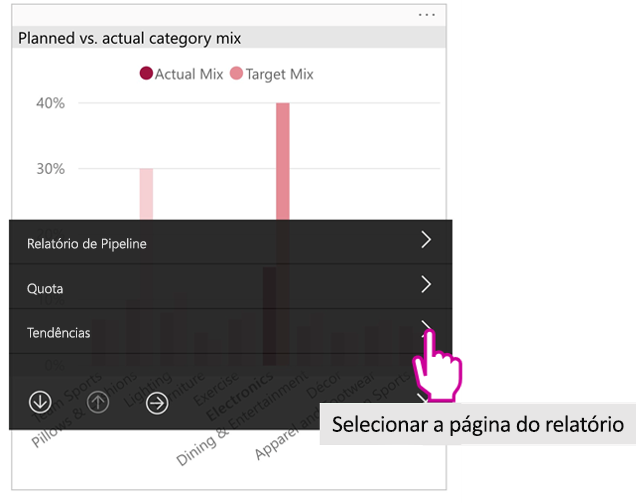

# Ver relatórios do Power BI otimizados para o seu telemóvel

Aplica-se a:

|  |  |
|:--- |:--- |
| iPhones |Telemóveis Android |

Quando exibe um relatório do Power BI no seu telemóvel, o Power BI verifica se o relatório foi otimizado para telemóveis. Em caso afirmativo, o Power BI abre automaticamente o relatório otimizado na vista vertical.

Se não existir um relatório otimizado para telemóvel, o relatório será aberto na mesma, mas nas vistas horizontais não otimizadas. Mesmo num relatório otimizado para telemóveis, se colocar o telemóvel de lado, o relatório será aberto na vista não otimizada com o esquema de relatório otimizado. Se apenas algumas páginas forem otimizadas, irá ver uma mensagem na vista vertical a indicar que o relatório se encontra disponível na vista horizontal.

Todas as restantes funcionalidades de relatórios do Power BI continuam a funcionar em relatórios otimizados para telemóveis. Saiba mais sobre o que pode fazer em:

* [Relatórios em iPhones](mobile-reports-in-the-mobile-apps.md). 
* [Relatórios em telemóveis Android](mobile-reports-in-the-mobile-apps.md).

## Filtrar a página de relatório num telemóvel
Se um relatório otimizado para telemóvel tiver filtros definidos, quando vir o relatório num telemóvel, pode utilizar esses filtros. O relatório é aberto no seu telemóvel, filtrada para os valores a serem filtrados no relatório na web. Aparece uma mensagem a indicar que existem filtros ativos na página. Pode alterar os filtros no seu telemóvel.

1. Toque no ícone de filtro  na parte inferior da página. 
2. Utilize a filtragem básica ou avançada para ver os resultados em que está interessado.
   
    

## Realce cruzado de visuais
Realce cruzado de visuais em retrato vista funciona da forma que ele faz no serviço Power BI e em telemóveis na vista horizontal: quando selecionar dados num elemento visual, este realça dados relacionados noutros elementos visuais nessa página.

Saiba mais sobre [filtrar e realçar no Power BI](../../power-bi-reports-filters-and-highlighting.md).

## Selecionar visuais
Nos relatórios no telemóvel, ao selecionar um visual, o relatório no telemóvel realça esse visual e foca-se no mesmo, neutralizando os gestos de tela.

Com o visual selecionado, pode fazer coisas como deslocar-se no visual. Para desmarcar um visual, basta tocar em qualquer lugar fora da área visual.

## Abrir visuais no modo de detalhe
Relatórios de telemóvel também oferecem um modo de detalhe: Obtenha uma vista mais alargada de um único elemento visual e explorá-lo mais facilmente.

* No relatório de telemóvel, toque nas reticências ( **...** ) no canto superior direito de um visual > **Expandir para o modo de detalhe**.
  
    

O que fazer no modo de detalhe apresenta para a tela de relatório e vice-versa. Por exemplo, se realça um valor num elemento visual, em seguida, regressar ao relatório completo, o relatório é filtrado para o valor que realçou no elemento visual.

Algumas ações só são possíveis no modo de detalhe, devido às limitações de tamanho de ecrã:

* **Desagregar** as informações mostradas num visual. Saiba mais sobre [desagregar e agregar](mobile-apps-view-phone-report.md#drill-down-in-a-visual) num relatório de telemóvel, mais abaixo.
* **Ordene** os valores num visual.
* **Reverter**: limpe os passos de exploração que realizou num elemento visual e reverta para a definição estabelecida quando o relatório foi criado.
  
    Para limpar toda a exploração de um visual, toque nas reticências ( **...** ) > **Reverter**.
  
    
  
    Reverter está disponível ao nível do relatório, limpar a exploração de todos os elementos visuais, ou ao nível visual, limpar a exploração do elemento visual selecionado.   

## Desagregar num visual
Se os níveis de hierarquia estiverem definidos num visual, pode desagregar até às informações detalhadas mostradas num visual e, em seguida, voltar para cima. Pode [adicionar desagregações a um visual](../end-user-drill.md) no serviço Power BI ou no Power BI Desktop.

Existem alguns tipos de desagregação:

### Desagregar um valor
1. Há muito tempo toque (tap e hold) num ponto de dados num elemento visual.
2. Descrição será apresentada e, se a hierarquia esteja definida, em seguida, o rodapé de descrição mostrará desagregação para baixo e seta para cima.
3. Toque na seta para baixo para desagregar

    
    
4. Toque na seta para cima para agregar.

### Desagregar para o nível seguinte
1. Num relatório num telemóvel, toque nas reticências ( **...** ) no canto superior direito > **Expandir para o modo de detalhe**.
   
    
   
    Neste exemplo, as barras mostram os valores de estados.
2. Toque no ícone Explorar  no canto inferior esquerdo.
   
    
3. Toque em **Mostrar nível seguinte** ou em **Expandir para o nível seguinte**.
   
    
   
    Agora, as barras mostram os valores das cidades.
   
    
4. Se tocar na seta no canto superior esquerdo, irá regressar ao relatório de telemóvel com os valores ainda expandidos ao nível inferior.
   
    
5. Para regressar ao nível original, toque nas reticências ( **...** ) novamente > **Reverter**.
   
    

## Pesquisar através de um valor
Exploração do liga-se os valores na página de único relatório, com outras páginas de relatório. Quando pesquisar através de um ponto de dados para outra página de relatório, os valores de ponto de dados são utilizados para filtrar o drilled através da página ou é no contexto dos dados selecionados.
Os autores do relatório podem [definir a exploração do](https://docs.microsoft.com/power-bi/desktop-drillthrough) quando criam o relatório.

1. Há muito tempo toque (tap e hold) num ponto de dados num elemento visual.
2. Descrição será apresentada e se exploração é definida, em seguida, o rodapé de descrição mostrará exploração do seta.
3. Toque na seta para a exploração do

    

4. Escolha qual página de relatório para pormenorizar

    

5. Utilize o botão voltar, no cabeçalho da aplicação para voltar à página de iniciada a partir de.

## Próximos passos
* [Criar relatórios otimizados para aplicações de telemóvel do Power BI](../../desktop-create-phone-report.md)
* [Criar uma vista de telemóvel de um dashboard no Power BI](../../service-create-dashboard-mobile-phone-view.md)
* [Criar visuais responsivos otimizados para qualquer tamanho](../../visuals/desktop-create-responsive-visuals.md)
* Mais perguntas? [Experimente perguntar à Comunidade do Power BI](http://community.powerbi.com/)

