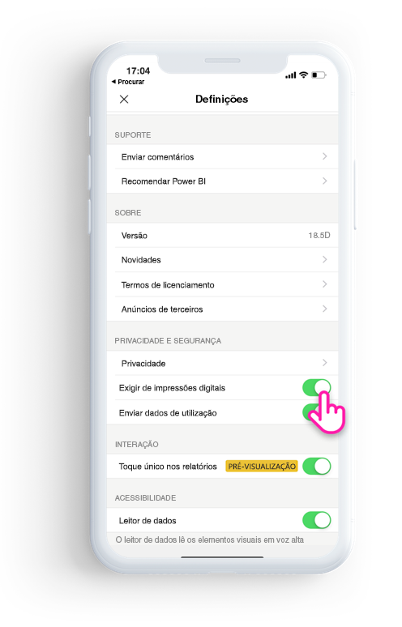
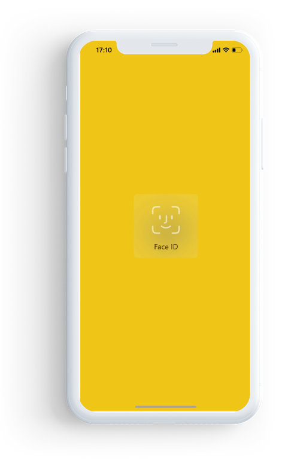

# Proteger a aplicação Power BI com o Face ID, Touch ID ou um código de acesso 

Em muitos casos, os dados geridos no Power BI são confidenciais, têm de ser protegidos e só podem ser acedidos por utilizadores autorizados. 

A aplicação Power BI para iOS permite-lhe proteger os seus dados ao configurar métodos de identificação adicionais. Terá de fornecer o Face ID, o Touch ID ou um código de acesso sempre que iniciar a aplicação ou quando mudar a aplicação de segundo para primeiro plano.

|  |  |
|:--- |:--- |
| iPhones |iPads |

## Ativar o Face ID, Touch ID ou código de acesso nas definições da aplicação

Para utilizar métodos de identificação adicionais no Power BI, aceda às definições da aplicação em **Privacidade e Segurança**. Verá a opção para ativar o Face ID, Touch ID ou código de acesso, com base nas capacidades do seu dispositivo.

Quando esta opção estiver configurada, sempre que iniciar o Power BI ou mudar a aplicação de segundo para primeiro plano, ser-lhe-á pedido para fornecer a sua identificação antes que possa aceder à aplicação. 

A decisão de pedir o Face ID, Touch ID ou código de acesso é tomada pelo sistema iOS, com base nas capacidades do dispositivo. Se o seu dispositivo suportar o Face ID, terá de utilizar o Face ID. Se suportar o Touch ID, terá de utilizar o Touch ID. Se nenhuma destas funcionalidades for suportada, terá de fornecer um código de acesso.

## Utilize a MDM para impor a utilização do Face ID, Touch ID ou código de acesso

Algumas organizações têm políticas de segurança e requisitos de conformidade que impõem métodos de identificação adicionais antes que possa aceder a dados confidenciais da empresa. 

A aplicação Power BI para iOS permite que os administradores controlem essa definição ao emitir as definições de configuração da aplicação via push a partir do Microsoft Intune e de outras soluções de gestão de dados globais (MDM). Os administradores podem utilizar a política de proteção de aplicações para ativar esta definição para todos ou para um grupo de utilizadores.

|Chave  |Tipo  |Descrição  |
|---------|---------|---------|
| com.microsoft.powerbi.mobile.ForceDeviceAuthentication | Booleano | O valor predefinido é Falso.  Quando o valor estiver definido como Verdadeiro, a aplicação irá forçar os utilizadores a identificarem-se com o Face ID, Touch ID ou código de acesso antes de poderem ver dados do Power BI na aplicação. Os utilizadores que não tenham o Face ID, Touch ID ou um código de acesso configurado no respetivo dispositivo, terão de configurar um destes métodos antes que possam aceder ao Power BI.  |

## Próximos passos

[Use MDM to remotely configure Power BI iOS app](mobile-app-configuration.md) (Utilizar a MDM para configurar a aplicação Power BI para iOS remotamente)
