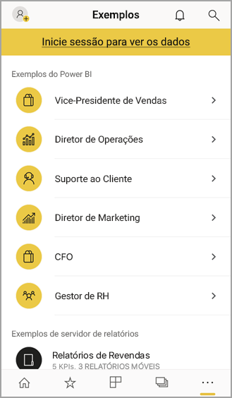
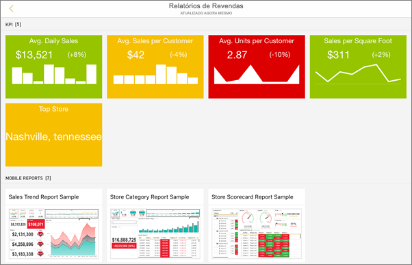
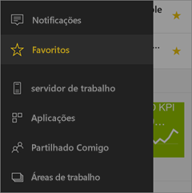
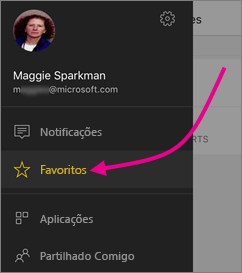
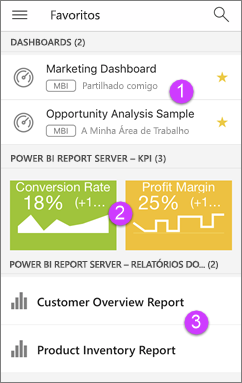

# Introdução à aplicação móvel Power BI em dispositivos iOS
A aplicação Microsoft Power BI para iOS no iPhone, iPad ou iPod Touch proporciona a experiência de BI móvel para o Power BI, Power BI Report Server e Reporting Services. Veja e interaja com os dashboards da sua empresa no local e na cloud em qualquer lugar, com acesso móvel em direto e tátil. Explore os dados nos dashboards e partilhe com os seus colegas em e-mails e mensagens de texto. E mantenha-se a par com os dados sempre atualizados no seu [Apple Watch](mobile-apple-watch.md).  

Crie relatórios do Power BI no Power BI Desktop e publique-os:

* [Publique-os no serviço Power BI](../../service-get-started.md) e crie dashboards.
* [Publique-os no local no Power BI Report Server](../../report-server/quickstart-create-powerbi-report.md).

Em seguida, na aplicação móvel Power BI para iOS, interaja com os seus dashboards e relatórios, seja no local ou na cloud.

Descubra as [novidades nas aplicações móveis do Power BI](mobile-whats-new-in-the-mobile-apps.md).

## Transferir a aplicação
[Transfira a aplicação para iOS](http://go.microsoft.com/fwlink/?LinkId=522062 "Transfira a aplicação para iOS") da Apple App Store para o seu iPhone, iPad ou iPod Touch.

Pode executar a aplicação Power BI para iOS no iPhone 5 e superior, com o iOS 10 ou posterior. Também pode executá-la num iPad ou iPod Touch com o iOS 10 ou posterior. 

## Inscreva-se no serviço do Power BI
Se ainda não se tiver inscrito, aceda a [powerbi.com](https://powerbi.microsoft.com/get-started/) e, em **Power BI – Colaboração e partilha na cloud**, selecione **Experimentar gratuitamente**.

## Introdução à aplicação Power BI
1. No seu dispositivo iOS, abra a aplicação Power BI.
2. Para ver os seus dashboards do Power BI, toque em **Power BI**.  
   Para ver os seus relatórios móveis e KPIs do Reporting Services, toque em **SQL Server Reporting Services**.
   
   
   
   Quando estiver na aplicação, basta tocar no botão de navegação global  no canto superior esquerdo para alternar entre os dois. 

## Experimente os exemplos do Power BI e do Reporting Services
Mesmo sem se inscrever, pode experimentar os exemplos do Power BI e do Reporting Services. Depois de transferir a aplicação, pode ver os exemplos ou começar. Regresse da navegação global aos exemplos sempre que quiser.

### Exemplos do Power BI
Pode ver e interagir com os exemplos de dashboards do Power BI, mas há algumas coisas que não pode fazer com estes. Não pode abrir os relatórios correspondentes aos dashboards, partilhar os exemplos com outras pessoas ou torná-los favoritos.

1. Toque no botão de navegação global  no canto superior esquerdo.
2. Toque no ícone da engrenagem no canto superior direito  e, em seguida, toque em **Exemplos do Power BI**.
3. Escolha uma função e explore o dashboard de exemplo para essa função.  
   
   
   
   > [!NOTE]
   > Nem todas as funcionalidades estão disponíveis nos exemplos. Por exemplo, não pode ver os relatórios de exemplo subjacentes aos dashboards. 
   > 
   > 

### Exemplos de relatórios móveis do Reporting Services
1. Toque no botão de navegação global  no canto superior esquerdo.
2. Toque no ícone da engrenagem no canto superior direito  e, em seguida, toque em **Exemplos do Reporting Services**.
3. Abra a pasta Relatórios de Revenda ou Relatórios de Vendas para explorar os respetivos KPIs e relatórios móveis.
   
   

## Encontre os seus conteúdos nas aplicações móveis do Power BI
Os seus dashboards e relatórios são armazenados em locais diferentes nas aplicações móveis do Power BI, consoante a sua proveniência. Saiba mais sobre [encontrar conteúdos em aplicações móveis](mobile-apps-quickstart-view-dashboard-report.md). Além disso, pode sempre procurar qualquer elemento que tiver nas aplicações móveis do Power BI. 

Saiba mais sobre [encontrar os seus conteúdos nas aplicações móveis](mobile-apps-quickstart-view-dashboard-report.md).

## Ver os dashboards, KPIs e relatórios favoritos
Na página Favoritos nas suas aplicações móveis, vê todos os seus dashboards favoritos do Power BI, juntamente com KPIs e relatórios do Power BI Report Server e do Reporting Services. Quando tornar um dashboard *favorito* na aplicação móvel do Power BI, pode aceder ao mesmo em todos os seus dispositivos, incluindo o serviço Power BI no seu browser. 

* Toque em **Favoritos**.
  
   
  
   Pode ver todos os seus favoritos juntos nesta página:
  
   
  
  1. Dashboards no serviço Power BI
  2. KPIs no Power BI Report Server
  3. Relatórios do Power BI no Power BI Report Server

Saiba mais sobre os [favoritos nas aplicações móveis do Power BI](mobile-apps-favorites.md).

## Suporte empresarial para aplicações móveis do Power BI
As organizações podem utilizar o Microsoft Intune para gerir dispositivos e aplicações, incluindo as aplicações móveis do Power BI para Android e iOS.

O Microsoft Intune permite às organizações controlar elementos, como exigir um PIN de acesso, controlar como os dados são processados pela aplicação e até encriptar dados de aplicações quando a aplicação não está a ser utilizada.

> [!NOTE]
> Se utiliza a aplicação móvel Power BI no seu dispositivo iOS e a sua organização configurou o MAM do Microsoft Intune, a atualização de dados em segundo plano está desativada. Na próxima vez que entrar na aplicação, o Power BI atualiza os dados do serviço Power BI na Web.
> 

Saiba mais sobre como [configurar as aplicações móveis do Power BI com o Microsoft Intune](../../service-admin-mobile-intune.md). 

## Próximos passos

* [O que é o Power BI?](../../power-bi-overview.md)
* Perguntas? [Experimente perguntar à Comunidade do Power BI](http://community.powerbi.com/)

