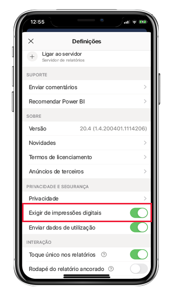

# Proteger a aplicação Power BI com o Face ID, Touch ID, código de acesso ou dados biométricos 

Em muitos casos, os dados geridos no Power BI são confidenciais, têm de ser protegidos e só podem ser acedidos por utilizadores autorizados. 

A aplicação Power BI para iOS e Android permite-lhe proteger os seus dados ao configurar métodos de identificação adicionais. Em seguida, sempre que iniciar a aplicação ou mudar a aplicação para primeiro plano, é necessário um método de identificação. No iOS, isso significa fornecer o Face ID, Touch ID ou um código de acesso. No Android, isso significa fornecer dados biométricos (ID de Impressão Digital).

Aplica-se a:

|  |  |  |  |
|:--- |:--- |:--- |:--- |
|iPhones |iPads |Telemóveis Android |Tablets Android |

## Ativar o Face ID, Touch ID ou código de acesso no iOS

Para utilizar métodos de identificação adicionais na aplicação móvel Power BI para iOS, aceda às definições da aplicação em **Privacidade e Segurança**. Verá a opção para ativar o Face ID, Touch ID ou código de acesso. As opções que vê dependem das funcionalidades do seu dispositivo.

Quando esta definição estiver ativada, sempre que iniciar a aplicação ou mudar a aplicação para primeiro plano, ser-lhe-á pedido para fornecer o seu ID antes de poder aceder à aplicação.

O tipo de ID que lhe será pedido depende das funcionalidades do seu dispositivo. Se o seu dispositivo suportar o Face ID, terá de utilizar o Face ID. Se suportar o Touch ID, terá de utilizar o Touch ID. Se nenhuma destas funcionalidades for suportada, terá de fornecer um código de acesso. A imagem abaixo mostra o ecrã de autenticação do Face ID.

## Ativar os dados biométricos (ID de Impressão Digital) no Android

Para utilizar métodos de identificação adicionais na aplicação móvel Power BI para Android, aceda às definições da aplicação em **Privacidade e Segurança**. Verá a opção para ativar os dados biométricos.

Quando esta definição estiver ativada, sempre que iniciar a aplicação ou mudar a aplicação para primeiro plano, ser-lhe-á pedido para fornecer os seus dados biométricos (ID de Impressão Digital) antes de poder aceder à aplicação.

A imagem abaixo mostra o ecrã de autenticação de impressão digital.

>[!NOTE]
>Para utilizar a definição Exigir Autenticação Biométrica da aplicação móvel, tem de configurar os dados biométricos no seu dispositivo Android. Se o seu dispositivo não suportar dados biométricos, não poderá proteger o acesso aos seus dados do Power BI com esta definição da aplicação móvel.
>
>Se o seu administrador tiver [ativado remotamente o acesso seguro](#mdm-enforcement-of-secure-access-to-your-power-bi-mobile-app) da aplicação móvel, tem de configurar os dados biométricos no seu dispositivo para aceder à aplicação, caso ainda não o tenha feito. Se o seu dispositivo não suportar dados biométricos, a definição remota não o afetará. O acesso à sua aplicação móvel permanecerá inseguro.

## Imposição de MDM de acesso seguro à sua aplicação móvel Power BI.

Algumas organizações têm políticas de segurança e requisitos de conformidade que impõem métodos de identificação adicionais antes que possa aceder a dados confidenciais da empresa.

Para suportar esta situação, a aplicação móvel Power BI permite que os administradores controlem a definição de acesso seguro da aplicação móvel ao emitir as definições de configuração da aplicação a partir do Microsoft Intune e de outras soluções de gestão de dados globais (MDM). Os administradores podem utilizar a política de proteção de aplicações para ativar esta definição para todos ou para um grupo de utilizadores. Para obter detalhes, veja [Use MDM to remotely configure Power BI mobile app](mobile-app-configuration.md#data-protection-settings-ios-and-android) (Utilizar a MDM para configurar a aplicação móvel Power BI remotamente).

## Próximas etapas
* [Use MDM to remotely configure Power BI mobile app](mobile-app-configuration.md) (Utilizar a MDM para configurar a aplicação móvel Power BI remotamente)
