# <a name="using-oauth-to-connect-to-power-bi-report-server-and-ssrs"></a>Utilizar OAuth para ligar ao Power BI Report Server e SSRS

Pode utilizar o OAuth para se ligar ao Power BI Report Server e aos Reporting Services para apresentar relatórios móveis ou KPIs. Saiba como configurar o ambiente para suportar a autenticação OAuth com a aplicação móvel do Power BI, para se ligar ao Power BI Report Server e ao SQL Server Reporting Services 2016 ou posterior.

> [!NOTE]
> A visualização de relatórios do Power BI alojados no Power BI Report Server com a utilização de WAP para autenticação é agora suportada para aplicações iOS e Android.

## <a name="requirements"></a>Requirements

O Windows Server 2016 é necessário para os servidores do Proxy de Aplicações Web (WAP) e dos Serviços de Federação do Active Directory (AD FS). Não precisa de ter um domínio de nível funcional do Windows 2016.

## <a name="domain-name-services-dns-configuration"></a>Configuração dos Serviços de Nomes de Domínio (DNS)

O URL público será aquele a que a aplicação móvel do Power BI se ligará. Por exemplo, deve ser semelhante ao seguinte.

```https
https://reports.contoso.com
```

O registo DNS dos **relatórios** para o endereço IP público do servidor Proxy de Aplicações Web (WAP). Também terá de configurar um registo DNS público para o servidor ADFS. Por exemplo, poderá ter configurado o servidor do ADFS com o seguinte URL.

```https
https://fs.contoso.com
```

O registo DNS de **fs** para o endereço IP público do servidor do Proxy de Aplicações Web (WAP), uma vez que será publicado como parte da aplicação WAP.

## <a name="certificates"></a>Certificados

Terá de configurar certificados para a aplicação WAP e para o servidor ADFS. Ambos estes certificados têm de fazer parte de uma autoridade de certificação válida que os seus dispositivos móveis reconhecem.

## <a name="reporting-services-configuration"></a>Configuração do Reporting Services

A configuração do Reporting Services é muito simples. Temos de nos certificar de que temos um Nome do Principal do Serviço (SPN) válido para ativar a autenticação Kerberos adequada a ocorrer e que o servidor do Reporting Services está ativado para a autenticação de negociação.

### <a name="service-principal-name-spn"></a>Nome do Principal do Serviço (SPN)

O SPN é um identificador exclusivo para um serviço que utiliza a autenticação Kerberos. Terá de confirmar que tem um SPN HTTP adequado para o servidor de relatórios.

Para obter informações sobre como configurar o Nome do Principal do Serviço (SPN) adequado para o servidor de relatórios, veja [Register a Service Principal Name (SPN) for a Report Server (Registar um Nome do Principal do Serviço (SPN) para um Servidor de Relatórios)](/sql/reporting-services/report-server/register-a-service-principal-name-spn-for-a-report-server).

### <a name="enabling-negotiate-authentication"></a>Ativar a autenticação de negociação

Para permitir que um servidor de relatórios utilize a autenticação Kerberos, tem de configurar o Tipo de Autenticação do servidor de relatórios como RSWindowsNegotiate. Pode fazê-lo no ficheiro rsreportserver.config.

```xml
<AuthenticationTypes>  
    <RSWindowsNegotiate />  
    <RSWindowsKerberos />  
    <RSWindowsNTLM />  
</AuthenticationTypes>
```

Para obter mais informações, veja [Modify a Reporting Services Configuration File (Modificar um Ficheiro de Configuração do Reporting Services)](/sql/reporting-services/report-server/modify-a-reporting-services-configuration-file-rsreportserver-config) e [Configure Windows Authentication on a Report Server (Configurar a Autenticação do Windows num Servidor de Relatórios)](/sql/reporting-services/security/configure-windows-authentication-on-the-report-server).

## <a name="active-directory-federation-services-adfs-configuration"></a>Configuração do Active Directory Federation Services (ADFS)

Tem de configurar o ADFS num servidor do Windows 2016 no seu ambiente. A configuração pode ser feita através do Gestor de Servidor, ao selecionar Adicionar Funções e Funcionalidades em Gerir. Para obter mais informações, veja [Active Directory Federation Services](/windows-server/identity/active-directory-federation-services).

### <a name="create-an-application-group"></a>Criar um grupo de aplicações

No ecrã Gestão do Serviços de Federação do Active Directory (AD FS), deve criar um grupo de aplicações para o Microsoft SQL Server Reporting Services, que incluirá informações das aplicações Power BI Mobile.

Pode criar o grupo de aplicações com os seguintes passos.

1. Na aplicação Gestão do AD FS, clique com o botão direito do rato em **Grupos de Aplicações** e selecione **Adicionar Grupo de Aplicações...**

   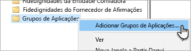

2. No Assistente Adicionar Grupo de Aplicações, indique um **nome** para o grupo de aplicações e selecione **Aplicação nativa a aceder a uma API Web**.

   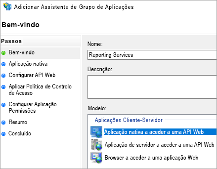

3. Selecione **Seguinte**.

4. Indique um **nome** para a aplicação que está a adicionar. 

5. Enquanto o **ID de Cliente** é automaticamente gerado para si, introduza *484d54fc-b481-4eee-9505-0258a1913020* para iOS e Android.

6. Deve adicionar os seguintes **URLs de Redirecionamento**:

   **Entradas do Power BI Mobile – iOS:**  
   msauth://code/mspbi-adal://com.microsoft.powerbimobile  
   msauth://code/mspbi-adalms://com.microsoft.powerbimobilems  
   mspbi-adal://com.microsoft.powerbimobile  
   mspbi-adalms://com.microsoft.powerbimobilems

   **As aplicações Android apenas precisam dos seguintes passos:**  
   urn:ietf:wg:oauth:2.0:oob

   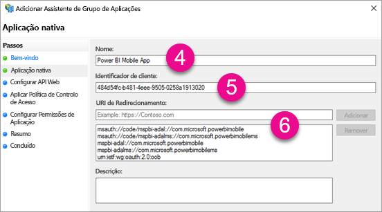
7. Selecione **Seguinte**.

8. Apresente o URL para o Servidor de Relatórios. Este é o URL externo que irá aceder ao Proxy de Aplicações Web. Deve estar no seguinte formato.

   > [!NOTE]
   > Este URL é sensível a maiúsculas e minúsculas!

   *https://< URL do servidor de relatórios >/*

   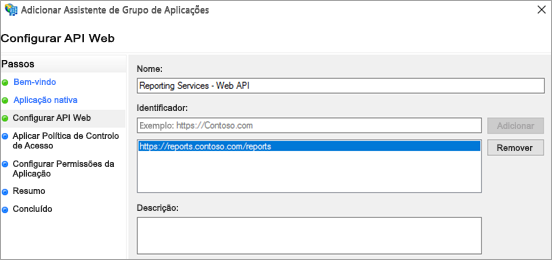
9. Selecione **Seguinte**.

10. Escolha a **Política de Controlo de Acesso** que se adeque às necessidades da sua organização.

    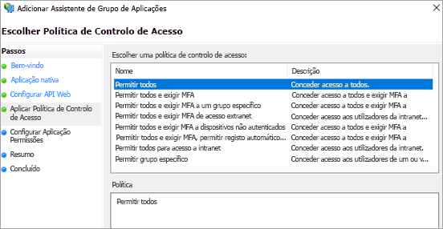

11. Selecione **Seguinte**.

12. Selecione **Seguinte**.

13. Selecione **Seguinte**.

14. Selecione **Fechar**.

Quando tiver terminado, as propriedades do grupo de aplicações deverão ser semelhantes ao seguinte.

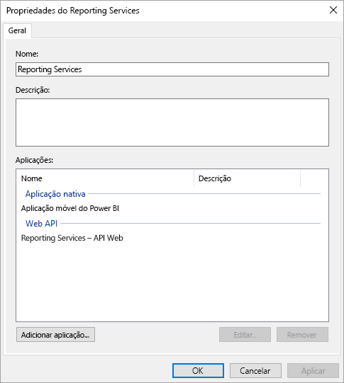

## <a name="web-application-proxy-wap-configuration"></a>Configuração de Proxy de Aplicações Web (WAP)

Deve ativar a função do Proxy de Aplicações Web (Função) do Windows num servidor do seu ambiente. Esta ação só é suportada num servidor do Windows 2016. Para obter mais informações, veja [Web Application Proxy in Windows Server 2016 (Proxy de Aplicações Web no Windows Server 2016)](/windows-server/remote/remote-access/web-application-proxy/web-application-proxy-windows-server) e [Publishing Applications using AD FS Preauthentication (Publicar aplicações com a Pré-autenticação do AD FS)](/windows-server/remote/remote-access/web-application-proxy/Publishing-Applications-using-AD-FS-Preauthentication#a-namebkmk14apublish-an-application-that-uses-oauth2-such-as-a-windows-store-app).

### <a name="constrained-delegation-configuration"></a>Configuração de delegação restrita

Para realizar a transição da autenticação OAuth para a autenticação do Windows, precisamos de utilizar a delegação restrita com a transição do protocolo. Isto faz parte da configuração Kerberos. Já definimos o SPN do Reporting Services na respetiva configuração.

Precisamos de configurar a delegação restrita na conta de computador do servidor do WAP do Active Directory. Se não tiver direitos para aceder ao Active Directory, terá de trabalhar com um administrador de domínio.

Para configurar a delegação restrita, deve realizar os seguintes passos.

1. Num computador que tenha as ferramentas do Active Directory instaladas, inicie **Utilizadores e Computadores do Active Directory**.

2. Encontre a conta de computador do servidor do WAP. Por predefinição, a conta estará no contentor dos computadores.

3. Clique com o botão direito do rato no servidor WAP e aceda a **Propriedades**.

4. Selecione o separador **Delegação**.

5. Selecione **Confiar neste computador para delegação apenas de serviços especificados** e, em seguida, **Utilizar qualquer protocolo de autenticação**.

   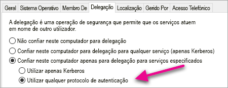

   Esta ação configura a delegação restrita para esta conta de computador do servidor do WAP. Em seguida, especificamos os serviços que esta máquina tem permissão para delegar.

6. Selecione **Adicionar...** na caixa de serviços.

   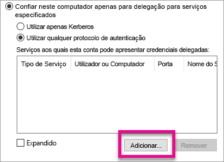

7. Selecione **Utilizadores ou Computadores...**

8. Introduza a conta de serviço que está a utilizar para o Reporting Services. Esta é a conta à qual adicionou o SPN na configuração do Microsoft SQL Server Reporting Services.

9. Selecione o SPN para o Reporting Services e, em seguida, selecione **OK**.

   > [!NOTE]
   > Só poderá ver o SPN do NetBIOS. Na realidade, seleciona os SPNs do NetBIOS e do FQDN, se existirem ambos.

   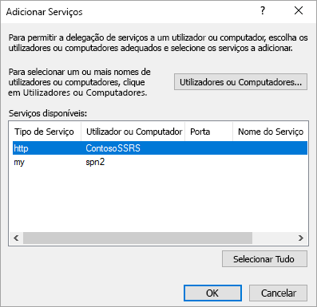

10. O resultado deve ser semelhante ao seguinte quando selecionar a caixa de verificação **Expandido**.

    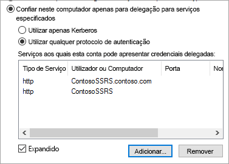

11. Selecione **OK**.

### <a name="add-wap-application"></a>Adicionar Aplicação WAP

Embora possa publicar aplicações na Consola de Gestão de Acesso de Relatórios, iremos criar a aplicação através do PowerShell. Eis o comando para adicionar a aplicação.

```powershell
Add-WebApplicationProxyApplication -Name "Contoso Reports" -ExternalPreauthentication ADFS -ExternalUrl https://reports.contoso.com/ -ExternalCertificateThumbprint "0ff79c75a725e6f67e3e2db55bdb103efc9acb12" -BackendServerUrl https://ContosoSSRS/ -ADFSRelyingPartyName "Reporting Services - Web API" -BackendServerAuthenticationSPN "http/ContosoSSRS.contoso.com" -UseOAuthAuthentication
```

| Parâmetro | Comentários |
| --- | --- |
| **ADFSRelyingPartyName** |O nome da API Web que criou como parte do Grupo de Aplicações no ADFS. |
| **ExternalCertificateThumbprint** |O certificado a utilizar para os utilizadores externos. É importante que o certificado seja válido em dispositivos móveis e seja proveniente de uma autoridade de certificação fidedigna. |
| **BackendServerUrl** |O URL do Servidor de Relatórios do servidor WAP. Se o servidor do WAP estiver numa DMZ, poderá ter de utilizar um nome de domínio completamente qualificado. Certifique-se de que pode aceder a este URL a partir do browser no servidor do WAP. |
| **BackendServerAuthenticationSPN** |O SPN que criou como parte da configuração do Microsoft SQL Server Reporting Services. |

### <a name="setting-integrated-authentication-for-the-wap-application"></a>Definir Autenticação Integrada da Aplicação do WAP

Depois de adicionar a aplicação WAP, tem de definir o BackendServerAuthenticationMode para utilizar a IntegratedWindowsAuthentication. Precisará do ID da Aplicação WAP de forma a poder defini-la.

```powershell
Get-WebApplicationProxyApplication "Contoso Reports" | fl
```


Execute o comando seguinte para definir o BackendServerAuthenticationMode com o ID da Aplicação do WAP.

```powershell
Set-WebApplicationProxyApplication -id 30198C7F-DDE4-0D82-E654-D369A47B1EE5 -BackendServerAuthenticationMode IntegratedWindowsAuthentication
```


## <a name="connecting-with-the-power-bi-mobile-app"></a>Ligar à Aplicação do Power BI Mobile

Na aplicação móvel do Power BI, deve ligar-se à sua instância do Microsoft SQL Server Reporting Services. Para fazê-lo, indique o **URL Externo** da sua Aplicação do WAP.

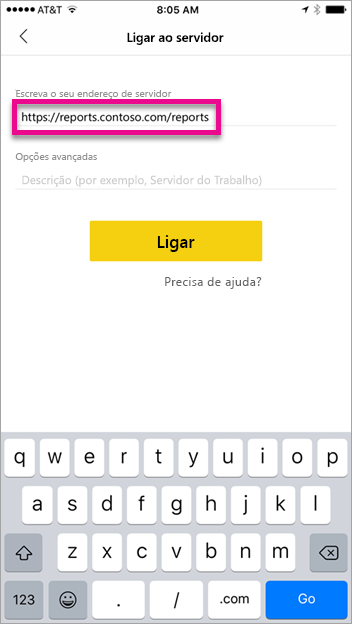

Quando selecionar **Ligar**, será direcionado para a página de início de sessão do ADFS. Introduza as credenciais válidas para o seu domínio.

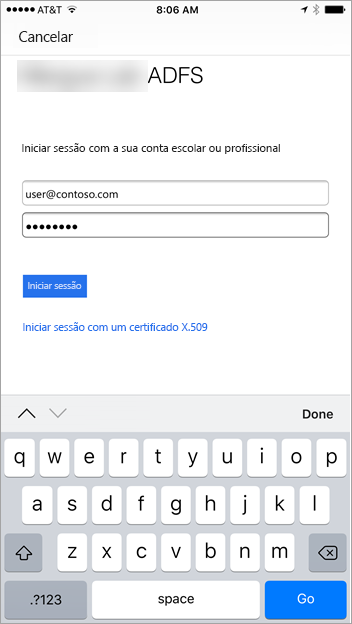

Depois de selecionar **Iniciar sessão**, verá os elementos do servidor do Reporting Services.

## <a name="multi-factor-authentication"></a>Autenticação multifator

Pode ativar a autenticação multifator para ativar segurança adicional no seu ambiente. Para obter mais informações, veja [Configure AD FS 2016 and Azure MFA (Configurar o AD FS 2016 e o MFA do Azure)](/windows-server/identity/ad-fs/operations/configure-ad-fs-and-azure-mfa).

## <a name="troubleshooting"></a>Resolução de problemas

### <a name="you-receive-the-error-failed-to-login-to-ssrs-server"></a>Vê o erro "Falha ao iniciar sessão no servidor SSRS"

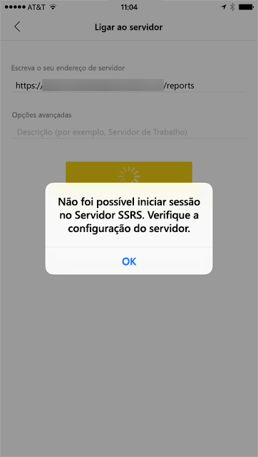

Pode configurar o [Fiddler](https://www.telerik.com/fiddler) para atuar como um proxy para os seus dispositivos móveis, para até onde chegou o pedido. Para ativar um proxy do Fiddler para o dispositivo móvel, tem de configurar o [CertMaker para iOS e Android](https://www.telerik.com/fiddler/add-ons) no computador com o Fiddler. O suplemento é do Telerik para o Fiddler.

Se o início de sessão for bem-sucedido ao utilizar o Fiddler, poderá ocorrer um problema de certificado com a aplicação WAP ou o servidor ADFS. 

## <a name="next-steps"></a>Próximos passos

[Registar um Nome do Principal do Serviço (SPN) para um Servidor de Relatórios](/sql/reporting-services/report-server/register-a-service-principal-name-spn-for-a-report-server)  
[Modificar um Ficheiro de Configuração do Reporting Services](/sql/reporting-services/report-server/modify-a-reporting-services-configuration-file-rsreportserver-config)  
[Configurar a Autenticação do Windows num Servidor de Relatórios](/sql/reporting-services/security/configure-windows-authentication-on-the-report-server)  
[Active Directory Federation Services](/windows-server/identity/active-directory-federation-services)  
[Proxy de Aplicação Web no Windows Server 2016](/windows-server/remote/remote-access/web-application-proxy/web-application-proxy-windows-server)  
[Publicar Aplicações com a Pré-autenticação do AD FS](/windows-server/remote/remote-access/web-application-proxy/Publishing-Applications-using-AD-FS-Preauthentication#a-namebkmk14apublish-an-application-that-uses-oauth2-such-as-a-windows-store-app)  
[Configurar o AD FS 2016 e o MFA do Azure](/windows-server/identity/ad-fs/operations/configure-ad-fs-and-azure-mfa)  
Mais perguntas? [Pergunte à Comunidade do Power BI](https://community.powerbi.com/)